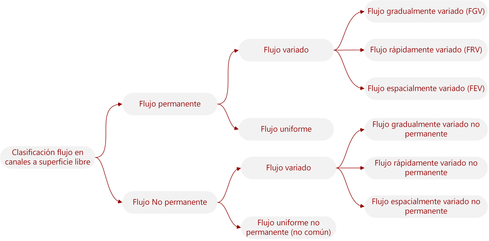

## Conceptos fundamentales
Keywords: `Hydraulics` `Channel` `Channel flow` `Cross section` `Velocity` `CriticalDepth`

> En la ilustración, canal de riego recubierto. Foto de Armenta Humberto.

### Alcance

En esta clase se presentan los conceptos generales requeridos para entender el flujo a superficie libre, en diferentes condiciones, considerando sus características geométricas, cinéticas y dinámicas.

### Objetivos

* Estudiar las características de un canal a superficie libre.
* Comprender los conceptos básicos del flujo a superficie libre.
* Conocer la clasificación general del flujo a superficie libre. 
* Revisar el concepto de profundidad crítica en un canal a superficie libre.

### Requerimientos

* Conocimientos en mecánica de fluidos.

### Flujo a superficie libre

El flujo a superficie libre implica que el fluido está expuesto a la atmósfera, esto puede darse en un canal abierto o en un conducto cuyo líquido no ocupa la sección por completo, y, por lo tanto, hay una superficie libre. Este flujo se distingue del flujo en tuberías o conductos cerrados a presión, los cuales permiten el transporte de líquidos y gases. Sin embargo, el flujo a superficie libre implica la existencia de una interfaz líquido-gas. El flujo en tuberías se conduce por una diferencia de presión, mientras que el flujo a superficie libre se conduce de manera natural por gravedad. El flujo del agua en un río, por ejemplo, se conduce por la diferencia de elevación entre río corriente arriba y río corriente abajo. La razón de flujo en un canal a superficie libre está establecida por el balance dinámico entre gravedad y fricción. [^1]

>  En la ilustración, Arroyo Las Ánimas, Cesar, Col. _Fuente propia_.

 La mayoría de los flujos naturales encontrados en la práctica, como los de agua en riachuelos, ríos e inundaciones además de cunetas a los lados de carreteras, estacionamientos o techos, son también flujos en canales abiertos. Los sistemas de flujo en canal abierto hechos por el hombre incluyen sistemas de irrigación, alcantarillas, desagües y cunetas.

### Distribución de velocidades

En un canal a superficie libre, la velocidad del flujo es cero sobre las superficies laterales y en el fondo del canal debido a la condición de no deslizamiento, y máxima ocurre abajo de la superficie libre en algún lugar entre 25% de profundidad como se muestra en la figura. Además, la velocidad varía en la dirección del flujo varía en la mayoría de los casos. Por lo tanto, la distribución de la velocidad (y en consecuencia el flujo) en canales es en general tridimensional. Ahora bien, en la práctica de la ingeniería las ecuaciones se trabajan en términos de la velocidad media en secciones transversales del canal. Debido a que la velocidad media varía solamente en la dirección del flujo. Esta hipótesis de unidimensionalidad hace posible resolver problemas importantes de la vida real de manera simple, precisa y aplicada comúnmente en la práctica. [^1]

> Distribución típica de velocidad en secciones de canal abierto.[^2]

La distribución de velocidades en una sección de canal depende también de otros factores, como una forma inusual de la sección, la rugosidad del canal y la presencia de curvas. En una corriente ancha, rápida y poco profunda o en un canal muy liso, la velocidad máxima por lo general se encuentra en la superficie libre. La rugosidad del canal causa un incremento en la curvatura del perfil vertical de velocidades.

> Distribución típica del perfil de velocidades en canal a superficie libre.[^3]

### Elementos geométricos de la sección transversal

Los canales pueden ser naturales o artificiales. Un canal que tiene la misma sección transversal y la misma pendiente de fondo se denomina canal prismático, mientras que un canal que tiene una sección transversal y/o pendiente variable se denomina canal no prismático. Un canal largo puede estar compuesto por varios canales regulares. Una sección transversal normal a la dirección del flujo se denomina **sección del canal**. Las secciones de canales naturales son, por lo general, muy irregulares y pueden constar de una sección principal y una o más secciones laterales. Los canales artificiales suelen ser diseñados con secciones de figuras geométricas regulares, más comúnmente trapezoidales, cuadrados o triangulares. Las secciones cerradas, por lo general circulares, son usadas en alcantarillados y estructuras de paso (culverts).  

Los **elementos geométricos** son propiedades de una sección de canal que pueden ser definidos por completo por la geometría de la sección y la profundidad de flujo. La **profundidad de flujo**, _'y'_, en una sección es la distancia vertical desde el punto más bajo de la sección del canal hasta la superficie libre. La **profundidad de flujo de la sección**, _'d'_, es la profundidad de flujo normal o perpendicular a la dirección del flujo. El **ancho superficial**, _T_, es el ancho de la sección del canal en la superficie libre. El **área de flujo** o área mojada, _'A'_, es el área de la sección transversal del canal normal a la dirección del flujo. El **perímetro mojado** o perímetro hidráulico, _'P'_ se define como la longitud de la línea de intersección de la superficie mojada del canal con un plano transversal perpendicular a la dirección del flujo. El **radio hidráulico**, _'R'_, es la relación del área (A) y el perímetro mojado (P). La **profundidad hidráulica**, _'D'_, es la relación entre el área mojada (A) y el ancho superficial (T). Y el **factor de sección** para la estimación del flujo crítico,_'Z'_, se definen como el producto del área (A) y la raíz cuadrada de la profundidad hidráulica (D).

Para secciones de canal regulares y simples, los elementos geométricos pueden expresarse matemáticamente en términos de la profundidad de flujo y de otras dimensiones de la sección. Para el caso de secciones complicadas y secciones naturales (irregulares), no se puede escribir una expresión algebraica simple, pero pueden prepararse curvas que representen la relación entre estos elementos y la profundidad de flujo. 

### Clasificación del flujo

En la dinámica de los fluidos existes diferentes clasificaciones en función de sus variables y características. En el caso de los canales a superficie libre, generalmente la clasificación se realiza de acuerdo con el cambio en la profundidad de flujo con respecto al tiempo y el espacio, como se muestra en el siguiente diagrama. 

 
Clasificación de flujo según la variación de la profundidad de flujo en el tiempo y espacio. 

 

#### En función del tiempo. Flujo permanente y no permanente.

Se dice que un flujo es **permanente** si la profundidad del flujo no varía con el tiempo en cualquier lugar o sección dado a lo largo del canal (aunque este podría variar de un lugar a otro). De otra manera, es no permanente. En este sentido, si el flujo es permanente, la velocidad media en cualquier sección se mantendrá constante en el tiempo y consecuentemente el caudal es constante y continuo.

Cuando a lo largo del curso del canal, una parte del caudal entra o sale del sistema, se presenta un flujo permanente no uniforme, conocido como **flujo espacialmente variado (FEV)** o discontinuo.

#### En función de espacio. Flujo uniforme y variado.

El flujo en canales a superficie libre también se clasifica como uniforme o variado, esto depende de cómo la profundidad del flujo _(y)_ y la profundidad de flujo de la sección _(d)_, varía a lo largo del canal. Se dice que el flujo en un canal es **uniforme** si la profundidad del flujo _(y)_ y la velocidad media se mantiene constante. De otra manera, el flujo es no uniforme o variado, lo cual indica que la profundidad varía con la distancia en la dirección del flujo. 

Las condiciones del flujo uniforme comúnmente se encuentran en la práctica en tramos largos y rectos de canales con pendiente y sección transversal constantes. En canales abiertos de pendiente y sección transversal constantes, el líquido acelera hasta que la pérdida de carga debida a los efectos de fricción se iguala a la caída de elevación. El líquido en este punto alcanza su velocidad final y se establece un flujo uniforme. El flujo se mantiene uniforme siempre que la pendiente, la sección transversal y la rugosidad del canal no tengan algún cambio. 

La presencia de un obstáculo o un cambio de la pendiente o de sección transversal, ocasiona que la profundidad del flujo cambie y en consecuencia el flujo se convierta en **variado** o no uniforme. Estos flujos variados son comunes en canales naturales o artificiales como ríos, sistemas de irrigación y canales de desagüe. Dentro del flujo variado tenemos el **flujo de rápidamente variado (FRV)** o de variación rápida, si la profundidad del flujo cambia considerablemente sobre una distancia relativamente corta en la dirección del flujo, como el paso del flujo de agua a través de una compuerta parcialmente abierta. Por otro lado, tenemos el **flujo gradualmente variado (FGV)** o de variación gradual, cuando la profundidad del flujo cambia gradualmente en una distancia larga a lo extenso del canal. 

En FGV se puede trabajar con la velocidad media unidimensional, tal y como se trabaja con ella en flujos uniformes. Sin embargo, la velocidad promedio no siempre es la más útil o el parámetro más apropiado para FRV. Por lo tanto, el análisis de flujos de variación rápida es bastante complicado, en especial cuando el flujo es no permanente.

 
Convenciones del esquema: Flujo uniforme (FU, UF por sus siglas en inglés), flujo gradualmente variado (FGV, GVF por sus siglas en inglés) 
y flujo rápidamente variado (FRV, RVF por sus siglas en inglés) en un canal abierto.  

> Flujo uniforme y variado en canales a superficie libre.[^1]

#### Efecto de viscosidad. Flujo laminar y turbulento.

El estado o comportamiento del flujo en canales a superficie libre está gobernado básicamente por los efectos de viscosidad y gravedad en relación con las fuerzas inerciales del flujo. El flujo se puede clasificar el flujo en laminar, turbulento o transicional, según el efecto de la viscosidad en relación con la inercia. El flujo es **laminar** si las fuerzas viscosas son muy fuertes en relación con las fuerzas inerciales, de tal manera que la viscosidad es relevante en el comportamiento del flujo. El flujo es turbulento si las fuerzas viscosas son débiles en relación con las fuerzas inerciales. Entre los estados de flujo laminar y turbulento existe un estado mixto o transicional. La clasificación del flujo o el efecto de la viscosidad en relación con la inercia se representa mediante el número de Reynolds, definido por la siguiente ecuación:

 
Donde, <b>V</b> es la velocidad media de flujo, 
<b>L</b> es la longitud característica (considerada como radio hidráulico, R) 
y <b><i>v</i></b> la viscosidad cinemática del fluido .  

Si se considera que con frecuencia los canales a superficie libre tienen secciones transversales irregulares, el radio hidráulico **R** sirve como la longitud característica y da uniformidad al tratamiento de canales. También, el número de Reynolds es constante para toda la sección del flujo uniforme de un canal. El flujo en canales es laminar si el número de Reynolds (Re) es pequeño y turbulento si es grande. Experimentalmente, se han definido los siguientes rangos para la clasificación del flujo.

| Número de Reynolds | Tipo de flujo |
|:------------------:|:-------------:|
|       ≤ 500        |    Laminar    |
|  entre 500 y 2500  |  Transición   |
|       ≥ 2500       |  Turbulento   |

El flujo laminar en canales a superficie libre ocurre con muy poca frecuencia, ya que la mayoría de los canales transportan el líquido en condiciones de flujo turbulento. Sin embargo, se puede encontrar flujo laminar cuando una delgada capa de agua (como el agua que fluye por cunetas de carreteras o estacionamientos) se mueve a baja velocidad.

#### Efecto de gravedad. Flujo crítico, subcrítico y supercrítico.

El efecto de la gravedad sobre el estado de flujo se presenta por la relación entre las fuerzas inerciales y las fuerzas gravitacionales. Esta relación está dada por el **_número de Froude_**, definido como

 
Donde, <b>V</b> es la velocidad media de flujo, 
<b>L</b> es la longitud característica (considerada como la profundidad hidráulica, D) 
y <b><i>g</i></b> es la aceleración gravitacional.  

El número de Froude es un parámetro importante que gobierna el tipo del flujo en canales a superficie libre y se clasifica como:

| Número de Froude | Tipo de flujo |
|:----------------:|:-------------:|
|       > 1        |  Subcrítico   |
|        1         |    Crítico    |
|       > 1        | Supercrítico  |

El denominador del número de Froude es un parámetro adimensional, es decir que su denominador tiene la dimensión de la velocidad, y este representa la velocidad o celeridad de la onda **co**. Por consiguiente, a velocidades de flujo lentas `Fr < 1`, una pequeña alteración viaja corriente arriba _(con una velocidad co - V relativa al observador en reposo)_ y afecta las condiciones de flujo corriente arriba. Este se llama flujo tranquilo o **subcrítico** e indica que eñ flujo es dominado por las fuerzas de gravedad. Pero, a velocidades de flujo altas `Fr > 1`, una pequeña alteración no puede viajar corriente arriba _(la onda es llevada corriente abajo con una velocidad V - co relativa)_ así que las condiciones de flujo corriente arriba no pueden ser influidas por las condiciones de flujo corriente abajo. Este se llama flujo rápido o **supercrítico**, cuando las fuerzas de inercia dominan el flujo y es controlado por las condiciones aguas arriba. [^1]

### Profundidad crítica

Cuando <kbd>Fr</kbd> es igual a 1, se dice que el flujo está en estado **crítico** y la velocidad media del flujo es igual a la celeridad de onda ($V = \sqrt{gD}$). Estas pequeñas ondas gravitacionales pueden ocurrir en aguas poco profundas como resultado de cualquier cambio momentáneo en la profundidad local del agua, como perturbaciones y obstáculos en el canal. El estado crítico del flujo también se caracteriza por otras condiciones importantes: la energía específica es mínima para un caudal determinado, el caudal es máximo para una determinada energía específica y la fuerza específica es mínima para un caudal determinado. [^5]

Los análisis sobre el estado crítico se refieren comúnmente a una sección particular del canal, conocida como **sección crítica**. A partir de la ecuación del número de Froude, podemos despejar la profundidad de flujo para esta sección, conocida como **profundidad crítica**, **yc**, la cuál depende de las características geométricas de la sección y de la velocidad de flujo o caudal. Considerando que yc no puede despejarse fácilmente de la función, se suele utilizar el factor de sección (Z) en función del caudal (Q), la gravedad (g) y el coeficiente de energía($/alpha$). Cuando se conoce el caudal, de la ecuación se obtiene el factor de sección crítico **Zc** y, por consiguiente, la profundidad crítica **yc**.

 

#### Secciones de control

Consiste en el control del flujo en una sección transversal de un canal a superficie libre, donde existe una relación definitiva entre el nivel del fluido y el caudal. Esta condición le permite a la sección de control regular el flujo aguas arriba y/o aguas abajo. Adicionalmente, es útil como sección de aforo o calibración. Algunos casos de secciones de control son: secciones de flujo crítico, vertederos, canaletas de flujo crítico, compuertas, orificios o cualquier otra estructura.   

La localización de la sección de control en general está gobernada por el estado de flujo y por la pendiente del canal. Por ejemplo en un canal prismático recto, en general se puede decir que un flujo en condición subcrítico tendrá una sección de control aguas abajo, mientras que un flujo en condición supercrítico tendrá su sección de control aguas arriba. 

>  En la ilustración, estructura de control y derivación de Arroyo Las Ánimas, Cesar, Col. _Fuente propia_.

### Referencias
- Fluid mechanics. Fundamentals and Applications.. Cengel Y., Cimbala J. McGraw-Hill.2006.
- Introduction to Fluid Mechanics. Fox and McDonald's. 8th Ed., Jhon Wilwy & Sons, Inc. 2011. 
- The Hydraulics of Channel Flow: An Introduction. Chanson H. 2nd Ed.,Elsevier Butterworth-Heinemann. 2004.
- Open Channel Hydraulics. Chow, Ven Te. 2nd Ed., Blackburn Press. 2009.
- Flow in open channels. Subramanya K. 3th Ed., Tata McGraw-Hill Publishing. 2009.

### Control de versiones

| Versión | Descripción                                                       |                    Autor                    | Horas |
|:-------:|-------------------------------------------------------------------|:-------------------------------------------:|:-----:|
| 2022.07 | Versión inicial con definición de estructura general y contenido. | [juanrodace](https://github.com/juanrodace) |  1.0  |
| 2022.07 | Inclusión de conceptos.                                           | [juanrodace](https://github.com/juanrodace) |  7.0  |
| 2022.11 | Desarrollo contenido multimedia.                                  | [juanrodace](https://github.com/juanrodace) |  3.0  |

| [:arrow_backward:Anterior](../../Readme.md) | [:house: Inicio](../../Readme.md) | [:beginner: Ayuda](https://github.com/juanrodace/J.HRAS/discussions/2) | [Siguiente:arrow_forward:](../FundamentalEquations) |
|---------------------------------------------|-----------------------------------|------------------------------------------------------------------------|-----------------------------------------------------|

_J.HRAS es de uso libre para fines académicos, conoce nuestra licencia, cláusulas, condiciones de uso y como referenciar los contenidos publicados en este repositorio, dando [clic aquí](../../License.md)._

_¡Encontraste útil este repositorio!, apoya su difusión marcando este repositorio con una ⭐ o síguenos dando clic en el botón Follow de [juanrodace](https://github.com/juanrodace) en GitHub._

[^1]: Fluid mechanics. Fundamentals and Applications.. Cengel Y., Cimbala J. McGraw-Hill.2006.
[^2]: Introduction to Fluid Mechanics. Fox and McDonald's. 8th Ed., Jhon Wilwy & Sons, Inc. 2011. 
[^3]: The Hydraulics of Channel Flow: An Introduction. Chanson H. 2nd Ed.,Elsevier Butterworth-Heinemann. 2004. _(Fig.1.2.)_
[^4]: Hidráulica de tuberías y canales. Rocha Arturo.
[^5]: Open Channel Hydraulics. Chow, Ven Te. 2nd Ed., Blackburn Press. 2009.

