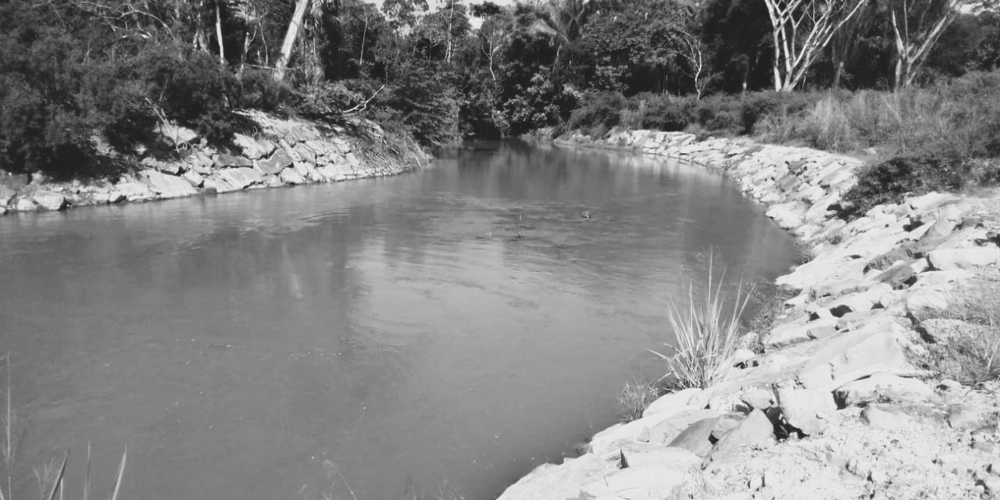

## Conceptos fundamentales
Keywords: `Hydraulics` `Channel` `Channel flow` `Continuity equation` `Energy equation` `CriticalDepth`

> En la ilustración, Arroyo Las Ánimas, Cesar, Col. _Fuente propia_.

### Alcance

En esta clase se presentan las ecuaciones fundamentales que describen el flujo a superficie libre, en condiciones de flujo permanente.

### Objetivos

* Entender las características y consideraciones del flujo permanente en un flujo a superficie libre.
* Comprender la aplicación de la ecuación de continuidad en un flujo a superficie libre.
* Comprender la aplicación de la ecuación de conservación de la energía en un flujo a superficie libre.
* Comprender la aplicación de la ecuación de conservación del momentum en un flujo a superficie libre.
* Revisar los conceptos de energía y fuerza específica en un canal o conducto con flujo a superficie libre.

### Requerimientos

* Conocimientos en mecánica de fluidos.
* Conceptos fundamentales en flujo a superficie libre [Ir Ahora :dash:](../FundamentalConcepts.

### Sistemas a superficie libre en condición de flujo permanente

En la dinámica de los fluidos existes diferentes clasificaciones en función de sus variables y características. En el caso de los canales a superficie libre, generalmente la clasificación se realiza de acuerdo con el cambio en la profundidad de flujo con respecto al tiempo y el espacio. Se dice que un flujo es **permanente** si la profundidad del flujo no varía con el tiempo en cualquier lugar o sección dado a lo largo del canal (aunque este podría variar de un lugar a otro). De otra manera, es no permanente. En este sentido, si el flujo es permanente, la velocidad media en cualquier sección se mantendrá constante en el tiempo y consecuentemente el caudal es constante y continuo.

A continuación revisaremos las ecuaciones fundamentales que describen los flujos a superficie libre en condiciones de flujo permanente. Más adelante abordaremos la condición de flujo no permanente.

### Continuidad en flujo permanente

Los flujos en canales abiertos incluyen líquidos cuyas densidades son casi constantes y, por lo tanto, la al evaluar la conservación de la masa de un flujo permanente unidimensional o la ecuación de continuidad se concluye que el flujo volumétrico es constante. Y al expresar dicho flujo como el producto del área de la sección traversal de flujo y la velocidad media en el canal, la ecuación de continuidad entre dos secciones a lo largo de un canal se expresa como:

 
Donde, <b>Q</b> es el flujo volumétrico o caudal, 
<b>A</b> es el área de la sección transversal y <b>V</b> es la velocidad media de flujo.  

### Conservación de la energía en flujo permanente

En dinámica de fluidos se sabe que la energía total del agua en unidades de altura de energía de cualquier línea de corriente que pasa a través de una sección de canal puede expresarse como la suma de la elevación por encima del nivel de referencia, la altura de presión y la altura de velocidad. Para propósitos prácticos, se suele utilizar la velocidad media, es decir asumir un flujo uniforme para toda la sección y utilizar el coeficiente de energía **α**, permitiendo definir la energía mecánica total en una sección transversal del canal como se muestra a continuación.
 

 
Donde, <b>z</b> es la elevación por encima del nivel de referencia, 
<b>y</b> es la profundidad vertical de flujo, <b>V</b> es la velocidad media de flujo, 
<b>α</b> es el coeficiente de energía o Coriolis y <b><i>g</i></b> es la aceleración gravitacional.  

 

> Esquema de conservación de la energía en flujo a superficie libre.[^2]

De acuerdo con el principio de conservación de la energía, la altura de energía total en una sección '1' localizada corriente arriba debe ser igual a la altura de energía total en una sección '2' corriente abajo más las perdidas de energía *(hf)* entre las dos secciones. Esta ecuación es aplicable a flujos uniformes y gradualmente variados.

  

#### Energía específica

La energía intrínseca del fluido a través de la sección transversal puede expresarse con mayor realidad si se toma como punto de referencia el fondo del canal y de esa manera z=0 en ese punto. Entonces, la energía mecánica total del fluido en términos de altura o carga, será la suma de la altura de presión y la altura dinámica. A esta suma se le denomina energía específica **Es**.

 
  

Esta ecuación es muy instructiva para evaluar la variación de la energía específica respecto a la profundidad del flujo. En un canal a superficie libre en condición de flujo permanente la razón de flujo (Q) es constante y se puede observar lo siguiente:

 

> Curva de energía específica en flujo a superficie libre. _Tomado de Fig.11.7_ [^1]

- La distancia desde un punto en el eje vertical y, a la curva, representa la energía específica correspondiente a este valor de profundidad y. La parte entre la línea **Es = y** y la curva corresponden a la carga dinámica (o energía cinética) del líquido, y la parte restante, a la carga de presión (o energía del flujo).

- La energía específica tiende a infinito cuando y → 0 (debido a que la velocidad se aproxima a infinito), y se vuelve igual a la profundidad del flujo _'y'_ para valores grandes de _'y'_ (debido a que la velocidad y en consecuencia la energía cinética se vuelven muy pequeñas). 

- La energía específica alcanza un valor mínimo Emin, en un punto intermedio, llamado punto crítico, caracterizado por la profundidad crítica _yc_ y la velocidad crítica _Vc_. La energía específica mínima también se llama energía crítica.

- Existe una energía específica mínima Emin necesaria para mantener el flujo
volumétrico (Q) dado.

- Una línea horizontal intercepta la curva de la energía específica solamente en un punto, así que un valor fijo de la profundidad del flujo corresponde a un valor fijo de la energía específica. Esto es de esperarse, puesto que la velocidad tiene valor fijo cuando _`Q`_, _`b`_ y _`y`_ se especifican.

- Para Es > Emin, una línea vertical intercepta la curva en dos puntos, indicando que un fluido puede tener dos profundidades diferentes (por tanto, dos velocidades diferentes) correspondientes a un valor fijo de energía específica. Esas dos profundidades se llaman profundidades alternas. 

- Un pequeño cambio en la energía específica cerca del punto crítico causa gran diferencia entre las profundidades alternas y podría causar una violenta fluctuación en el nivel del flujo. Por lo tanto, las operaciones cerca del punto crítico deben evitarse en el diseño de canales abiertos.

### Conservación del momentum en flujo permanente

La segunda ley del movimiento de newton dice que la resultante de las fuerzas externas a un sistema es igual al cambio de la cantidad de movimiento por unidad de tiempo. Dicho cambio de momentum del flujo en una sección por unidad de tiempo se expresa como **βρQV**, donde **β** es el coeficiente de corrección de *momentum*, **ρ** es la densidad del fluido, **Q** es el caudal o flujo volumétrico y **V** es la velocidad media en la sección. Siendo así, al aplicar este principio en un tramo de canal, al considerar las fuerzas externas de presión, las fuerzas gravitacionales y las fuerzas de fricción o de resistencia externa, puede escribirse la siguiente expresión para el cambio de *momentum* por unidad de tiempo entre las secciones 1 y 2.

 

> Esquema de conservación del momentum a superficie libre. _Tomado de Fig.7.18_ [^2]

 
Donde, <b>P1 y P2</b> son las presiones resultantes que actúan en las dos secciones transversales, 
<b>W</b> es el peso del agua contenida entre las dos secciones, <b>θ</b> es ángulo de inclinación del canal 
y <b>Ff</b> es la fuerza de fricción y de resistencia totales externas que actúan en el canal.  

Cuando el flujo es uniforme o gradualmente variado, los valores de P1 y P2 pueden calcularse suponiendo una distribución hidrostática. Para el caso de flujos rápidamente variados, la distribución de presiones no es hidrostática y deben corregirse para tener en cuenta los efectos de curvatura de las líneas de corriente. 

#### Fuerza específica

Si analizamos la ecuación anterior de cantidad de movimiento en un tramo horizontal de canal corto y prismático, se puede considerar la presión hidrostática y se pueden ignorar los efectos externos de fricción, y del peso del agua, obteniendo la siguiente expresión.

 
Donde, <b>y1 y y2</b> son las profundidades al centroide de la sección transversal, 
<b>A</b> es el área de las dos secciones transversales, <b>Q</b> es el flujo volumétrico o caudal 
y <b>g</b> es la constante gravitacional.  

Los dos lados de esta ecuación son análogos y cada uno corresponde a la **fuerza específica** de la sección. Esta fuerza específica se compone de dos términos, el primero **$Q2/gA** corresponde al flujo de *momentum* por unidad de peso de la sección y el segundo, **yA** equivale a la fuerza del fluido por unidad de peso.

 

Al igual que la energía específica, esta ecuación nos permite evaluar la variación de la fuerza específica con respecto a la profundidad del flujo para un caudal constante y se puede observar lo siguiente:

 

> Curva de fuerza específica en flujo a superficie libre. _Tomado de Fig.7.19_ [^2]

- Para una fuerza específica **M** hay dos profundidades posibles y1 y y2, excepto para la Fe mínima. Estas profundidades se conocen como profundidad inicial y profundidad secuente o profundidades conjugadas.
- Existe un valor mínimo de la fuerza específica el cual corresponde a la profundidad crítica, tal como ocurre con la energía específica mínima.
- Al revisar las profundidades conjugadas y1 y y2, se evidencia que la primera se encuentra en condición supercrítica y la otra en condición subcrítica, similar a la curva de energía específica. Sin embargo, la profundidad secuente y2 tiene menos energía que la profundidad y1.
- Las profundidades conjugadas corresponder a las encontradas en el fenómeno del resalto hidráulico.

### Referencias
- Fluid mechanics. Fundamentals and Applications.. Cengel Y., Cimbala J. McGraw-Hill.2006.
- Introduction to Fluid Mechanics. Fox and McDonald's. 8th Ed., Jhon Wilwy & Sons, Inc. 2011. 
- The Hydraulics of Channel Flow: An Introduction. Chanson H. 2nd Ed.,Elsevier Butterworth-Heinemann. 2004.
- Open Channel Hydraulics. Chow, Ven Te. 2nd Ed., Blackburn Press. 2009.
- Flow in open channels. Subramanya K. 3th Ed., Tata McGraw-Hill Publishing. 2009.

### Control de versiones

| Versión  | Descripción                                                       |                    Autor                    | Horas |
|:--------:|-------------------------------------------------------------------|:-------------------------------------------:|:-----:|
| 2022.07  | Versión inicial con definición de estructura general y contenido. | [juanrodace](https://github.com/juanrodace) |  1.0  |
| 2022.08  | Inclusión conceptos.                                              | [juanrodace](https://github.com/juanrodace) |  4.0  |

| [:arrow_backward:Anterior](../FundamentalConcepts) | [:house: Inicio](../../Readme.md) | [:beginner: Ayuda](https://github.com/juanrodace/J.HRAS/discussions/2) | [Siguiente:arrow_forward:](../VariedFlow) |
|-------------------------------------------------|-----------------------------------|------------------------------------------------------------------------|-------------------------------------------|

_J.HRAS es de uso libre para fines académicos, conoce nuestra licencia, cláusulas, condiciones de uso y como referenciar los contenidos publicados en este repositorio, dando [clic aquí](../../License.md)._

_¡Encontraste útil este repositorio!, apoya su difusión marcando este repositorio con una ⭐ o síguenos dando clic en el botón Follow de [juanrodace](https://github.com/juanrodace) en GitHub._

[^1]: Introduction to Fluid Mechanics. Fox and McDonald's. 8th Ed., Jhon Wilwy & Sons, Inc. 2011. 
[^2]: Hidráulica de tuberías y canales. Rocha Arturo.
[^3]: Open Channel Hydraulics. Chow, Ven Te. 2nd Ed., Blackburn Press. 2009.

