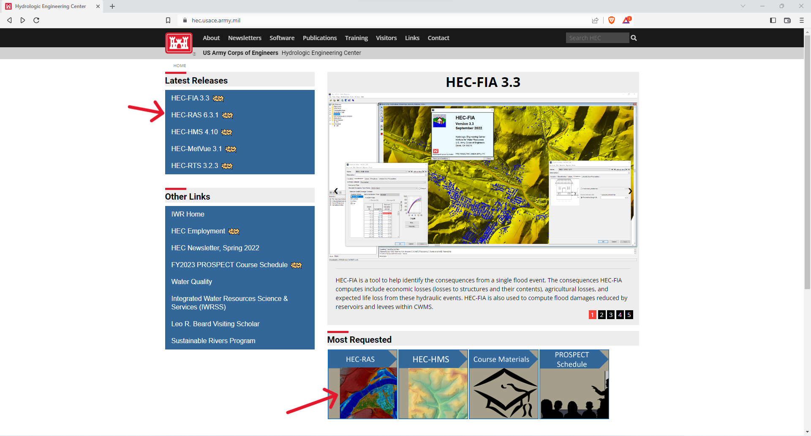
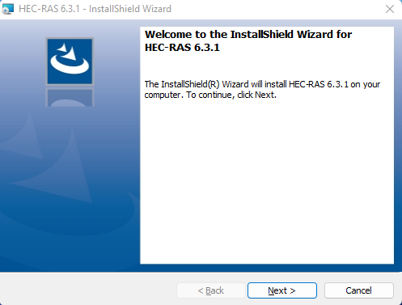

## HEC-RAS. Generalidades, usos y estructura.
Keywords: `Engineering` `Hydraulics` `Open Channel Flow` `Hydraulic Systems` `Hydraulic Modelling`   

### Alcance

En esta clase se presentan las generalidades del software de modelación hidráulica desarrollado por el Hydrological Engineering Center, el cual es uno de los programas de referencia dentro de su campo. Así mismo, su obtención, descarga, instalación, características básicas, uso generalizado, actualización y estructura.

### Objetivos

* Conocer las generalidades del programa de modelación HEC-RAS.
* Conocer las características y componentes generales de la herramienta.
* Entender la estructura básica del programa.

### Requerimientos

* Conocimientos básicos en hidráulica a superficie libre. [**(Ir a la actividad 1)**](../FundamentalConcepts).
* Computador con Microsoft® Windows 98/NT/2000/XP/Vista/7/8/8.1/10.
* Contar con conexión a internet.

### HEC-RAS. Generalidades.
El Sistema de Análisis de Ríos o River Analysis System (HEC-RAS), es un software que ha sido desarrollado en el Centro de Ingeniería Hidrológica (Hydrologic Engineering Center- HEC), que es una división del Instituto de Recursos Hídricos (IWR) del Cuerpo de Ingenieros del Ejército de los EE. UU. La primera versión de HEC-RAS se lanzó en el año 1995. Desde entonces, el paquete de software se ha actualizado hasta la versión 6.3 del año 2022.

El programa de modelado HEC-RAS se desarrolló como parte del software de ingeniería hidrológica de "próxima generación" (NexGen) del Centro de Ingeniería Hidrológica, el cual abarca varios aspectos de la ingeniería hidrológica como el análisis de precipitaciones y escorrentías (HEC-HMS), hidráulica a superficie libre (HEC-RAS), simulación de sistemas de reservorios (HEC-ResSim), análisis de daños por inundaciones (HEC-FDA y HEC-FIA) y predicción de ríos en tiempo real para operaciones de embalses (CWMS).

La filosofía del programa es de un sistema integrado de software, diseñado para uso interactivo en un entorno multitarea. El sistema se compone de una interfaz gráfica de usuario, componentes de análisis independientes, capacidades de gestión y almacenamiento de datos, gráficos, mapeo e informes.

### HEC-RAS. Usos y componentes.

El software tiene 4 componentes generales: 
1. Modelación de sistemas hidráulicos a superficie libre para canales naturales y artificiales en condición de flujo permanente y unidimensionales
2. Modelación de sistemas hidráulicos a superficie libre en condición no permanente unidimensional y bidimensional.
3. Cálculo de transporte de sedimentos en condición cuasi no permanente y no permanente.
4. Análisis unidimensional de la calidad del agua.

Un elemento clave es que estos cuatro componentes utilizan una representación de datos geométricos común y rutinas de cálculo hidráulicas y geométricas comunes. Además de los cuatro componentes, el sistema contiene varias características de diseño hidráulico que se pueden invocar una vez que se calculan los perfiles de la superficie del agua. Adicionalmente, tiene un extenso sistema de mapeo e integración de datos espaciales (HEC-RAS Mapper).
En este curso abordaremos los primeros dos componentes, los cuales se detallan a continuación.

**Flujo a superficie libre en condición permanente (Steady Flow Water Surface Profiles)**. Este componente del sistema está destinado a calcular los perfiles de la superficie del agua para un flujo permanente y gradualmente variado (FGV). El sistema puede manejar una red completa de canales, un sistema dendrítico o un solo tramo de río. El componente de flujo permanente es capaz de modelar perfiles de flujo en régimen de flujo subcrítico, supercrítico y mixto. El procedimiento computacional básico se basa en la solución de la ecuación de energía unidimensional. Las pérdidas de energía se evalúan por fricción con la ecuación de Manning y las pérdidas por contracción y expansión con coeficientes multiplicados por el cambio en la carga de velocidad. La ecuación de cantidad de movimiento se utiliza en situaciones en las que el perfil es rápidamente variado. Estas situaciones incluyen cálculos de régimen de flujo mixto (es decir, resaltos hidráulicos), hidráulica de puentes y evaluación de perfiles en confluencias de ríos (uniones de arroyos).

Los efectos de las estructuras como puentes, alcantarillas, represas, presas y otras estructuras en la planicie de inundación pueden ser considerados en los cálculos. El sistema de flujo permanente está diseñado para su aplicación en la gestión de llanuras aluviales y estudios de inundaciones. Además, es posible evaluar el cambio en los perfiles de flujo debido a las modificaciones del canal y los diques. Las características especiales del componente incluyen:
* Análisis de planes múltiples.
* Cálculos de perfiles múltiples.
* Análisis multiple de puentes y alcantarillas.
* Análisis de socavación de puentes.
* Optimización de flujo dividido.
* Diseño y análisis de canales estables.

**Simulación de flujo no permanente (Unsteady Flow Simulation)**. Este componente del sistema es capaz de simular el flujo unidimensional, bidimensional y combinado en condición no permanente a través de una red completa de canales abiertos, llanuras de inundación y valles aluviales. El componente de flujo no estacionario se puede utilizar para realizar cálculos de régimen de flujo subcrítico, supercrítico y mixto (subcrítico, supercrítico, saltos hidráulicos y reducciones). Los cálculos hidráulicos para secciones transversales, puentes, alcantarillas y otras estructuras hidráulicas también se han incorporado al módulo de flujo no estacionario. Las características especiales del componente:
* Análisis de estructuras hidráulicas.
* Rompimiento de presas.
* Rotura y desbordamiento de diques.
* Estaciones de bombeo.
* Operación de presas.
* Sistemas de tuberías presurizadas.
* Funciones de calibración automatizadas.
* Reglas de cálculo definidas por el usuario.
* Modelado combinado de flujo no estacionario unidimensional y bidimensional.

### HEC-RAS. Instalación
Antes de instalar el software HEC-RAS, es importante revisar que la computadora tenga los siguientes requerimientos mínimos de hardware y software:
- Computador con procesador Intel Pentium 5, compatible o superior. (Si va a realizar un modelado 2D, se recomienda una máquina con varios núcleos).
- Disco duro con al menos 1 Gigabyte de espacio libre.
- Memoria RAM de mínimo 8 Gigabytes si usa Windows 7 o superior.
- Un mouse, panel táctil o pantalla táctil.
- Pantalla de video en color, se recomienda súper VGA (1024x768) o superior.
- La versión 5.0.4 y posteriores de HEC-RAS solo se ejecutarán en sistemas operativos Windows de 64 bits. 

La instalación del software HEC-RAS se logra mediante el uso del programa de instalación.

Para instalar el software en su disco duro, haga lo siguiente

1. Ingrese a la página web: [**www.hec.usace.army.mil**](https://www.hec.usace.army.mil/) y seleccione el software HEC-RAS.

- Luego seleccione o de clic en descargas (downloads).

- A continuación, seleccione la opción **descargar** (Download) para la última versión del software.

- Guarde el archivo de instalación en un directorio temporal y ejecútelo desde allí.

3. Siga las instrucciones de configuración e instalación en la pantalla.

### HEC-RAS. Interfaz.
El usuario interactúa con HEC-RAS a través de una interfaz gráfica de usuario. El enfoque principal en el diseño de la interfaz fue facilitar el uso del software, manteniendo al mismo tiempo un alto nivel de eficiencia para el usuario. De forma general, la interfaz proporciona las siguientes funciones:

* Gestión de archivos.
* Entrada y edición de datos e interfaces de datos geoespaciales.
* Análisis de flujo.
* Tabulación y visualización gráfica de datos de entrada y salida.
* Mapeo de inundaciones y animaciones de propagación del agua.
* Instalaciones de informes.
* Ayuda en linea

### Referencias
- [HEC-RAS User’s Manual. US Army Corps of Engineers.](https://www.hec.usace.army.mil/confluence/rasdocs/rasum/latest)
- [HEC-RAS Hydraulic Reference Manual.2020](https://www.hec.usace.army.mil/confluence/rasdocs/ras1dtechref/latest)
- [HEC-RAS Documentation. US Army Corps of Engineers.](https://www.hec.usace.army.mil/confluence/rasdocs)
    

### Control de versiones

| Versión | Descripción                                                       |                    Autor                    | Horas |
|:-------:|-------------------------------------------------------------------|:-------------------------------------------:|:-----:|
| 2022.11 | Versión inicial con definición de estructura general y contenido. | [juanrodace](https://github.com/juanrodace) |  1.0  |
| 2022.12 | Inclusión de conceptos, esquemas y gráficos.                      | [juanrodace](https://github.com/juanrodace) |  3.0  |
| 2023.01 | Desarrollo de contenido multimedia.                               | [juanrodace](https://github.com/juanrodace) |  1.5  |

### Licencia, cláusulas y condiciones de uso

| [:arrow_backward:Anterior](../HydraulicSystems) | [:house: Inicio](../../Readme.md) | [:beginner: Ayuda/Colabora](https://github.com/juanrodace/J.HRAS/discussions/7) | [Siguiente:arrow_forward:](../../Section02/Readme.md) |
|-------------------------------------------------|-----------------------------------|---------------------------------------------------------------------------------|-----------------------------------------------|

_J.HRAS es de uso libre para fines académicos, conoce nuestra licencia, cláusulas, condiciones de uso y como referenciar los contenidos publicados en este repositorio, dando [clic aquí](https://github.com/juanrodace/J.HRAS/wiki/License)._

_¡Encontraste útil este repositorio!, apoya su difusión marcando este repositorio con una ⭐ o síguenos dando clic en el botón Follow de [juanrodace](https://github.com/juanrodace) en GitHub._

