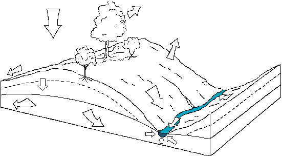
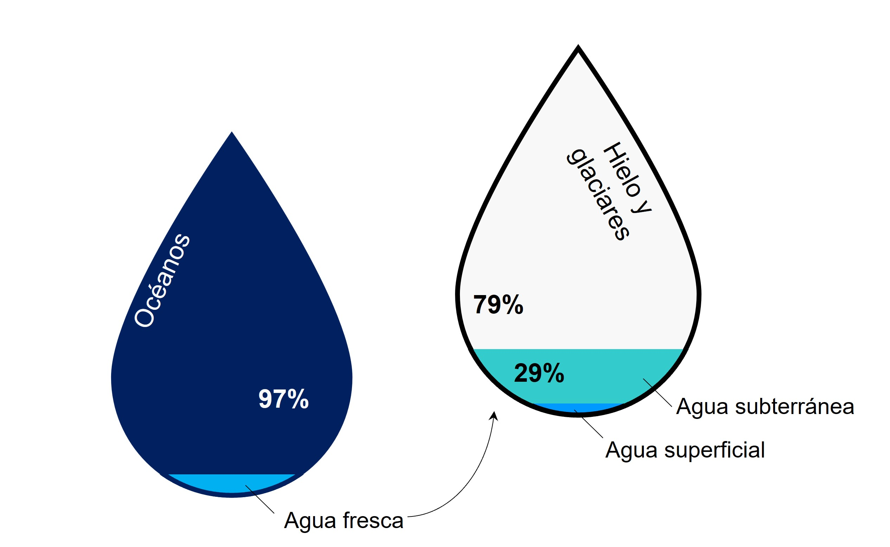
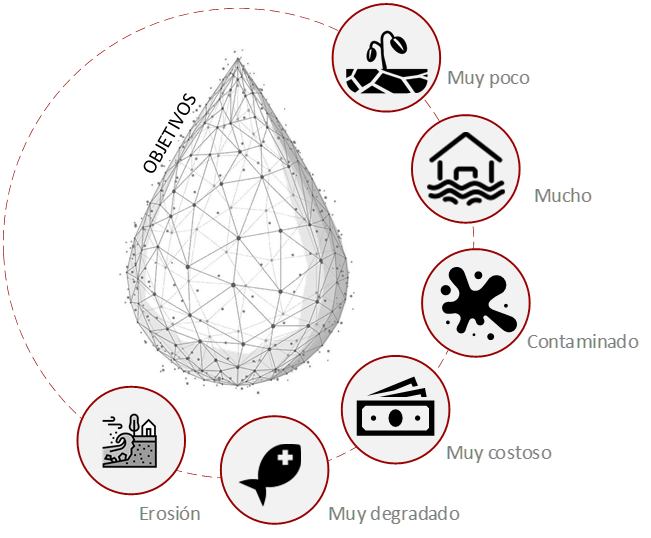

## Sistemas Hidráulicos
Keywords: `Engineering` `Hydraulics` `Open Channel Flow` `Hydraulic Systems` `Hydraulic Modelling`   

### Alcance

En esta clase se presentan los conceptos básicos de la gestión y planificación de sistemas de recursos hídricos, sus objetivos, características y aspectos. Así mismo se presenta la relación de los estudios o evaluación hidráulica en la planificación y gestión integral del recurso.

### Objetivos

* Comprender los conceptos de la gestión y planificación del recurso hidráulico.
* Conocer los conceptos y características básicas de un estudio hidráulico.
* Entender los procedimientos y estudios relacionados con un proyecto de ingeniería asociados a la intervención de un cuerpo de agua superficial.

### Requerimientos

* Conocimientos básicos en ingeniería.
* Conocimientos básicos en hidráulica e hidrología.

### Sistemas de Recursos Hidráulicos

Los recursos hídricos son especiales y primordiales. La vida en el planeta depende del agua, la mayoría de nuestras actividades requieren de este recurso, como los alimentos que cultivamos, procesamos y consumimos, el saneamiento básico, las diferentes actividades económicas e industriales y el consumo humano. La importancia del agua para nuestro bienestar está fuera de toda duda, nuestra dependencia indudablemente durará para siempre.

Aunque los recursos hidráulicos en nuestro planeta son abundantes, no se distribuye como quisiéramos. En algunos lugares y momentos hay demasiado o muy poco, o lo que existe está demasiado contaminado o es demasiado costoso obtenerlo. A esto podemos sumarle los cambios a nivel global en las últimas décadas, como el calentamiento, el crecimiento poblacional, cambios en el uso del suelo y la densificación de las ciudades.

Si se considera toda el agua de la Tierra, cerca del 97% se encuentra en los mares y océanos y la disponible en ríos, lagos y embalses para el consumo humano inmediato no supera el 0,01 % del total. En términos de la disponibilidad, el panorama es aún más inquietante. Mientras que en 1975 la disponibilidad rondaba los 13k m3 por persona por año, este valor se ha reducido a unos 6k m3; mientras tanto, la calidad del agua también se ha deteriorado severamente. 

En el otro extremo, las leyes de continuidad prevalecientes indican que la severidad y la duración de la sequía también aumentarán. Es probable que este aumento de los riesgos tenga graves consecuencias regionales. Algunos estudios sugieren que las regiones húmedas se volverán aún más húmedas, mientras que las regiones secas se volverán cada vez más áridas.

#### Gestión y planeación de los recursos hídricos

Las actividades de planificación y gestión de los recursos hídricos suelen estar motivadas por la comprensión de que hay necesidades o problemas que resolver o por el hecho de que se presenten oportunidades para obtener mayores beneficios al cambiar la gestión y el uso del agua y los recursos del suelo. Estos beneficios se pueden medir de maneras diferentes y cualquier forma de evaluar el beneficio puede provocar conflicto. Por lo que es necesario realizar un estudio e investigación cuidadosos, así como contar con la participación total de las partes interesadas, en la búsqueda del mejor plan de gestión.

Algunos objetivos comunes en la planificación y gestión son reducir la frecuencia y/o la gravedad de las consecuencias adversas de las sequías, las inundaciones y la contaminación excesiva, aumentar los suministros de agua disponibles, el aprovechamiento de energía hidroeléctrica, mejorar la recreación y/o la navegación, mejorar la calidad del agua y mejorar las condiciones de los ecosistemas. Los criterios cuantitativos de rendimiento de cada sistema pueden ayudar a juzgar los beneficios netos relativos, cualquiera que sea su medida, de planes y políticas de gestión alternativos.

#### Gestión integrada de los recursos hídricos

El concepto de la gestión integrada de los recursos hídricos (Integrated Water Resources Management - IWRM), se ha desarrollado durante las últimas décadas como el enfoque ideal en la gestión y planeación. La gestión de los recursos hídricos se ha transformado de un enfoque principalmente orientado a la oferta y con sesgo de ingeniería a un enfoque multisectorial orientado a la demanda, a menudo denominado gestión integrada de los recursos hídricos.  

La gestión integrada es un proceso que promueve el desarrollo y la gestión coordinados del agua, la tierra y los recursos relacionados, con el fin de maximizar el bienestar económico y social resultante de manera equitativa sin comprometer la sostenibilidad de los ecosistemas vitales. La gestión integrada considera el uso de los recursos en relación con las actividades y funciones sociales y económicas. Estos determinan la necesidad de leyes y reglamentos relacionados con el aprovechamiento sostenible y beneficioso de los recursos hídricos.

A la gestión integrada y planificación podemos agregarle el concepto de seguridad hídrica, como la capacidad de una población para salvaguardar el acceso de calidad al recurso vital, considerando los objetivos y aspectos del desarrollo sostenible como el suministro de agua potable y saneamiento, la productividad del agua en la agricultura, la industria y la energía, la protección del medio ambiente y la reducción de inundaciones y sequías.

#### Aspectos en la gestión y planeación

Teniendo una mejor cosmovisión de la gestión y planificación de los recursos hídricos, voy a mencionar algunos de los aspectos relevantes a tener en cuenta:

* Técnicos.
* Evaluaciones hidrológicas.
* Evaluaciones hidráulicas.
* Estimación costo - beneficio.
* Evaluaciones ambientales.
* Financiero y económico.
* Institucional y de gobierno.
* Modelos de impacto y evaluación de la planeación.

### Estudios y evaluación hidráulica

La planificación y gestión de los sistemas de recursos hídricos es una actividad multidisciplinaria. Una de sus campos es el modelado y análisis de los sistemas de recursos hídricos, el cual implica aquellos aportes de las ciencias naturales y sociales aplicables y de las personas que se verán afectadas. Los métodos más apropiados para la planificación y gestión suelen ser los más simples, principalmente porque son más fáciles de entender y explicar, requieren menos insumos y tiempo. Así mismo, son más fáciles de aplicar a cuestiones o problemas específicos. Esto no implica que los métodos más sofisticados y complejos sean menos útiles, sino que por las condiciones y disponibilidad de la información, a veces, es la única forma en que se puede proporcionar la información necesaria.

En términos de los estudios y modelos hidráulicos, al momento de seleccionar un método o modelo particular, hay que revisar varios factores, como las características de los problemas o necesidad, la información disponible y necesaria, el nivel de precisión deseado, la disponibilidad de datos y su costo, y el tiempo requerido para realizar el análisis. La elección de un método de solución en particular debe basarse en el conocimiento de varios enfoques metodológicos, sus ventajas y limitaciones. No existe un mejor enfoque para analizar todos los problemas.

Las intervenciones o proyectos que se realizan sobre un cuerpo de agua superficial requieren una serie de procedimientos y estudios que por lo general deben ser aprobados por las autoridades ambientales competentes.  Algunos de los estudios deben considerar temas relacionados con análisis de frecuencias, obtención de caudales, análisis de batimetrías, modelamiento hidráulico, transporte de sedimentos, definición de planicies de inundación y análisis de obras hidráulicas típicas. Dentro de estos estudios preliminares y/o paralelos, que son usados como insumo en el proceso de estudio y modelación hidráulica podemos resumir los más relevantes como: 

* Topografía y batimetría
* Estudios geotécnicos
* Estudios geológicos
* Estudios de cobertura 
* Estudios hidrológicos
* Estudios hidroclimatológicos
* Transporte de sedimentos
* Revisión y/o diseño de estructuras

### Referencias
- Water Resourse System Planning and Management. Loucks D.P. and van Beek E. Springer. DOI 10.1007/978-3-319-44234-1_1.
- Hydraulic modeling. Lyatkher, Victor; Proudovsky Alexander. Scrivener Publishing. 2016
- Hydraulic modeling. Concepts and practice. American Society of Civil Engineers, ASCE. 2000.
- Flood Risk Assessment and Management. Chapter 9, Hydraulic Modelling. Schuman Andreas H. Springer. 2011.
- Source Integrated Water Resources Management in Action. WWAP, DHI Water Policy, UNEP-DHI Centre for Water and Environment. 2009.
- Integrated Water Resources Management Plans. Training Manual and Operational Guide.United Nations Development
Programme (UNDP).2005.
    

### Control de versiones

| Versión | Descripción                                                       |                    Autor                    | Horas |
|:-------:|-------------------------------------------------------------------|:-------------------------------------------:|:-----:|
| 2022.08 | Versión inicial con definición de estructura general y contenido. | [juanrodace](https://github.com/juanrodace) |  2.0  |
| 2022.08 | Inclusión de conceptos y diagramas.                               | [juanrodace](https://github.com/juanrodace) |  1.0  |
| 2022.10 | Inclusión de conceptos y diagramas.                               | [juanrodace](https://github.com/juanrodace) |  2.0  |
| 2022.11 | Inclusión de conceptos y diagramas.                               | [juanrodace](https://github.com/juanrodace) |  3.0  |
| 2022.12 | Inclusión de conceptos y diagramas.                               | [juanrodace](https://github.com/juanrodace) |  2.0  |
| 2023.01 | Desarrollo de contenido multimedia.                               | [juanrodace](https://github.com/juanrodace) |  2.5  |

### Licencia, cláusulas y condiciones de uso

| [:arrow_backward:Anterior](../UnsteadyFlow) | [:house: Inicio](../../Readme.md) | [:beginner: Ayuda/Colabora](https://github.com/juanrodace/J.HRAS/discussions/2) | [Siguiente:arrow_forward:](../HECRAS) |
|---------------------------------------------|-----------------------------------|---------------------------------------------------------------------------------|---------------------------------------|

_J.HRAS es de uso libre para fines académicos, conoce nuestra licencia, cláusulas, condiciones de uso y como referenciar los contenidos publicados en este repositorio, dando [clic aquí](https://github.com/juanrodace/J.HRAS/wiki/License)._

_¡Encontraste útil este repositorio!, apoya su difusión marcando este repositorio con una ⭐ o síguenos dando clic en el botón Follow de [juanrodace](https://github.com/juanrodace) en GitHub._

