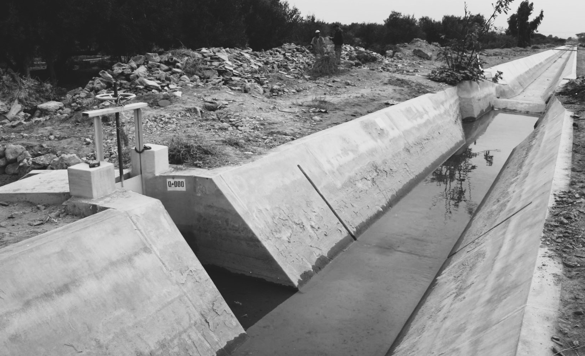

## Sistemas Hidráulicos y Modelación
Keywords: `Engineering` `Hydraulics` `Open Channel Flow` `Hydraulic Systems` `Hydraulic Modelling`   

### Alcance

Conceptos básicos requeridos para realizar estudios asociados a la intervención de un cuerpo de agua superficial para atender un problema o necesidad de manejo, intervención, evaluación, aprovechamiento o similares. Igualmente, se presentan los conceptos relacionados con la definición de condiciones de frontera para la modelación hidráulica, así como los conceptos de calibración de un modelo que competen la determinación de características físicas y operacionales de un sistema existente, que ingresados como datos al modelo computacional permitan obtener resultados realistas.

### Objetivos

* Conocer los conceptos y características básicas de un estudio hidráulico.
* Entender los procedimientos y estudios relacionados con un proyecto de ingeniería asociados a la intervención de un cuerpo de agua superficial.
* Conocer la definición de modelación en la ingeniería.
* Entender los conceptos y características relacionadas con la modelación hidráulica.
* Estudiar los conceptos de calibración de un modelo.

### Requerimientos

* Conocimientos básicos en ingeniería.
* Conocimientos básicos en hidráulica e hidrología.

### Sistemas de Recursos Hidráulicos

Los recursos hídricos son especiales y primordiales. La vida en el planeta depende del agua, la mayoría de nuestras actividades requieren de este recurso, como los alimentos que cultivamos, procesamos y consumimos, el saneamiento básico, las diferentes actividades económicas e industriales y el consumo humano. La importancia del agua para nuestro bienestar está fuera de toda duda, nuestra dependencia indudablemente durará para siempre.

Aunque los recursos hidráulicos en nuestro planeta son abundantes, no se distribuye como quisiéramos. En algunos lugares y momentos hay demasiado o muy poco, o lo que existe está demasiado contaminado o es demasiado costoso obtenerlo. A esto podemos sumarle los cambios a nivel global en las últimas décadas, como el calentamiento, el crecimiento poblacional, cambios en el uso del suelo y la densificación de las ciudades.

Si se considera toda el agua de la Tierra, cerca del 97% se encuentra en los mares y océanos y la disponible en ríos, lagos y embalses para el consumo humano inmediato no supera el 0,01 % del total. En términos de la disponibilidad, el panorama es aún más inquietante. Mientras que en 1975 la disponibilidad rondaba los 13k m3 por persona por año, este valor se ha reducido a unos 6k m3; mientras tanto, la calidad del agua también se ha deteriorado severamente. 

En el otro extremo, las leyes de continuidad prevalecientes indican que la severidad y la duración de la sequía también aumentarán. Es probable que este aumento de los riesgos tenga graves consecuencias regionales. Algunos estudios sugieren que las regiones húmedas se volverán aún más húmedas, mientras que las regiones secas se volverán cada vez más áridas.

### Gestión y planeación de los recursos hídricos

Las actividades de planificación y gestión de los recursos hídricos suelen estar motivadas por la comprensión de que hay necesidades o problemas que resolver o por el hecho de que se presenten oportunidades para obtener mayores beneficios al cambiar la gestión y el uso del agua y los recursos del suelo. Estos beneficios se pueden medir de maneras diferentes y cualquier forma de evaluar el beneficio puede provocar conflicto. Por lo que es necesario realizar un estudio e investigación cuidadosos, así como contar con la participación total de las partes interesadas, en la búsqueda del mejor plan de gestión.

Algunos objetivos comunes en la planificación y gestión son reducir la frecuencia y/o la gravedad de las consecuencias adversas de las sequías, las inundaciones y la contaminación excesiva, aumentar los suministros de agua disponibles, el aprovechamiento de energía hidroeléctrica, mejorar la recreación y/o la navegación, mejorar la calidad del agua y mejorar las condiciones de los ecosistemas. Los criterios cuantitativos de rendimiento de cada sistema pueden ayudar a juzgar los beneficios netos relativos, cualquiera que sea su medida, de planes y políticas de gestión alternativos.

### Planificación, gestión , modelación y análisis 

La planificación y gestión de los sistemas de recursos hídricos es una actividad multidisciplinaria. Una de sus campos es el modelado y análisis de los sistemas de recursos hídricos, el cual implica aquellos aportes de las ciencias naturales y sociales aplicables y de las personas, las partes interesadas, que se verán afectadas. Es un desafío.

### Estudios Hidráulicos

Las intervenciones o proyectos que se realizan sobre un cuerpo de agua superficial requieren una serie de procedimientos y estudios que por lo general deben ser aprobados por las autoridades ambientales competentes. Algunos de los estudios deben considerar temas relacionados con análisis de frecuencias, obtención de caudales, análisis de batimetrías, modelamiento hidráulico, transporte de sedimentos, definición de planicies de inundación y análisis de obras hidráulicas típicas.

#### Ciclo de un estudio de ingeniería

#### Estudios previos requeridos
* Topografía
* Batimetría
* Hidrología
* Aforos
* Estructuras
* Transporte de sedimentos

#### Parámetros hidráulicos e hidrológicos

#### Periodos de retorno.

#### Obtención de caudales.

### Modelación en la ingeniería

La modelación es una importante vía para el desarrollo de conocimiento, en donde se estudia un sustituto del objeto (prototipo, naturaleza) llamado modelo. Si la naturaleza del objeto _‘N’_ se caracteriza por una serie de valores _XN_, entonces, al modelar, se crea un objeto _‘M’_ de este tipo, cuyas características _XM_. 

Los modelos se pueden clasificar en modelos sustantivos y simbólicos. El primero de ellos son los objetos materiales, cuyas características se corresponden de alguna manera con las características de la naturaleza. El segundo representa símbolos de notación (diagramas, gráficos, dibujos, fórmulas, palabras, etc.), como el caso de los modelos matemáticos, realizados por medio del lenguaje matemático y la lógica. El modelado matemático realizado mediante un proceso computacional se denomina comúnmente modelado numérico.

La calidad de los modelos depende del éxito de la esquematización, algunos modelos pueden ser mejores que otros, pero todos tienen algún grado de incertidumbre e inexactitudes, ya que se basan en una hipótesis. La evaluación de su calidad es la comparación de valores, correspondientes a la hipótesis utilizada, con las características medidas de los fenómenos reales a los que se refieren. 

Particularmente en el modelado en ingeniería, es posible distinguir dos grandes clases. La modelación numérica, cuya solución resulta de un proceso computacional sobre varios operadores, con valores base y resultados de acuerdo con un plan y funciones definidas. El orden de las operaciones en la solución del problema se denomina algoritmo de su solución.  La segunda clase es la modelación análoga, la cual utiliza métodos y herramientas con representación directa, que incluyen dispositivos analógicos que representan físicamente una clase particular de problemas matemáticos. 

### Modelación hidráulica
Los fenómenos hidráulicos pueden ser estudiados mediante modelos físicos y numéricos. La modelación física es un método tradicional de ingeniería hidráulica, utilizado con éxito en el siglo pasado, el modelado numérico con el uso de computadoras es el último logro. La solución de problemas y aplicaciones desarrolladas por medio de modelos numéricos está en constante expansión, creando nuevas perspectivas en la solución de problemas hidráulicos complejos. 

Entre la modelación **física** y la **numérica** existe una gran relación, ambos se basan en un modelo matemático del fenómeno, reflejando el lado más significativo del objeto estudiado, y por otro lado, ambos modelan el objeto significativamente esquematizado. Las diferencias entre la modelación física y numérica pueden deberse a las siguientes circunstancias: La modelación física es una herramienta altamente especializada, mientras que las computadoras pueden ser una solución para los más diversos problemas, al tener la posibilidad de recibir la decisión en su resolución algorítmica de un problema sobre el conjunto seleccionado de operadores. 

### Modelación numérica en hidráulica

#### Definición de un modelo

### Referencias
- Water Resourse System Planning and Management. Loucks D.P. and van Beek E. Springer. DOI 10.1007/978-3-319-44234-1_1.
- Hydraulic modeling. Lyatkher, Victor; Proudovsky Alexander. Scrivener Publishing. 2016
- Hydraulic modeling. Concepts and practice. American Society of Civil Engineers, ASCE. 2000.
- Flood Risk Assessment and Management. Chapter 9, Hydraulic Modelling. Schuman Andreas H. Springer. 2011.
    

### Control de versiones

| Versión | Descripción                                                       |                    Autor                    | Horas |
|:-------:|-------------------------------------------------------------------|:-------------------------------------------:|:-----:|
| 2022.08 | Versión inicial con definición de estructura general y contenido. | [juanrodace](https://github.com/juanrodace) |  2.0  |
| 2022.08 | Inclusión de conceptos y diagramas.                               | [juanrodace](https://github.com/juanrodace) |  1.0  |
| 2022.10 | Inclusión de conceptos y diagramas.                               | [juanrodace](https://github.com/juanrodace) |  2.0  |
| 2022.11 | Inclusión de conceptos y diagramas.                               | [juanrodace](https://github.com/juanrodace) |   P   |
| 2022.11 | Desarrollo de contenido multimedia.                               | [juanrodace](https://github.com/juanrodace) |   P   |

### Licencia, cláusulas y condiciones de uso

| [:arrow_backward:Anterior](../UnsteadyFlow) | [:house: Inicio](../../Readme.md) | [:beginner: Ayuda/Colabora](https://github.com/juanrodace/J.HRAS/discussions/6) | [Siguiente:arrow_forward:](../HECRAS) |
|----------------------------------|-----------------------------------|---------------------------------------------------------------------------------|----------------------------------|

_J.HRAS es de uso libre para fines académicos, conoce nuestra licencia, cláusulas, condiciones de uso y como referenciar los contenidos publicados en este repositorio, dando [clic aquí](https://github.com/juanrodace/J.HRAS/wiki/License)._

_¡Encontraste útil este repositorio!, apoya su difusión marcando este repositorio con una ⭐ o síguenos dando clic en el botón Follow de [juanrodace](https://github.com/juanrodace) en GitHub._