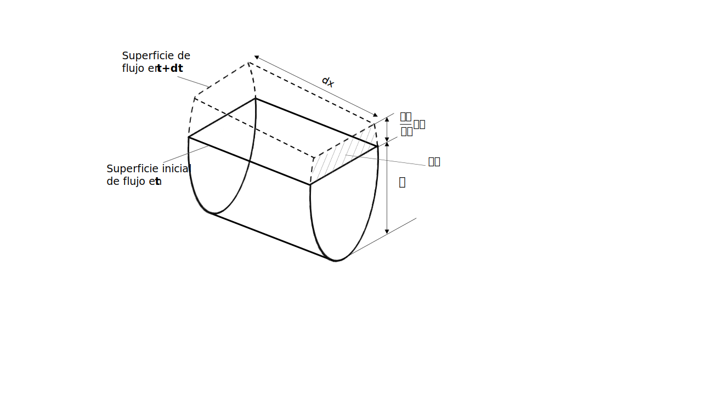
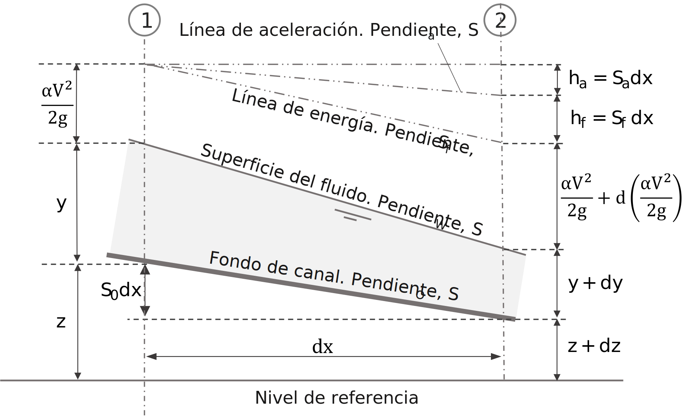
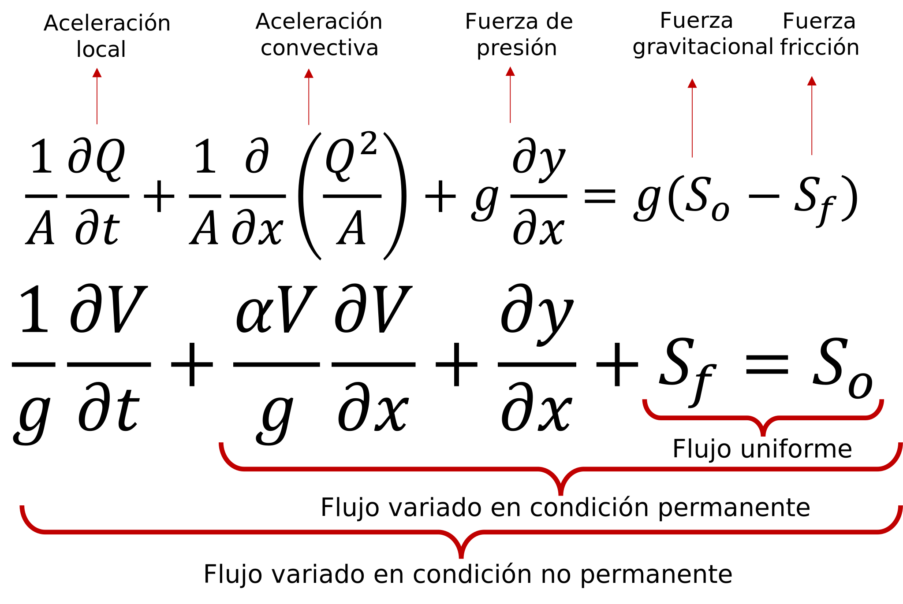

## Flujo no permanente
Keywords: `Hydraulics` ` Open Channel flow` `Manning` `UnsteadyFlow` `Saint-Venant` 

> En la ilustración, canal de aguas lluvia en White Oak Ave. _Robley, Feather_.

### Alcance

El flujo en canales a superficie libre puede darse en condiciones permanentes y no permanentes. Este último suele ser la condición de flujo en los sistemas de la vida real, donde el caudal generalmente varía con el tiempo. En esta clase se revisan los conceptos particulares del flujo no permanente en un sistema de flujo a superficie libre.

### Objetivos

* Comprender las características del flujo a superficie libre en condición no permanente.
* Analizar las ecuaciones y características del flujo no permanente.

### Requerimientos

* Conocimientos en mecánica de fluidos.
* Microsoft Excel

### Flujo no permanente

En muchos canales abiertos como canales de drenaje, alcantarillas pluviales y arroyos naturales, es normal que se presente una variación de las condiciones de flujo con el tiempo. Estas variaciones son significativas, particularmente durante y después de una tormenta. En la práctica, para muchos estudios hidráulicos con flujo a superficie libre, es común usar las ecuaciones de flujo permanente para calcular las profundidades y/o condiciones máximas en un canal. Sin embargo, este enfoque es conservador, ya que no tiene en cuenta los cambios en el flujo relacionados a su vez con el almacenamiento en el canal. Entender mejor como se comporta el flujo frente a estas variaciones, solo es posible mediante el uso de las ecuaciones de flujo a superficie libre en condición no permanente. 

El análisis de los flujos no permanentes suele ser más complejo que el de los flujos permanentes porque sus condiciones pueden variar con respecto al espacio y al tiempo, es decir, son función tanto del espacio como del tiempo. Por lo tanto, las ecuaciones que describen el flujo son representadas con derivadas parciales, ya que las variables dependientes de profundidad **'y'** y velocidad del flujo **'V'** son funciones de más de una variable independiente (espacio y tiempo). Estas complejas ecuaciones no se prestan a soluciones analíticas de forma cerrada, por lo que es necesario usar métodos numéricos para su solución. Los investigadores han dedicado enormes esfuerzos al desarrollo de métodos de solución eficientes para las ecuaciones de flujo no permanente y la mayoría se pueden categorizar ampliamente en métodos de diferencias finitas y elementos finitos. A continuación se presentan algunos ejemplos o situaciones en las cuales se desarrolla el flujo no permanente.

* Apertura o cierre de un sistema hidroeléctrico (compuertas y turbinas).
* Arranque o parada de sistemas de bombeo con flujo desde o hacia el sistema a superficie libre.
* Apertura o cierre de compuertas de control de flujo.
* Ondas de crecientes en corrientes naturales asociadas a tormentas.
* Ondas de inundación asociadas a la operación o fallo de una estructura de control (presa, dique, vertedero).
* Flujo en sistemas de alcantarillado y canales de drenaje pluvial. 

### Ecuación de continuidad del flujo no permanente

> Continuidad de flujo no permanente.

De acuerdo con la definición de Chow(2009)[^1], la ley de continuidad para flujo no permanente puede establecerse considerando la conservación de masa en un espacio infinitesimal entre dos secciones de canal **dx**. En un flujo no permanente el caudal cambia con la distancia a una tasa **$\frac{𝜕Q}{𝜕x}$**, y la profundidad cambia con el tiempo a una tasa de **$\frac{𝜕y}{𝜕t}$**. Al considerar el cambio del flujo a través del espacio en el tiempo **𝜕t**, el cambio correspondiente en el almacenamiento dentro del canal en el espacio **𝜕x** y la incompresibilidad del líquido, se puede plantear que el cambio neto en el caudal más el cambio en el almacenamiento debería ser cero. Llegando a la _ecuación de flujo no permanente para canales abiertos_. 

 
Donde, <b>Q</b> es el caudal o flujo volumétrico,<b>A</b> es el área de la sección transversal,  
<b>q</b> es el caudal unitario ,<b>y</b> es la profundidad de flujo, <b>𝜕x</b> corresponde a la variación espacial en 'x'  
<b>𝜕t</b> al cambio de la variable tiempo y <b>ql</b> corresponde al flujo lateral por unidad de longitud.  

### Ecuación dinámica para flujo no permanente

El análisis de las ecuaciones de flujo permanente, puede simplificarse al considerar permanente una o dos de las dimensiones espaciales. Al considerar la hipótesis de flujo permanente bidimensional (en la sección transversal), se considera la variación de la velocidad de flujo y consecuentemente de la respectiva aceleración. Esta aceleración produce una fuerza y el trabajo realizado por esta fuerza a lo largo de la distancia **dx**, causa pérdidas de energía adicionales que pueden representarse como **$h_{a}=\frac{1}{g}\frac{𝜕V}{𝜕t}dx$**.

> Representación simplificada de la energía en flujo no permanente.

De acuerdo con la figura de representación simplificada de energía en el flujo no permanente, se puede decir que el cambio total de la energía **(H)** en la longitud infinitesimal **dx** puede tratarse exactamente igual que en el caso de flujo permanente, excepto que debe incluirse una la pérdida adicional debida a la aceleración. Es decir que la pérdida total de energía se compone de pérdida debida a la fricción **$h_{f}=S_{f} dx$** y la pérdida debida a la aceleración **$h_{a}=S_{a}dx$**. Donde **$S_{f}$** corresponde a la pendiente de la línea de energía y **$S_{a}$** es conocida como pendiente de la línea de aceleración. Al plantear la ecuación de conservación de energía en la longitud infinitesimal de canal y simplificar, podemos llegar a la _ecuación dinámica general para flujo no permanente gradualmente variado_.

 
Donde, <b>V</b> es la velocidad media de flujo, <b>𝜕x</b> corresponde al cambio de la variable espacial 'x' 
y <b>𝜕t</b> al cambio de la variable tiempo.  

Las ecuaciones de continuidad y la ecuación dinámica para flujo no permanente las publicó por primera vez Saint-Venant. Su validez ha sido verificada mediante muchas observaciones y experimentos. Sin embargo, debido a su complejidad matemática, la integración exacta de estas ecuaciones es imposible. Para aplicaciones prácticas, puede obtenerse una solución de las ecuaciones mediante métodos numéricos de paso aproximados o basados en suposiciones simplificadas. 

### Ecuaciones de Saint-Venant
Como ya he mencionado, las tres ecuaciones fundamentales de la hidráulica describen el flujo en sistemas a superficie libre. Dos variables, como la profundidad de flujo y la velocidad media o, la profundidad de flujo y el caudal, son suficientes para definir las condiciones de flujo en una sección transversal. Por lo tanto, se requieren dos de estas ecuaciones para el análisis de un flujo en particular. Entonces la ecuación de continuidad y la ecuación de _momentum_ o energía suelen usarse dependiendo del flujo a evaluar, por ejemplo cuando se presentan discontinuidades se utiliza la ecuación de _momentum_, ya que no requiere evaluar las perdidas en estos cambios. Al analizar el flujo no permanente, la diferencia entre la ecuación de _momentum_ y de energía, es básicamente los coeficientes **α** y **β** los cuales son equivalentes. Las ecuaciones de Saint-Venant, previamente presentadas, parten del análisis de la ecuación de continuidad y de _momentum_, considerando algunos supuestos o hipótesis:

* Distribución de presiones hidrostática.
* Pendiente del fondo pequeña.
* La velocidad del flujo en una sección transversal es constante (velocidad media).
* Las pérdidas pueden ser simuladas con las ecuaciones de resistencia de flujo permanente (Manning).

A continuación se presentan dos expresiones diferentes para la ecuación dinámica de flujo, a partir de la ecuación de *momentum*, una en términos del flujo volumétrico y otra de la velocidad media del flujo.  En la parte superior se identifica cada término de la ecuación y su asociación con la aceleración o las fuerzas asociadas al flujo. Así mismo, en la parte inferior vemos que al simplificar los diferentes terminos de la ecuación, podríamos obtener las ecuaciones de flujo uniforme y flujo gradualmente variado en condición permanente. 

 

Las ecuaciones de continuidad y momentum forman un conjunto de ecuaciones diferenciales parciales no lineales. No se dispone de una solución de forma cerrada de estas ecuaciones, excepto en casos muy simplificados. Por lo tanto, se utilizan métodos numéricos para su integración. Al determinar el tipo de ecuaciones diferenciales, es posible identificar la dependencia con la celeridad de la onda. Y se puede afirmar que las ecuaciones son ecuaciones diferenciales parciales hiperbólicas. Este tipo de ecuación representa la propagación de ondas en diferentes medios. Los procedimientos computacionales, denominados procedimientos de marcha, son adecuados para la integración numérica de estas ecuaciones.

#### Aplicación ED con HEC-RAS

El software estudiado en este curso, utiliza un esquema implícito de diferencias finitas para la solución de las ecuaciones diferenciales del flujo. El procedimiento aceptado es el esquema implícito de cuatro puntos, también conocido como esquema de caja. Bajo este esquema, las derivadas espaciales y los valores de función se evalúan en un punto interior. Para un tramo de río, resulta un sistema de ecuaciones simultáneas. La solución simultánea es un aspecto importante de este esquema porque permite que la información de todo el alcance influya en la solución en cualquier punto. En consecuencia, el paso de tiempo puede ser significativamente mayor que con esquemas numéricos explícitos. 

#### Flujo bidimensional

A partir de la versión 5 del software HEC-RAS, es posible ejecutar modelaciones bidimensionales en flujo no permanente utilizando las ecuaciones completas de Saint Venant, inclusive los términos correspondiente a la modelación de turbulencia y el efecto Coriolis. 

### Referencias
- The hydraulics of Channel Flow: An Introduction. Chanson H. 2nd Ed.,Elsevier Butterworth-Heinemann. 2004.
- Open channel Hydraulics. Chow, Ven Te. 2nd Ed., Blackburn Press. 2009.
- Flow in open channels. Subramanya K. 3th Ed., Tata McGraw-Hill Publishing. 2009. 
- Open Channel Flow. Chaudhry, M. Hanif. 2nd Ed., Springer. 2008
- Hydraulic Reference Manual. HEC-RAS, River Analysis System. U.S. 2020.

### Control de versiones

| Versión | Descripción                                                       |                    Autor                    | Horas |
|:-------:|-------------------------------------------------------------------|:-------------------------------------------:|:-----:|
| 2022.10 | Versión inicial con definición de estructura general y contenido. | [juanrodace](https://github.com/juanrodace) |  1.0  |
| 2022.10 | Inclusión de conceptos y diagramas.                               | [juanrodace](https://github.com/juanrodace) |  3.0  |
| 2022.11 | Inclusión de conceptos y diagramas.                               | [juanrodace](https://github.com/juanrodace) |  3.0  |
| 2022.11 | Desarrollo de contenido multimedia.                               | [juanrodace](https://github.com/juanrodace) |  2.0  |

### Licencia, cláusulas y condiciones de uso

| [:arrow_backward:Anterior](../VariedFlow) | [:house: Inicio](../../Readme.md) | [:beginner: Ayuda/Colabora](https://github.com/juanrodace/J.HRAS/discussions/3) | [Siguiente:arrow_forward:](../HydraulicSystems) |
|-------------------------------------------|-----------------------------------|---------------------------------------------------------------------------------|-------------------------------------------------|

_J.HRAS es de uso libre para fines académicos, conoce nuestra licencia, cláusulas, condiciones de uso y como referenciar los contenidos publicados en este repositorio, dando [clic aquí](../../License.md)._

_¡Encontraste útil este repositorio!, apoya su difusión marcando este repositorio con una ⭐ o síguenos dando clic en el botón Follow de [juanrodace](https://github.com/juanrodace) en GitHub._

[^1]: Open channel Hydraulics. Chow, Ven Te. 2nd Ed., Blackburn Press. 2009.
[^2]: