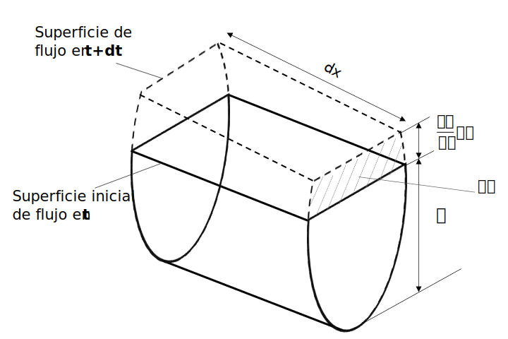

## Flujo no permanente
Keywords: `Hydraulics` ` Open Channel flow` `Manning` `UnsteadyFlow`

> En la ilustración, canal de aguas lluvia en White Oak Ave. _Robley, Feather_.

### Alcance

El flujo en canales a superficie libre puede darse en condiciones permanentes y no permanentes. Este último suele ser la condición de flujo en los sistemas de la vida real, donde el caudal generalmente varía con el tiempo. En esta clase se revisan los conceptos particulares del flujo no permanente en un sistema de flujo a superficie libre.

### Objetivos

* Comprender las características del flujo a superficie libre en condición no permanente.
* Analizar las ecuaciones y características del flujo no permanente.

### Requerimientos

* Conocimientos en mecánica de fluidos.
* Microsoft Excel

### Flujo no permanente

En muchos canales abiertos como canales de drenaje, alcantarillas pluviales y arroyos naturales, se presenta una variación de las condiciones de flujo con el tiempo. Estas variaciones son significativas, particularmente durante y después de una tormenta. En la práctica, para muchos estudios hidráulicos con flujo a superficie libre, es común usar las ecuaciones de flujo permanente para calcular las profundidades y/o condiciones máximas en un canal. Sin embargo, este enfoque es conservador, ya que no tiene en cuenta los cambios en el flujo relacionados a su vez con el almacenamiento en el canal. Entender mejor como se comporta el flujo frente a estas variaciones, solo es posible mediante el uso de las ecuaciones de flujo a superficie libre en condición no permanente. 

El análisis de los flujos no permanentes suele ser más complejo que el de los flujos permanentes porque sus condiciones pueden variar con respecto al espacio y al tiempo, es decir, son función tanto del espacio como del tiempo. Por lo tanto, las ecuaciones que describen el flujo son representadas con derivadas parciales, ya que las variables dependientes de profundidad **'y'** y velocidad del flujo **'V'** son funciones de más de una variable independiente (espacio y tiempo). Estas complejas ecuaciones no se prestan a soluciones analíticas de forma cerrada, por lo que es necesario usar métodos numéricos para su solución. Los investigadores han dedicado enormes esfuerzos al desarrollo de métodos de solución eficientes para las ecuaciones de flujo no permanente y la mayoría se pueden categorizar ampliamente en métodos de diferencias finitas y elementos finitos.

## Ecuación de continuidad del flujo no permanente

> Continuidad de flujo no permanente.

De acuerdo con la definición de Chow(2009)[^1], la ley de continuidad para flujo no permanente puede establecerse considerando la conservación de masa en un espacio infinitesimal entre dos secciones de canal **dx**. En un flujo no permanente el caudal cambia con la distancia a una tasa **$\frac{\partial Q}{\partial x}$**, y la profundidad cambia con el tiempo a una tasa de **$\frac{\partial y}{\partial t}$**. Al considerar el cambio del flujo a través del espacio en el tiempo **dt**, el cambio correspondiente en el almacenamiento dentro del canal en el espacio **dx** y la incompresibilidad del líquido, se puede plantear que el cambio neto en el caudal más el cambio en el almacenamiento debería ser cero. Llegando a la _ecuación de flujo no permanente para canales abiertos_. 

## Ecuación dinámica para flujo no permanente

### Referencias
- Fluid mechanics. Fundamentals and Applications.. Cengel Y., Cimbala J. McGraw-Hill.2006.
- Introduction to fluid mechanics. Fox and McDonald's. 8th Ed., Jhon Wilwy & Sons, Inc. 2011. 
- The hydraulics of Channel Flow: An Introduction. Chanson H. 2nd Ed.,Elsevier Butterworth-Heinemann. 2004.
- Open channel Hydraulics. Chow, Ven Te. 2nd Ed., Blackburn Press. 2009.
- Flow in open channels. Subramanya K. 3th Ed., Tata McGraw-Hill Publishing. 2009. 

### Control de versiones

| Versión | Descripción                                                       |                    Autor                    | Horas |
|:-------:|-------------------------------------------------------------------|:-------------------------------------------:|:-----:|
| 2022.10 | Versión inicial con definición de estructura general y contenido. | [juanrodace](https://github.com/juanrodace) |  1.0  |
| 2022.10 | Inclusión de conceptos y diagramas.                               | [juanrodace](https://github.com/juanrodace) |  1.0  |

### Licencia, cláusulas y condiciones de uso

| [:arrow_backward:Anterior](../VariedFlow) | [:house: Inicio](../../Readme.md) | [:beginner: Ayuda/Colabora](https://github.com/juanrodace/J.HRAS/discussions/3) | [Siguiente:arrow_forward:](../HydraulicSystems) |
|----------------------------------------|------------------------------------|---------------------------------------------------------------------------------|----------------------------------|

_J.HRAS es de uso libre para fines académicos, conoce nuestra licencia, cláusulas, condiciones de uso y como referenciar los contenidos publicados en este repositorio, dando [clic aquí](../../License.md)._

_¡Encontraste útil este repositorio!, apoya su difusión marcando este repositorio con una ⭐ o síguenos dando clic en el botón Follow de [juanrodace](https://github.com/juanrodace) en GitHub._

[^1]: Open channel Hydraulics. Chow, Ven Te. 2nd Ed., Blackburn Press. 2009.
[^2]: 
