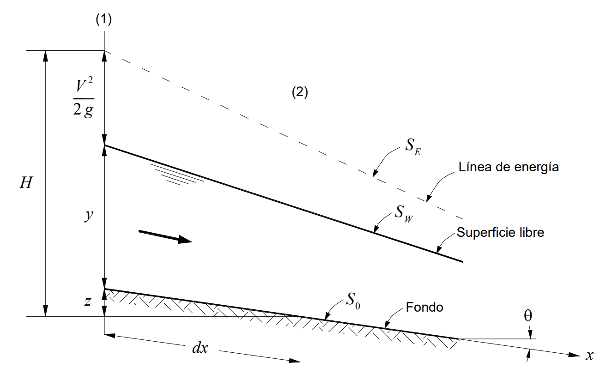

## Flujo uniforme y variado en condición permanente
Keywords: `Hydraulics` ` Open Channel flow` `Manning` `FGV (GVF)` `FRV (RVF)`

> En la ilustración, canal en hidroeléctrica de Colombia. _Fuente anónima_.

### Alcance

El flujo en canales a superficie libre también se clasifica como uniforme (FU) o variado, dependiendo del cambio o no de la profundidad del flujo `y` a lo largo del canal. Así mismo, los flujos variados se clasifican en flujo de rápidamente variado (FRV) y flujo gradualmente variado (FGV). En esta clase se revisan los conceptos particulares del flujo uniforme, gradualmente variado y rápidamente variado en un sistema de flujo a superficie libre en condiciones permanentes.

### Objetivos

* Comprender las características del flujo uniforme en condición permanente.
* Analizar las características del flujo gradualmente variado.
* Estudiar los conceptos del flujo rápidamente variado.

### Requerimientos

* Conocimientos en mecánica de fluidos.
* Microsoft Excel

### Flujo uniforme

Se dice que un sistema a superficie libre se encuentra en condición de flujo uniforme y permanente cuando sus propiedades permanecen constantes a lo largo del canal. Específicamente, cuando la profundidad de flujo `y`, la velocidad media `V` y el flujo o caudal `Q` permanecen constantes en todas las secciones. Así mismo, se afirma que las pendientes de su superficie libre `Sw`, su línea de energía `Se` y su fondo `So` son iguales, es decir, son líneas paralelas. 

> Flujo uniforme en canal a superficie libre. _Tomado de Fig.2.1._[^1]

Esta condición de flujo estrictamente uniforme es muy difícil de encontrar y casi imposible en canales naturales. Este flujo ses puede encontrar en canales largos y rectos con una pendiente y
sección transversal constantes y un revestimiento de las superficies homogéneo.

La profundidad del flujo en flujos uniformes se le llama profundidad normal `Yn`. El flujo permanecerá en la condición uniforme mientras la pendiente `So`, el área de la sección `A` y la rugosidad del canal no tengan algún cambio. 

#### Establecimiento

Desde el punto de vista dinámico, el establecimiento del flujo uniforme será posible cuando las fuerzas gravitacionales y las fuerzas de resistencia al flujo encuentren un equilibrio. Dicha resistencia se relaciona con los esfuerzos de corte los cuales dependen de la velocidad.  Si al inicio o al final de un canal no se encuentra este equilibrio, se presentará una aceleración o desaceleración del flujo, aumentando o reduciendo su velocidad y consecuentemente su resistencia de manera gradual, hasta encontrar el balance entre las fuerzas y, por lo tanto, el flujo uniforme. En este sentido, se puede llegar una expresión matemática que representa el flujo uniforme como la relación entre el esfuerzo de corte `τ`, el peso específico `γ`, el radio hidráulico `R` y la pendiente del canal `So`.

#### Ecuación de Manning

En 1889 el ingeniero irlandés Robert Manning presentó esta ecuación, la cual es la más utilizada para cálculos de flujo en canales a superficie libre.

 
Donde, <b>V</b> es la velocidad media del flujo, <b>n</b> corresponde al coeficiente de rugosidad o de Manning, 
<b>R</b> es el radio hidráulico de la sección transversal (relación de área y perímetro, A/P)  
y <b>So</b> es la pendiente del fondo del canal.  

La mayor dificultad en la aplicación de la ecuación, está en la definición del coeficiente `n`. Para su determinación, Ven T. Chow[^2] recomienda tener en cuenta las siguientes consideraciones: 
- Entender los factores que afectan su valor.
- Consultar una tabla de valores comunes para canales de diferentes tipos.
- Examinar y familiarizarse con la apariencia de algunos canales comunes con coeficientes conocidos.
- Determinar el valor de **n** mediante un proceso analítico basado en la distribución de velocidades en la sección y datos medidos de velocidad y rugosidad.

Como referencia para la definición del coeficiente **n**, se recomienda consultar la tabla de coeficientes de rugosidad de Chow[^2], el cual considera varios tipos de canal con descripción y algunos valores generalmente recomendados para el diseño. Y la [Guía](../../.refs/Guide%20for%20selecting%20Manning's%20Roughness%20Coef.%20USGS.%20P2339..pdf)[^3] o [Reporte](../../.refs/Roughness%20Characteristics%20of%20Natural%20Channels.%20USGS.pdf)[^4] del USGS. 

Como material adicional, puedes acceder al siguiente video de la USGS sobre selección del coeficiente de rugosidad. 

 (https://www.usgs.gov/media/videos/selection-roughness-coefficients)  

### Flujo gradualmente variado

El movimiento o flujo gradualmente variado (FGV), es aquel en el cual hay un cambio suave en la profundidad de flujo a lo largo del canal, y consecuentemente, un cambio en su velocidad. A diferencia del flujo uniforme, las pendientes de energía, flujo y fondo serán diferentes. Esta es una condición mucho más aproximada al flujo a superficie libre en canales naturales y artificiales, considerando los posibles cambios de sección, pendiente, rugosidad y alineamiento. El remanso producido por una presa o vertedero a través de un canal o rio y la caída producida por una caída o desnivel repentino son algunos ejemplos típicos de FGV.

El análisis del FGV parte dos supuestos básicos:
- La pérdida de carga en una sección es la misma que correspondería a un flujo uniforme con la misma velocidad y radio hidráulico que la sección mencionada. Esto quiere decir que, la ecuación de Manning puede usarse para la estimación de la línea de energía en un perfil de FGV, con la condición de que el término de pendiente que se utiliza sea la pendiente de energía y no la pendiente del fondo. 
- La distribución de presiones en cada sección es hidrostática, al considerar que los cambios en la superficie libre y fondo son graduales, dando lugar a aceleraciones normales insignificantes. 
 

> Flujo gradualmente variado en un canal a superficie libre. _Tomado de Fig.8.6._[^1]

#### Ecuación dinámica del FGV

Para establecer esta ecuación, partimos de la imagen previa y la ecuación de energía en un tramo <kbd>dx</kbd> de canal a superficie libre con FGV: **$H=z+y+\frac{V^{2}}{2g}$**. Se evalúa la variación de la energía total <kbd>H</kbd> en el espacio <kbd>dx</kbd> y se obtiene la variación del perfil de flujo en el espacio o su pendiente $S_{W}=\frac{dy}{dx}$, teniendo en cuenta la pendiente del fondo $S_{0}=\frac{dz}{dx}$ y la pendiente de la línea de energía $S_{E}=\frac{dH}{dx}$, obteniendo finalmente la siguiente ecuación:   

#### Características de los perfiles

La ecuación dinámica del FGV, expresa la pendiente de la superficie libre del flujo, por lo que se usa para describir las características de varios perfiles. En FGV, se pueden presentar perfiles de remanso y perfiles de caída. Los perfiles o curvas de remanso se presentan cuando la profundidad de flujo se incrementa a lo largo del canal, es decir *dy/dx* es positivo. En caso contrario, cuando la profundidad disminuye *(dy/dx negativo)*, se tendrá una curva de caída.

> Características de los perfiles del FGV. _Tomado de Sec.8.4._[^1]

Para el desarrollo del análisis, la pendiente del fondo del canal se clasifica en adversa ($S_{0}<0$), horizontal ($S_{0}=0$), subcrítica ($S_{0}<S_{c}$), crítica ($S_{0}=S_{c}$) y supercrítica ($S_{0}>S_{c}$). Así mismo, considerando la ecuación dinámica y las profundidades de flujo crítico y uniforme, se pueden tener dos condiciones generales para los perfiles de flujo: que la profundidad del flujo sea mayor a la profundidad normal ($y>y_{n}$), y que la profundidad sea mayor a la profundidad crítica ($y>y_{c}$). Este análisis y características da como resultado la posibilidad de 13 tipos de perfil de FGV, clasificadas en los cinco tipos de pendiente y tres zonas en relación con la profundidad normal y crítica.

La formación de los diferentes perfiles del FGV, dependerá de las características del flujo y de las secciones de control que se puedan presentar a lo largo del sistema hidráulico a superficie libre, considerando los posibles cambios de pendiente y sección que se puedan presentar. En la siguiente imagen se ilustra un ejemplo de FGV para un canal prismático con dos cambios de pendiente, en las cuales se presentan 6 tipos de perfil.

### Referencias
- Fluid mechanics. Fundamentals and Applications.. Cengel Y., Cimbala J. McGraw-Hill.2006.
- Introduction to fluid mechanics. Fox and McDonald's. 8th Ed., Jhon Wilwy & Sons, Inc. 2011. 
- The hydraulics of Channel Flow: An Introduction. Chanson H. 2nd Ed.,Elsevier Butterworth-Heinemann. 2004.
- Open channel Hydraulics. Chow, Ven Te. 2nd Ed., Blackburn Press. 2009.
- Flow in open channels. Subramanya K. 3th Ed., Tata McGraw-Hill Publishing. 2009. 

### Flujo espacialmente variado
El flujo espacialmente variado (FEV), tiene un caudal no uniforme como resultado de la adición o disminución de flujo a lo largo del canal. El fluido agregado o extraído causará perturbaciones graduales en el contenido de energía o de momentum del flujo. Como resultado, el comportamiento hidráulico de un flujo espacialmente variado es más complicado que el de un flujo con caudal constante en todas las secciones transversales. Igualmente, el FEV con caudal creciente difiere del FEV con caudal decreciente. Un ejemplo del FEV es un vertedero de canal lateral, en el cual se presenta un caudal de creciente a lo largo del vertedero.

> Canal de desbordamiento la presa Hoover, Arizona. _Tomado de Musument. Hoover Dam.

#### FEV con caudal creciente
En este tipo de flujo, se presentan pérdidas de energía por la mezcla turbulenta del flujo adicionado, la cual suele ser alta y difícil de cuantificar. Esto hace el canal poco práctico e ineficiente, aunque en algunas circunstancias puede ser necesario o más conveniente su uso. En general varios investigadores han planteado ecuaciones diferenciales que describen este FEV, quizás la más completa fue la ecuación desarrollada por Hinds y Favre. Un ejemplo de este flujo es un canal lateral junto a un vertedero lateral como el de la imagen previa. 

> Análisis del FEV con caudal creciente. _Tomado de Fig.12-2._[^2]

A partir de la ecuación de conservación del *momentum*, es posible plantear la ecuación dinámica para el FEV con caudal creciente. Cuando la variación del caudal **(q*)** es cero, esta ecuación se convierte en la ecuación dinámica del FGV con caudal constante.

    
#### FEV con caudal decreciente

### Flujo rápidamente variado

El movimiento o flujo rápidamente variado (FRV), es aquel en el cual hay un cambio considerable en la profundidad de flujo en un pequeño tramo del canal, y consecuentemente, un cambio en su velocidad y/o condición de flujo. Un ejemplo de este flujo es el resalto hidráulico o la descarga libre. El FRV también se puede desarrollar frente a un fuerte cambio de la pendiente del fondo, con el cambio de la geometría de la sección transversal, con la presencia de un obstáculo o después de una estructura de control.   

### Control de versiones

| Versión | Descripción                                                       |                    Autor                    | Horas |
|:-------:|-------------------------------------------------------------------|:-------------------------------------------:|:-----:|
| 2022.08 | Versión inicial con definición de estructura general y contenido. | [juanrodace](https://github.com/juanrodace) |  1.0  |
| 2022.09 | Inclusión de conceptos y diagramas.                               | [juanrodace](https://github.com/juanrodace) |  5.0  |
| 2022.11 | Inclusión de conceptos y diagramas.                               | [juanrodace](https://github.com/juanrodace) |  3.0  |
| 2022.11 | Desarrollo de contenido multimedia.                               | [juanrodace](https://github.com/juanrodace) |  2.0  |

### Licencia, cláusulas y condiciones de uso

| [:arrow_backward:Anterior](../FundamentalEquations) | [:house: Inicio](../../Readme.md) | [:beginner: Ayuda/Colabora](https://github.com/juanrodace/J.HRAS/discussions/3) | [Siguiente:arrow_forward:](../UnsteadyFlow) |
|-----------------------------------------------------|-----------------------------------|---------------------------------------------------------------------------------|---------------------------------------------|

_J.HRAS es de uso libre para fines académicos, conoce nuestra licencia, cláusulas, condiciones de uso y como referenciar los contenidos publicados en este repositorio, dando [clic aquí](../../License.md)._

_¡Encontraste útil este repositorio!, apoya su difusión marcando este repositorio con una ⭐ o síguenos dando clic en el botón Follow de [juanrodace](https://github.com/juanrodace) en GitHub._

[^1]: Hidráulica de tuberías y canales. Rocha Arturo.
[^2]: Open channel Hydraulics. Chow, Ven Te. 2nd Ed., Blackburn Press. 2009.
[^3]: [Guide for selecting Manning's roughness coefficients for natural channels and flood plains. Paper 2339. USGS.](https://pubs.usgs.gov/wsp/2339/report.pdf)
[^4]: [Roughness Characteristics of Natural Channels. Paper 1849. USGS.](https://pubs.usgs.gov/wsp/wsp_1849/pdf/wsp_1849.pdf)
