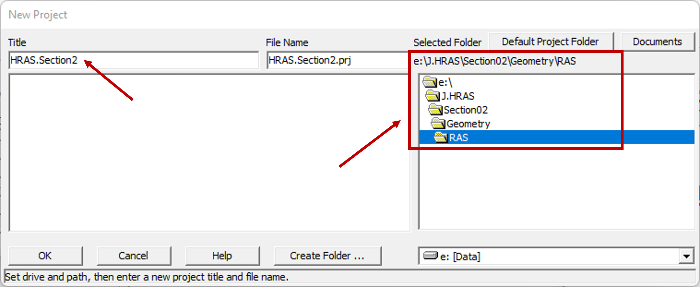
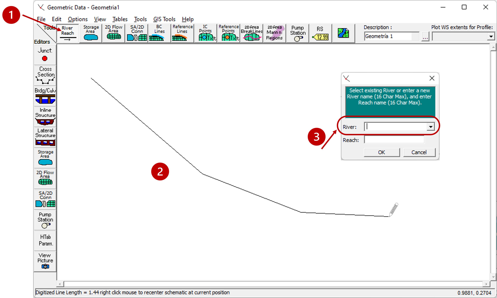
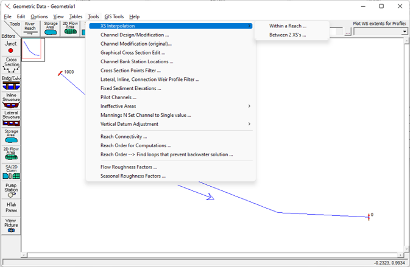

## Cargue y validación geométrica.
Keywords: `Hydraulics` `HEC-RAS` `Channel Section` `Geometry` 

### Alcance
En esta clase se presentan las funcionalidades, características y procedimiento general para el cargue y edición de la geometría de un modelo hidráulico.

### Objetivos

* Aprender la metodología de creación de la geometría de un canal.
* Conocer las características generales de las secciones y perfiles geométricos.
* Conocer las opciones de edición y visualización de la geometría.

### Requerimientos

* Conocimientos en hidráulica a superficie libre. [**(Ver Actividad 1)**](../../Section01/FundamentalConcepts).
* Software de modelación hidráulica HEC-RAS. [**(Ver Actividad 6)**](../../Section01/HECRAS).

### Creación de geometría. 
A continuación se describen los pasos sugeridos para la creación de la geometría asociada a un modelo hidráulico de un canal natural o artificial.

#### Archivos de proyecto y geometría.
1. Para empezar con el desarrollo de nuestro modelo, lo primero a realizar es la creación del proyecto. Una vez abierto el programa vamos a archivo (File) y seleccionamos nuevo proyecto (New Project).

2. Ahora ingrese el nombre que va a darle al proyecto RAS y la ubicación en el directorio o disco. El archivo del proyecto quedará guardado con la extensión <kbd>.prj</kbd>.
 

3. Ahora debemos revisar las unidades del proyecto. Por defecto están en sistema internacional (SI Units). Pero si se desean cambiar, podemos ir a **Opciones**(Options)**→ Sistema de unidades**(Unit system). Y seleccionar entre sistema inglés (US) y sistema internacional (SI).

4. Para crear un archivo de geometría, seleccione el ícono "Ver/editar información geométrica". Y en la nueva ventana, seleccione **Archivo** (File) **→ Guardar información geométrica** (Save geometry data). 

5. Ahora asigne el nombre de la geometría a crear, se guardará con la extensión <kbd>.g*</kbd>. Tenga en cuenta que en un mismo proyecto puede guardar varias geometrías o versiones de esta. En la ventana de **Información geométrica** (Geometry Data) es posible agregar una descripción de la geometría.

#### Creación del eje.

1. Primero seleccionamos el ícono **Nuevo tramo de río** (Add new river reach). Luego trazamos con el cursor el esquema del eje del canal, dando doble clic izquierdo al finalizar. Hay que tener en cuenta que el esquema se realiza iniciando aguas arriba y terminando aguas abajo. Luego se abrirá una ventana para agregar el nombre del canal o rio (River) y el nombre del tramo (Reach).

2. Luego podremos visualizar el esquema de planta del eje trazado con su nombre y dirección.

#### Creación de secciones transversales.
Ahora crearemos las secciones transversales de nuestro canal. Para este tramo, simularemos un canal con sección trapezoidal compuesta en tierra. [_(ver geometría)_](Seccion.xlsx).

1. De clic en el ícono de secciones transversales (cross section).

2. En la ventana emergente de Información de Secciones Transversales (Cross Section Data), seleccione **Opciones → Agregar nueva sección transversal** (Options → Add a new Cross Section). Luego ingrese el identificador numérico de la sección. Una recomendación es iniciar con la creación de la sección aguas abajo.

3. Ahora podemos agregar las características e información de la sección: Descripción, coordenadas espaciales para el dibujo, longitud hasta la siguiente sección aguas abajo, valores del coeficiente 'n' de Manning, ubicación de los límites de banca y coeficientes de expansión y contracción. 

4. Una vez creada podremos visualizar el esquema de la sección transversal.

5. Las demás secciones pueden ser creadas con el mismo procedimiento anterior. O también puede generarse una copia de alguna sección transversal existente seleccionando **Opciones → Copiar la sección transversal actual** (Options → Copy Current Cross Section).

- En el caso de copiar la sección, aparecerá una ventana para agregar el identificador de la nueva sección. Posteriormente, podrá editar sus características y propiedades (elevación, estaciones, longitudes, coeficientes y bancas).

5. Una vez creada las secciones, se podrá cerrar la ventana de edición y se observará el esquema de planta. Para este caso con las dos secciones transversales generadas.

#### Interpolación de secciones.

1. Para tener una geometría con mayor detalle, realizaremos la interpolación de las secciones transversales generadas. En primer lugar, se seleccione **Herramientas → Interpolación XS** (Tools → XS Interpolation). Allí tenemos dos opciones:
* **Dentro de un tramo (Within a reach...)**.  Permite interpolar con respecto al eje de uno de los tramos previamente definidos, con dos o más secciones transversales existentes.
* **Entre 2 secciones (Between 2 XS's..)**. Permite interpolar entre dos secciones transversales previamente generadas.

En esta ocasión utilizaremos la segunda opción. Al dar clic, se abrirá la ventana de interpolación.

2. En la ventana de interpolación (XS Interpolation), se seleccionan y/o definen las características de la interpolación: el canal, el tramo, las secciones, la forma de interpolación, y la metodología. Posteriormente, se seleccionan las coordenadas de las líneas de corte (Cut Line GIS Coordinates).

>Cuando se interpolan secciones transversales, también se interpola su ubicación en el esquema del sistema. HEC-RAS tiene dos opciones para interpolar las coordenadas de las líneas de corte de la sección transversal: 
> * **Interpolación lineal:** Es el método predeterminado a partir de las secciones transversales delimitantes. Este método simplemente dibuja líneas rectas entre las dos secciones transversales e interpola las coordenadas de la sección transversal en función de la distancia del canal principal.
> *  **Segmentos perpendiculares:** Este método escala las secciones transversales a lo largo de la línea de inversión del tramo. Se dibuja un segmento perpendicular a través del tramo para el canal principal. Sin embargo, las bancas se basan en pendientes promedio de la línea de inversión aguas arriba y aguas abajo desde el punto de intersección.

3. Finalmente, podrá visualizar y revisar tanto en la ventana de información geométrica como en la de secciones transversales, cómo han quedado las secciones interpoladas.

### Edición de la geometría creada.

La herramienta dispone de una gran variedad de opciones para la edición de la geometría creada, entre los más relevantes podemos resaltar:

### Referencias
- [HEC-RAS User’s Manual. US Army Corps of Engineers.](https://www.hec.usace.army.mil/confluence/rasdocs/rasum/latest)
- [HEC-RAS Hydraulic Reference Manual.2020](https://www.hec.usace.army.mil/confluence/rasdocs/ras1dtechref/latest)
- [HEC-RAS Documentation. US Army Corps of Engineers.](https://www.hec.usace.army.mil/confluence/rasdocs)
    
### Control de versiones

| Versión | Descripción                                                       |                    Autor                    | Horas |
|:-------:|-------------------------------------------------------------------|:-------------------------------------------:|:-----:|
| 2022.11 | Versión inicial con definición de estructura general y contenido. | [juanrodace](https://github.com/juanrodace) |  1.0  |
| 2022.12 | Inclusión de conceptos, procedimientos, esquemas y gráficos.      | [juanrodace](https://github.com/juanrodace) |  3.0  |
| 2022.12 | Desarrollo de contenido multimedia.                               | [juanrodace](https://github.com/juanrodace) |       |

### Licencia, cláusulas y condiciones de uso

| [:arrow_backward:Anterior](../Readme.md) | [:house: Inicio](../../Readme.md) | [:beginner: Ayuda/Colabora](https://github.com/juanrodace/J.HRAS/discussions/8) | [Siguiente:arrow_forward:](../Topography/Readme.md) |
|------------------------------------------|-----------------------------------|---------------------------------------------------------------------------------|-----------------------------------------------------|

_J.HRAS es de uso libre para fines académicos, conoce nuestra licencia, cláusulas, condiciones de uso y como referenciar los contenidos publicados en este repositorio, dando [clic aquí](https://github.com/juanrodace/J.HRAS/wiki/License)._

_¡Encontraste útil este repositorio!, apoya su difusión marcando este repositorio con una ⭐ o síguenos dando clic en el botón Follow de [juanrodace](https://github.com/juanrodace) en GitHub._