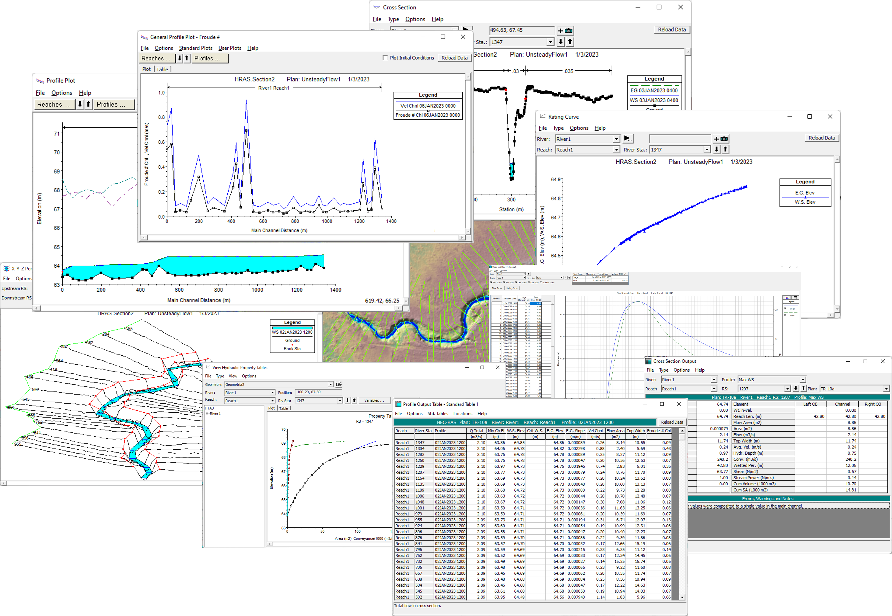

## Visualización de resultados
Keywords: `Hydraulics` `HEC-RAS` `Simulation` `Views` `Results` 

### Alcance
En esta clase se presentan las diferentes opciones de visualización de los resultados de un modelo unidimensional (1D) incluyendo las visualizaciones en tablas y visualizaciones gráficas. Igualmente, se presentan los errores, avisos (warnings) y notas (notes) comunes que pueden aparecer en el proceso de simulación.

### Objetivos

* Conocer la definición de condiciones hidráulicas y de frontera en simulación 1D no permanente.
* Aprender las diferentes opciones de configuración de la información de flujo no permanente.
* Aprender las diferentes opciones de configuración de la simulación en condición no permanente.

### Requerimientos

* Conocimientos en hidráulica a superficie libre. [**(Ver Actividad 1)**](../../Section01/FundamentalConcepts).
* Software de modelación hidráulica HEC-RAS. [**(Ver Actividad 6)**](../../Section01/HECRAS).
* Definición de geometría. [**(Ver Actividad 7)**](../../Section02/Geometry).
