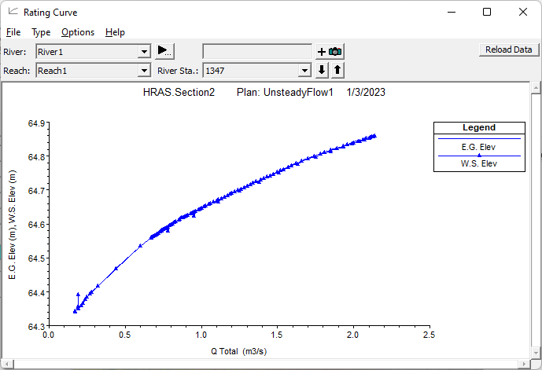

## Visualización de resultados
Keywords: `Hydraulics` `HEC-RAS` `Simulation` `Views` `Results` 

 

 <b>Universidad Escuela Colombiana de Ingeniería Julio Garavito</b> 
<a href="https://github.com/juanrodace/">Juan David Rodriguez Acevedo</a> 
Profesor del Centro de Estudios Hidráulicos 
juan.rodrigueza@escuelaing.edu.co
 
 

    

##

### Alcance
En esta clase se presentan las diferentes opciones de visualización de los resultados de un modelo unidimensional (1D) incluyendo las visualizaciones en tablas y visualizaciones gráficas. Igualmente, se presentan los errores, avisos (warnings) y notas (notes) comunes que pueden aparecer en el proceso de simulación.

### Objetivos

* Conocer las diferentes formas de visualización de resultados.
* Conocer los posibles errores, avisos y notas comunes en el proceso de simulación.

### Requerimientos

* Definición de geometría. [**(Ver Actividad 7**](../../Section02/Geometry) [**y 8)**](../../Section02/Topography)  .
* Simulación flujo permanente. [**(Ver Actividad 9)**](../../Section02/Simulation_1D_SF).
* Simulación flujo no permanente. [**(Ver Actividad 10)**](../../Section02/Simulation_1D_UF).

### Visualización de resultados

Una vez que se ha realizado una simulación de flujo permanente o no permanente, el usuario puede comenzar a ver la los datos de salida o resultados. Los resultados están disponibles en gráficos y tablas. Actualmente, el programa permite visualizar secciones transversales, perfiles de la superficie del agua, perfiles generales, curvas de calificación, gráficos de perspectiva X-Y-Z, hidrogramas, tablas detalladas en una sola ubicación y tablas resumidas en muchas secciones transversales. Los usuarios también tienen la capacidad de desarrollar sus propias tablas de resultado. Además, si el modelo está georreferenciado, también puede crear mapas de inundación y crear animaciones de las áreas inundadas dentro del RAS Mapper. A continuación se presentan estas posibles visualizaciones de los resultados.

#### Mapas con RAS Mapper
Si tiene un modelo que está georreferenciado y tiene datos del terreno para cubrir las extensiones del modelo, puede usar HEC-RAS Mapper para realizar el mapeo de inundaciones para modelos de flujo permanente o no permanente. Puede crear mapas de las diferentes características hidráulicas del flujo como profundidad, velocidad, caudal, número de Froude, energía, entre otros.

#### Secciones transversales y perfiles

Las vistas gráficas suelen ser el método más eficaz para presentar los datos de entrada y los resultados calculados. Los gráficos permiten al usuario detectar fácilmente errores en los datos de entrada, además de proporcionar una visión general de los resultados de una manera que las tablas de números no pueden. Las vistas más comunes son las de secciones transversales y las de perfil.

Existen muchas características disponibles de visualización e impresión de los resultados en el menu **Opciones**(Options) de todas las opciones de visualización. Dentro de estas se incluye: zoom in; zoom out; selección de planes, perfiles, tramos y variables del gráfico; configuración de etiquetas, lineas, símbolos, escala, opciones del plano, tamaño de letra y marcadores. 

#### Secciones transversales y perfiles

Otro tipo de visualización o gráfica disponible es la Perspectiva X-Y-Z. Es un esquema tridimensional de varias secciones transversales de un tramo en particular. El usuario puede seleccionar el tramo y canal a mostrar, así como el rango de las estaciones o secciones transversales. EL esquema puede rotar de izquierda a derecha y de arriba a abajo para obtener diferentes perspectivas del sistema.

#### Tablas resumen y específicas

Las tablas de resultado siempre son necesarias para analizar y documentar los resultados de una simulación. La visualización de resultados a través de tablas permite al usuario ver una gran cantidad de información detallada en un formato conciso. HEC-RAS tiene dos tipos básicos de tablas: tablas detalladas y tablas resumen. 

**Tablas detalladas o específicas**

Las tablas detalladas muestran información hidráulica en una sola posición o estructura y para un solo perfil de flujo. El usuario podrá seleccionar el canal, el tramo, la estación, el plan y el perfil a visualizar.

**Tablas resumen**

Las tablas resumen son utilizadas para mostrar un número limitado de variables hidráulicas para varias secciones transversales. Hay varios tipos de tabla estándar (Std. Tables) diseñadas para presentar información particular de las estructuras o de las secciones transversales.

### Referencias
- [HEC-RAS User’s Manual. US Army Corps of Engineers.](https://www.hec.usace.army.mil/confluence/rasdocs/rasum/latest)
- [HEC-RAS Hydraulic Reference Manual.2020](https://www.hec.usace.army.mil/confluence/rasdocs/ras1dtechref/latest)
- [HEC-RAS Documentation. US Army Corps of Engineers.](https://www.hec.usace.army.mil/confluence/rasdocs)
    
### Control de versiones

| Versión | Descripción                                                       |                    Autor                    | Horas |
|:-------:|-------------------------------------------------------------------|:-------------------------------------------:|:-----:|
| 2022.12 | Versión inicial con definición de estructura general y contenido. | [juanrodace](https://github.com/juanrodace) |  1.0  |
| 2023.01 | Inclusión de conceptos, procedimientos, esquemas y gráficos.      | [juanrodace](https://github.com/juanrodace) |  2.0  |
| 2023.01 | Desarrollo de contenido multimedia.                               | [juanrodace](https://github.com/juanrodace) |  2.0  |

### Licencia, cláusulas y condiciones de uso

| [:arrow_backward:Anterior](../Simulation_1D_UF/Readme.md) | [:house: Inicio](../../Readme.md) | [:beginner: Ayuda/Colabora](https://github.com/juanrodace/J.HRAS/discussions/3) | [Siguiente:arrow_forward:](../../Section03) |
|-----------------------------------------------------------|-----------------------------------|---------------------------------------------------------------------------------|---------------------------------------------|

_J.HRAS es de uso libre para fines académicos, conoce nuestra licencia, cláusulas, condiciones de uso y como referenciar los contenidos publicados en este repositorio, dando [clic aquí](https://github.com/juanrodace/J.HRAS/wiki/License)._

_¡Encontraste útil este repositorio!, apoya su difusión marcando este repositorio con una ⭐ o síguenos dando clic en el botón Follow de [juanrodace](https://github.com/juanrodace) en GitHub._

##

##

 Este curso guía ha sido desarrollado con el apoyo de la Escuela Colombiana de Ingeniería - Julio Garavito. Encuentra más contenidos en https://github.com/uescuelaing  
