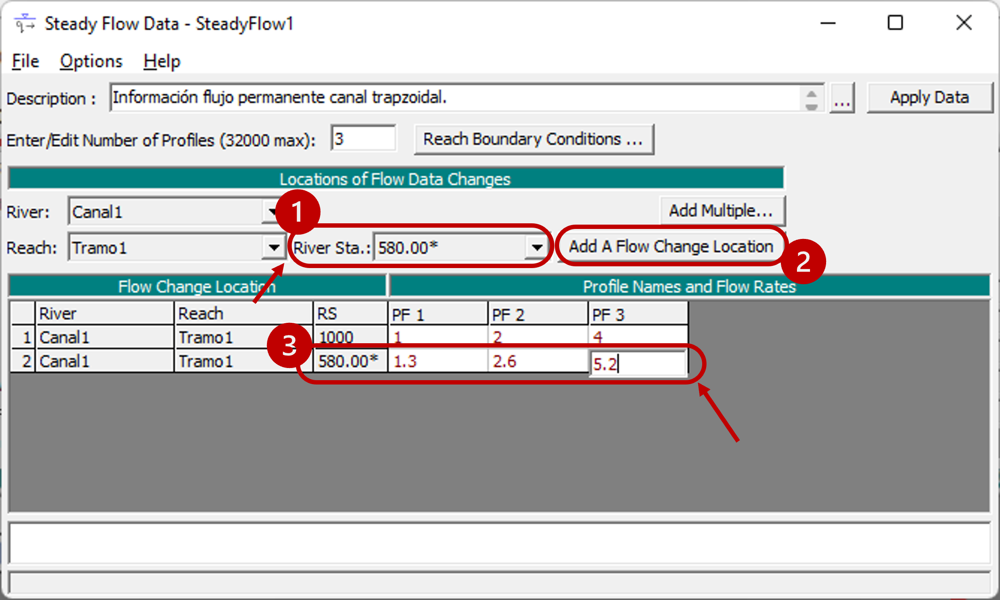
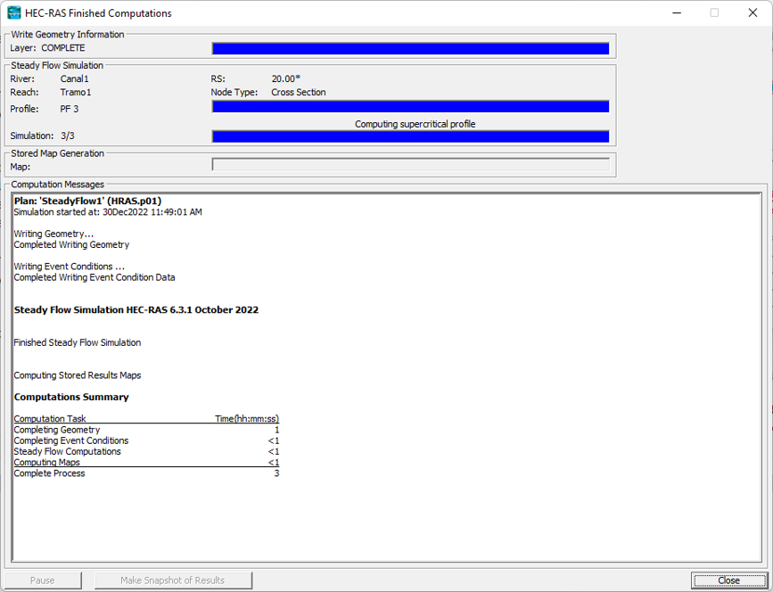

## Condiciones de frontera y simulación 1D en régimen permanente.
Keywords: `Hydraulics` `HEC-RAS` `Channel Section` `FGV` `SteadyFlow` `Simulation` 

 

 <b>Universidad Escuela Colombiana de Ingeniería Julio Garavito</b> 
<a href="https://github.com/juanrodace/">Juan David Rodriguez Acevedo</a> 
Profesor del Centro de Estudios Hidráulicos 
juan.rodrigueza@escuelaing.edu.co
 
 

    

##

### Alcance
En esta clase se presentan la definición de las condiciones hidráulicas y de frontera para la modelación del flujo a superficie libre unidimensional (1D) en condición de flujo permanente.

### Objetivos

* Conocer la definición de condiciones hidráulicas y de frontera en simulación 1D permanente.
* Aprender las diferentes opciones de configuración de la información de flujo permanente.
* Aprender las diferentes opciones de configuración de la simulación en condición permanente.

### Requerimientos

* Conocimientos en hidráulica a superficie libre. [**(Ver Actividad 1)**](../../Section01/FundamentalConcepts).
* Software de modelación hidráulica HEC-RAS. [**(Ver Actividad 6)**](../../Section01/HECRAS).
* Definición de geometría. [**(Ver Actividad 7)**](../../Section02/Geometry).

### Definición de condiciones hidráulicas y de frontera. 
A continuación se describen los pasos sugeridos para la definición de las condiciones hidráulicas y de frontera para la simulación unidimensional (1D) en condición de flujo permanente (steady flow).

1. Para iniciar, vamos a ingresar a la ventana de **Información de flujo permanente (Steady flow data)**, seleccione el ícono "Ver/editar información flujo permanente". Y en la ventana emergente, seleccione **Archivo → Guardar información de flujo** (File → Save flow data). 

2. En la nueva ventana ingrese el nombre que desee asignarle a la información del flujo y de clic en el botón <kbd>**OK**</kbd>.

3. En la ventana de **Información de flujo** (Steady flow data), podrá ingresar una descripción de la información de flujo, así como seleccionar la cantidad de perfiles que desea modelar y los respectivos caudales constantes (flujo permanente) para cada uno de los perfiles. Una vez ingrese la información de clic en el botón <kbd>**Apply Data**</kbd> que encontrará en la parte superior derecha de la ventana.

4. Si a lo largo del canal hay un cambio en la magnitud del caudal, podrá seleccionar la sección transversal en la que desee ver reflejado el cambio, luego agregarla a la información de flujo con el botón <kbd>**Add A Flow Change Location**</kbd> y finalmente incluir el caudal para esa sección transversal y para cada uno de los perfiles de flujo creados o definidos.

5. Ahora definiremos las condiciones de frontera dando clib al botón <kbd>**Reach Boundary Conditions ...**</kbd>.

6. En la ventana de **Condiciones de frontera para flujo permanente** (Steady flow boundary conditions), podrá seleccionar y definir los tipos de condición de frontera del flujo a modelar para su tramo de canal y para cada uno de los perfiles. Dentro de las opciones de condición de frontera, usted puede definir: Profundidad de flujo conocida <kbd>**Known W.S.**</kbd>, Profundidad Crítica <kbd>**Critical Depth**</kbd>, Profundidad normal <kbd>**Normal Depth**</kbd> y curva de elevación-flujo <kbd>**Rating Curve**</kbd>.

7. Recuerde guardar los cambios realizados a las características del flujo y condiciones hidráulicas.

### Simulación 1D condición permanente. 
A continuación se describen los pasos sugeridos para realizar la simulación unidimensional (1D) en condición de flujo permanente (steady flow).

1. Vamos a ingresar a la ventana de **Análisis de flujo permanente (Steady flow analysis)**, seleccionando el ícono  "Realizar una simulación de flujo permanente". Y en la ventana emergente, seleccione **Archivo → Guardar plan** (File → Save plan). 

2. Luego ingrese el nombre con el cual desea guardar el plan. Se creará un archivo con el formato <kbd>.p*</kbd>.

3. En la ventana de análisis del flujo, revise que el archivo de geometría y de información de flujo estén correctamente seleccionados. Luego seleccione el régimen de flujo a simular (subcrítico, supercrítico o mixto), y finalmente como opcionales podrá seleccionar la creación de un mapa de inundación y podrá agregar la descripción del plan.

4. Finalmente de clic en el botón <kbd>**Compute**</kbd> y se iniciarán los cálculos de la simulación.

### Referencias
- [HEC-RAS User’s Manual. US Army Corps of Engineers.](https://www.hec.usace.army.mil/confluence/rasdocs/rasum/latest)
- [HEC-RAS Hydraulic Reference Manual.2020](https://www.hec.usace.army.mil/confluence/rasdocs/ras1dtechref/latest)
- [HEC-RAS Documentation. US Army Corps of Engineers.](https://www.hec.usace.army.mil/confluence/rasdocs)
    
### Control de versiones

| Versión | Descripción                                                       |                    Autor                    | Horas |
|:-------:|-------------------------------------------------------------------|:-------------------------------------------:|:-----:|
| 2022.11 | Versión inicial con definición de estructura general y contenido. | [juanrodace](https://github.com/juanrodace) |  1.0  |
| 2022.12 | Inclusión de conceptos, procedimientos, esquemas y gráficos.      | [juanrodace](https://github.com/juanrodace) |  2.0  |
| 2022.12 | Desarrollo de contenido multimedia.                               | [juanrodace](https://github.com/juanrodace) |  1.5  |

### Licencia, cláusulas y condiciones de uso

| [:arrow_backward:Anterior](../Topography/Readme.md) | [:house: Inicio](../../Readme.md) | [:beginner: Ayuda/Colabora](https://github.com/juanrodace/J.HRAS/discussions/3) | [Siguiente:arrow_forward:](../Simulation_1D_UF/Readme.md) |
|-----------------------------------------------------|-----------------------------------|---------------------------------------------------------------------------------|-----------------------------------------------------------|

_J.HRAS es de uso libre para fines académicos, conoce nuestra licencia, cláusulas, condiciones de uso y como referenciar los contenidos publicados en este repositorio, dando [clic aquí](https://github.com/juanrodace/J.HRAS/wiki/License)._

_¡Encontraste útil este repositorio!, apoya su difusión marcando este repositorio con una ⭐ o síguenos dando clic en el botón Follow de [juanrodace](https://github.com/juanrodace) en GitHub._

##

##

 Este curso guía ha sido desarrollado con el apoyo de la Escuela Colombiana de Ingeniería - Julio Garavito. Encuentra más contenidos en https://github.com/uescuelaing  
