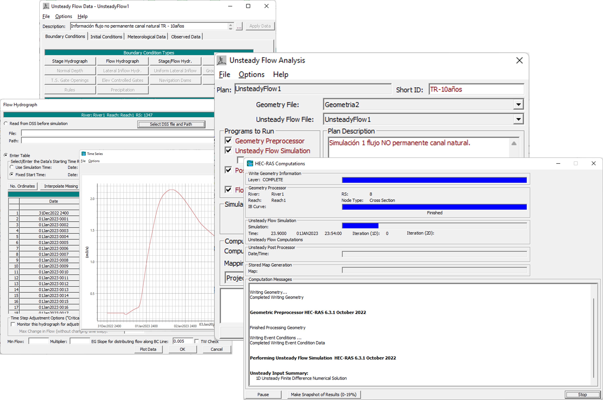
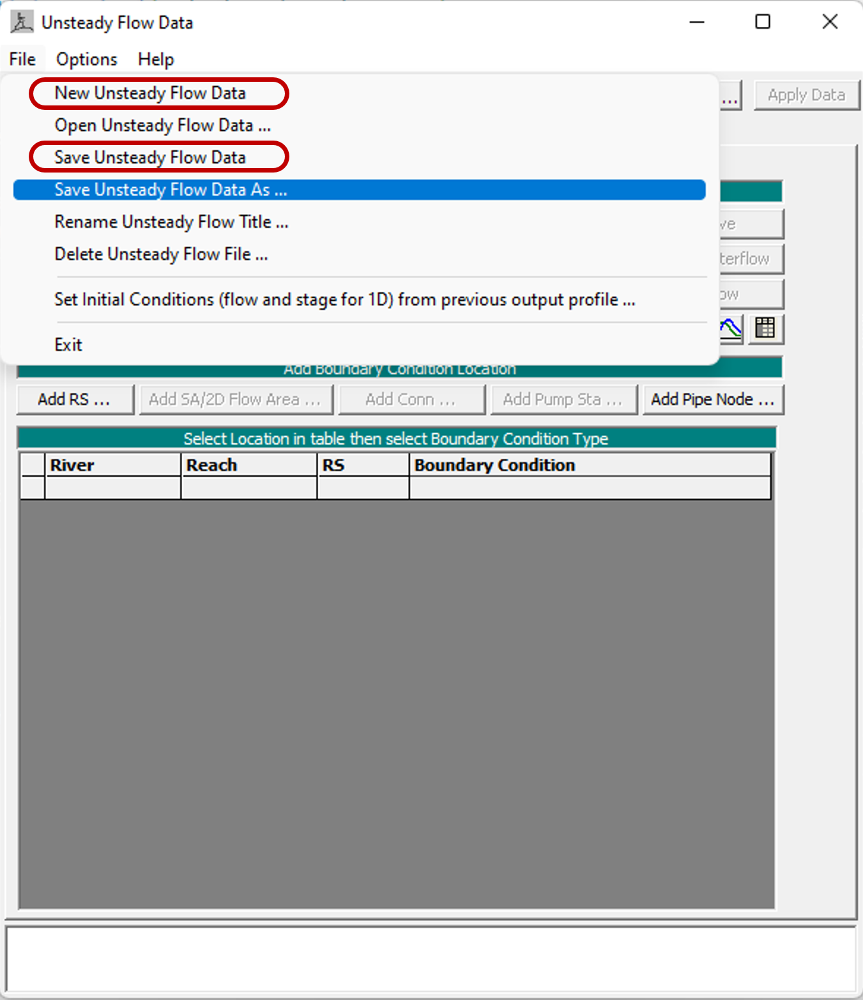
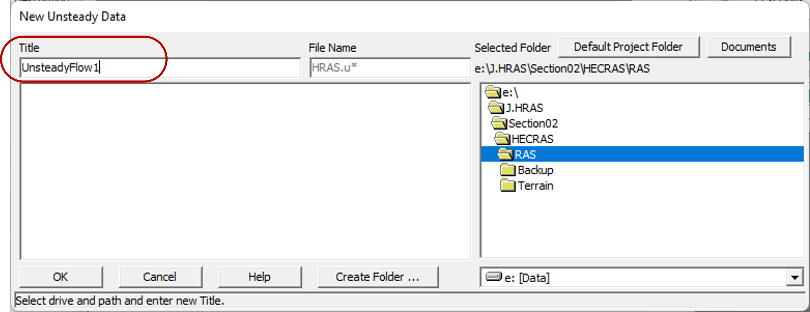
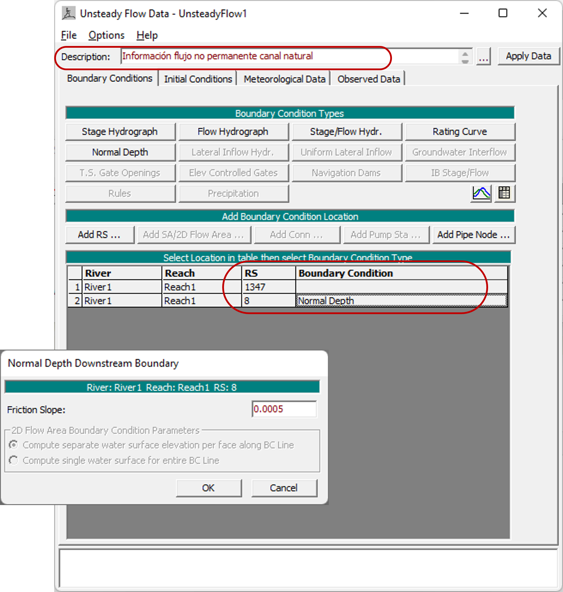
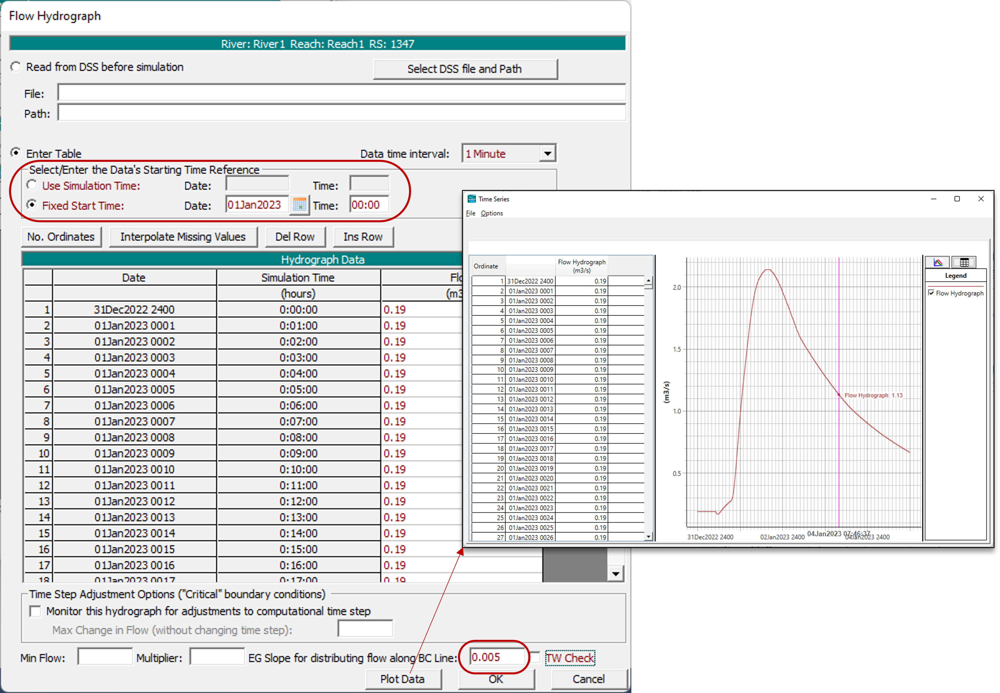
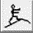
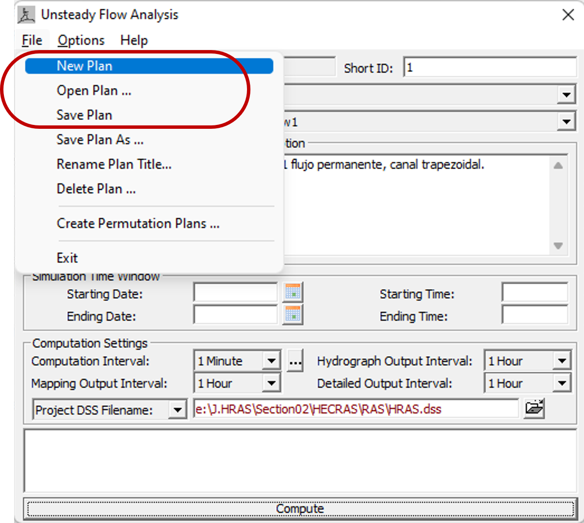
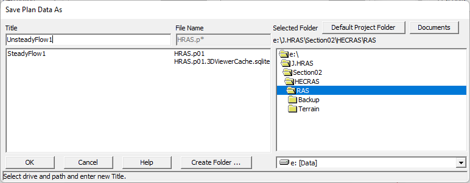
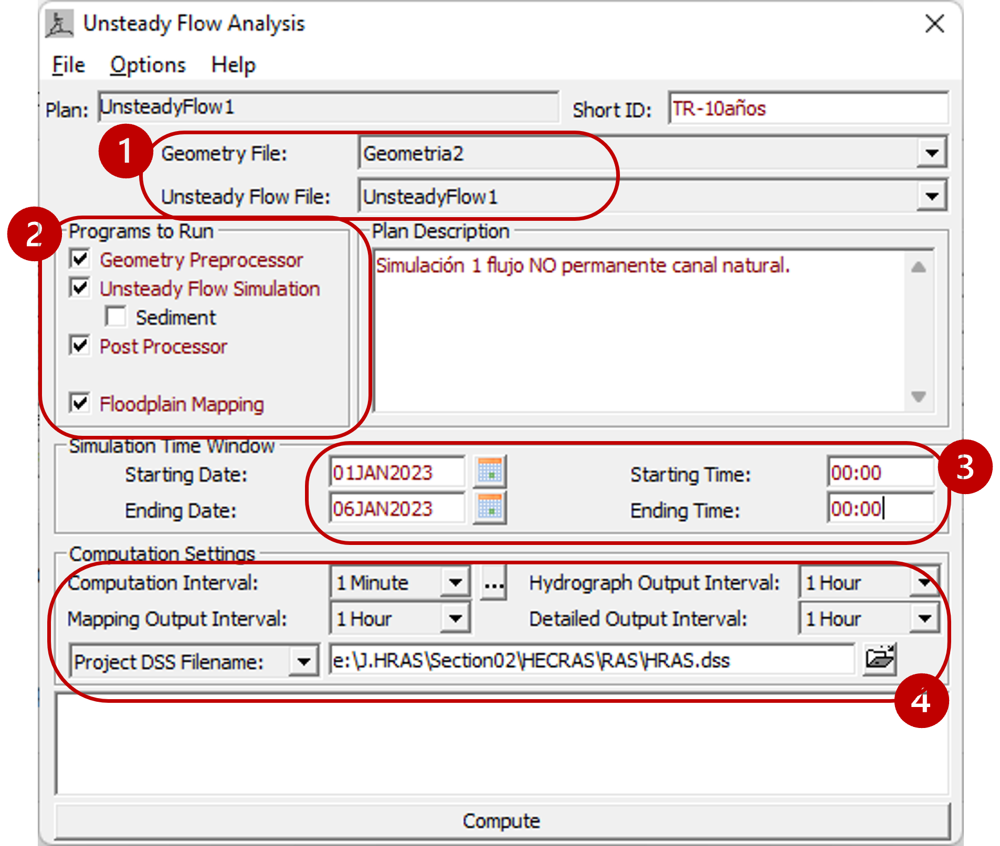
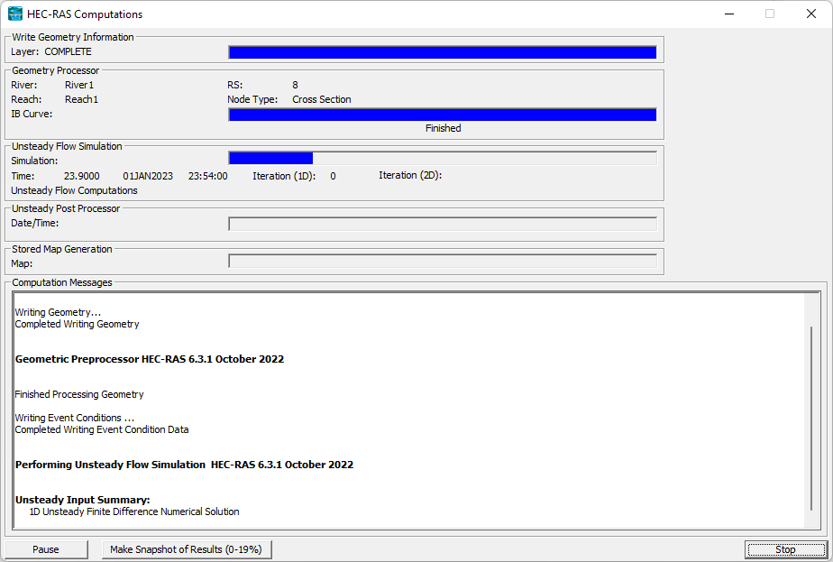

## Condiciones de frontera y simulación 1D en régimen NO permanente.
Keywords: `Hydraulics` `HEC-RAS` `Channel Section` `FGV` `UnsteadyFlow` `Simulation` 

### Alcance
En esta clase se presentan la definición de las condiciones hidráulicas y de frontera para la modelación del flujo a superficie libre unidimensional (1D) en condición de flujo NO permanente.

### Objetivos

* Conocer la definición de condiciones hidráulicas y de frontera en simulación 1D no permanente.
* Aprender las diferentes opciones de configuración de la información de flujo no permanente.
* Aprender las diferentes opciones de configuración de la simulación en condición no permanente.

### Requerimientos

* Conocimientos en hidráulica a superficie libre. [**(Ver Actividad 1)**](../../Section01/FundamentalConcepts).
* Software de modelación hidráulica HEC-RAS. [**(Ver Actividad 6)**](../../Section01/HECRAS).
* Definición de geometría. [**(Ver Actividad 7)**](../../Section02/Geometry).

### Definición de condiciones hidráulicas y de frontera. 
A continuación se describen los pasos sugeridos para la definición de las condiciones hidráulicas y de frontera para la simulación unidimensional (1D) en condición de flujo NO permanente (unsteady flow).

1. Para iniciar, vamos a ingresar a la ventana de **Información de flujo permanente (Steady flow data)**, seleccione el ícono  "Ver/editar información flujo no permanente". Y en la ventana emergente, seleccione **Archivo → Nuevo/Guardar información de flujo no permanente** (File → New/Save unsteady flow data). 

2. En la nueva ventana ingrese el nombre que desee asignarle a la información del flujo y de clic en el botón <kbd>**OK**</kbd>.

3. En la ventana de **Información de flujo no permanente** (Unsteady flow data), podrá ingresar una descripción de la información de flujo, así como definir las condiciones de frontera, condiciones iniciales y agregar información metereológica u observada en el sistema a modelar. Para este ejercicio, agregaremos un hidrograma de flujo aguas arriba del canal y definiremos flujo uniforme en la sección aguas abajo. Una vez ingrese toda la información de clic en el botón <kbd>**Apply Data**</kbd> que encontrará en la parte superior derecha de la ventana.

4. En el caso de los hidrogramas o curvas de estación-flujo, deberá definir correctamente los tiempos de inicio y fin del hidrograma, así como el intervalo de tiempo y la pendiente de la línea de energía (EG slope for distributing flow). Finalmente seleccione <kbd>**Plot Data**</kbd> para verificar y revisar el cargue de la información.

7.  Si desea evaluar diferentes periodos de retorno, deberá crear un archivo de información de flujo no permanente para cada periodo de retorno. Recuerde guardar los cambios realizados a las características del flujo y condiciones hidráulicas.

### Simulación 1D condición NO permanente. 
A continuación se describen los pasos sugeridos para realizar la simulación unidimensional (1D) en condición de flujo NO permanente (unsteady flow).

1. Vamos a ingresar a la ventana de **Análisis de flujo no permanente (Unsteady flow analysis)**, seleccionando el ícono  "Realizar una simulación de flujo no permanente". Y en la ventana emergente, seleccione **Archivo → Nuevo/Guardar plan** (File → Save plan). 

2. Luego ingrese el nombre con el cual desea guardar el plan. Se creará un archivo con el formato <kbd>.p*</kbd>.

3. En la ventana de análisis del flujo, revise que el archivo de geometría y de información de flujo estén correctamente seleccionados. Luego seleccionamos las características de la modelación o simulación a simular (preprocesador de geometría, simulación de flujo no permanente, sedimentos, post-procesador, creación de mapas de inundación), y finalmente deberás definir los tiempos de inicio y fin de la simulación y las propiedades de cálculo (intervalo de cálculo, intervalo de hidrograma de salida, intervalo de mapas de salida y archivo de salida ).

4. Finalmente de clic en el botón <kbd>**Compute**</kbd> y se iniciarán los cálculos de la simulación.

### Referencias
- [HEC-RAS User’s Manual. US Army Corps of Engineers.](https://www.hec.usace.army.mil/confluence/rasdocs/rasum/latest)
- [HEC-RAS Hydraulic Reference Manual.2020](https://www.hec.usace.army.mil/confluence/rasdocs/ras1dtechref/latest)
- [HEC-RAS Documentation. US Army Corps of Engineers.](https://www.hec.usace.army.mil/confluence/rasdocs)
    
### Control de versiones

| Versión | Descripción                                                       |                    Autor                    | Horas |
|:-------:|-------------------------------------------------------------------|:-------------------------------------------:|:-----:|
| 2022.12 | Versión inicial con definición de estructura general y contenido. | [juanrodace](https://github.com/juanrodace) |  1.0  |
| 2023.01 | Inclusión de conceptos, procedimientos, esquemas y gráficos.      | [juanrodace](https://github.com/juanrodace) |  2.0  |
| 2023.01 | Desarrollo de contenido multimedia.                               | [juanrodace](https://github.com/juanrodace) |  2.0  |

### Licencia, cláusulas y condiciones de uso

| [:arrow_backward:Anterior](../Simulation_1D_SF/Readme.md) | [:house: Inicio](../../Readme.md) | [:beginner: Ayuda/Colabora](https://github.com/juanrodace/J.HRAS/discussions/3) | [Siguiente:arrow_forward:](../Results/Readme.md) |
|-----------------------------------------------------------|-----------------------------------|---------------------------------------------------------------------------------|--------------------------------------------------|

_J.HRAS es de uso libre para fines académicos, conoce nuestra licencia, cláusulas, condiciones de uso y como referenciar los contenidos publicados en este repositorio, dando [clic aquí](https://github.com/juanrodace/J.HRAS/wiki/License)._

_¡Encontraste útil este repositorio!, apoya su difusión marcando este repositorio con una ⭐ o síguenos dando clic en el botón Follow de [juanrodace](https://github.com/juanrodace) en GitHub._

