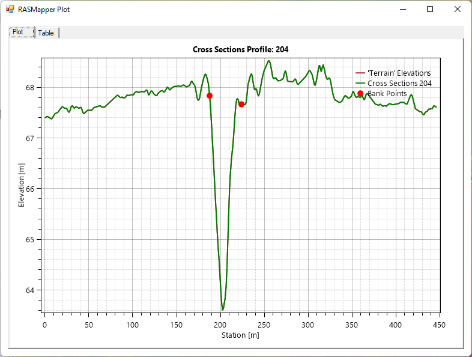

## Cargue de información topográfica.
Keywords: `Hydraulics` `HEC-RAS` `Channel Section` `Topography` `Geometry` `MDT` 

 

 <b>Universidad Escuela Colombiana de Ingeniería Julio Garavito</b> 
<a href="https://github.com/juanrodace/">Juan David Rodriguez Acevedo</a> 
Profesor del Centro de Estudios Hidráulicos 
juan.rodrigueza@escuelaing.edu.co
 
 

    

##

### Alcance
En esta clase se presentan las características y procedimiento general para el cargue y edición de la geometría de un modelo hidráulico a partir de información topográfica y con la aplicación de la herramienta RAS Mapper.

### Objetivos

* Aprender la metodología para cargar información topográfica con RAS Mapper.
* Conocer las opciones de cargue y edición geométrica desde el RAS Mapper.
* Conocer las opciones de edición y visualización.

### Requerimientos

* Conocimientos en hidráulica a superficie libre. [**(Ver Actividad 1)**](../../Section01/FundamentalConcepts).
* Software de modelación hidráulica HEC-RAS. [**(Ver Actividad 6)**](../../Section01/HECRAS).

### Cargue de información topográfica. 
A continuación se describen los pasos sugeridos para el cargue de información y creación de la geometría asociada a un modelo hidráulico, a partir de información topográfica proveniente de un archivo Raster.

#### Creación geometría y cargue de información topográfica.
1. Para iniciar, lo primero a realizar es la creación de una nueva geometría. Para esto, seleccione el ícono "Ver/editar información geométrica". Y en la ventana emergente, seleccione **Archivo** (File) **→ Nueva información geométrica** (New geometry data). 

2. Ahora asigne el nombre de la geometría a crear, se guardará con la extensión <kbd>.g*</kbd>. Tenga en cuenta que en un mismo proyecto puede guardar varias geometrías o versiones de esta. En la ventana de **Información geométrica** (Geometry Data) es posible agregar una descripción de la geometría.

#### Cargue de información Raster

1. Ahora, cierre la ventana de edición geométrica y abra el RAS Mapper dando clic en el icono 

2. Para definir el sistema de coordenadas de referencia, vamos a **Proyecto → Definir Proyección** (Project → Set Projection). 

3. Luego seleccionamos y cargamos el archivo de proyección de coordenadas de nuestro proyecto. Luego selecciona el botón <kbd>OK</kbd>.

4. Ahora, podemos cargar la información Raster de nuestro proyecto. Para eso vamos a **Proyecto → Crear nuevo terreno RAS** (Project → Create New Ras Terrain). En la ventada desplegada **Nueva capa de terreno** (New Terrain Layer), podrá cargar la información en formato Raster. Allí puede cargar varios archivos e incluso unir (merge) varios archivos raster en la nueva capa de terreno. El nuevo archivo será guardado en la carpeta **Terrain** en formato <kbd>.hdf</kbd>.

5. De clic en **Crear** (Create) y se abrirá una ventana con el proceso de creación.

6. A continuación, podrá visualizar el terreno creado en el RAS Mapper.

#### Creación de geometría

1. Para crear la geometría, seguiremos un procedimiento similar al realizado en la clase anterior. Primero, damos clic derecho en la geometría a modificar para luego seleccionar la opción **Editar geometría** (Edit Geometry).

2. Iniciaremos trazando el eje del canal. Para esto damos clic en **Río (River)**. Se habilitarán las herramientas de trazado y edición. 

3. Seleccionamos la opción de agregar nueva característica (Add new feature) e iniciamos el trazado del eje de nuestro canal, desde aguas arriba hacia aguas abajo. Al finalizar se debe definir el nombre del río o canal (river name), así como el nombre del tramo (reach name). Al finalizar podrás visualizar, revisar y si es necesario editar el eje trazado.

4. Ahora crearemos las líneas de banca siguiendo el mismo procedimiento anterior, pero seleccionando previamente **Líneas de banca (Bank lines)**.

5. Es el turno de las secciones transversales. Primero seleccionamos las **Secciones transversales (Cross sections)** y luego las trazamos de izquierda a derecha, procurando que las líneas sean perpendiculares al cauce principal del canal.

6. Una vez creadas las secciones, detenemos la edición y guardamos los cambios. Podremos visualizar el perfil del terreno para las secciones generadas con el fin de revisar y ajustar si es necesario.

7. Finalmente, en la ventana de geometría podremos visualizar la geometría creada a partir de la información topográfica Raster.

### Referencias
- [HEC-RAS User’s Manual. US Army Corps of Engineers.](https://www.hec.usace.army.mil/confluence/rasdocs/rasum/latest)
- [HEC-RAS Hydraulic Reference Manual.2020](https://www.hec.usace.army.mil/confluence/rasdocs/ras1dtechref/latest)
- [HEC-RAS Documentation. US Army Corps of Engineers.](https://www.hec.usace.army.mil/confluence/rasdocs)
- [HEC-RAS Mapper User's Manual](https://www.hec.usace.army.mil/confluence/rasdocs/rmum/latest)
    
### Control de versiones

| Versión | Descripción                                                       |                    Autor                    | Horas |
|:-------:|-------------------------------------------------------------------|:-------------------------------------------:|:-----:|
| 2022.12 | Versión inicial con definición de estructura general y contenido. | [juanrodace](https://github.com/juanrodace) |  1.0  |
| 2022.12 | Inclusión de conceptos, procedimientos, esquemas y gráficos.      | [juanrodace](https://github.com/juanrodace) |  2.5  |
| 2022.12 | Desarrollo de contenido multimedia.                               | [juanrodace](https://github.com/juanrodace) |  2.0  |

### Licencia, cláusulas y condiciones de uso

| [:arrow_backward:Anterior](../Geometry/Readme.md) | [:house: Inicio](../../Readme.md) | [:beginner: Ayuda/Colabora](https://github.com/juanrodace/J.HRAS/discussions/3) | [Siguiente:arrow_forward:](../Simulation_1D_SF/Readme.md) |
|---------------------------------------------------|-----------------------------------|---------------------------------------------------------------------------------|-----------------------------------------------------------|

_J.HRAS es de uso libre para fines académicos, conoce nuestra licencia, cláusulas, condiciones de uso y como referenciar los contenidos publicados en este repositorio, dando [clic aquí](https://github.com/juanrodace/J.HRAS/wiki/License)._

_¡Encontraste útil este repositorio!, apoya su difusión marcando este repositorio con una ⭐ o síguenos dando clic en el botón Follow de [juanrodace](https://github.com/juanrodace) en GitHub._

##

##

 Este curso guía ha sido desarrollado con el apoyo de la Escuela Colombiana de Ingeniería - Julio Garavito. Encuentra más contenidos en https://github.com/uescuelaing  
