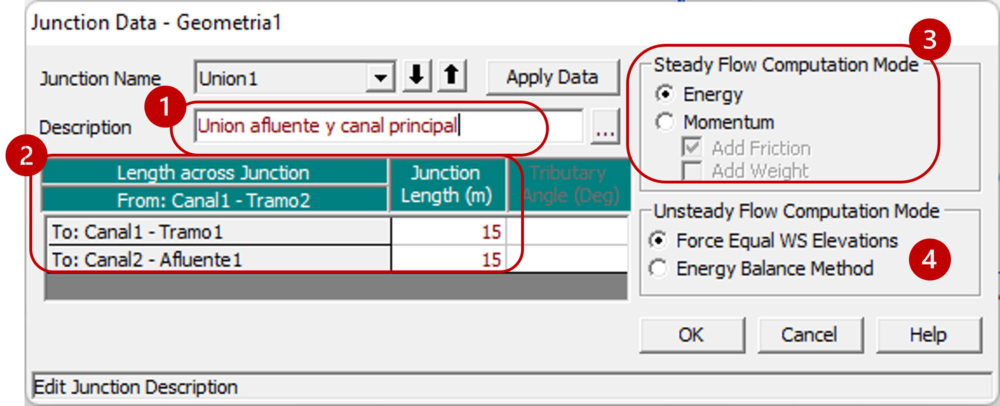

# Confluencias y separaciones
Keywords: `Hydraulics` `HEC-RAS` `Confluence` `Split` 

### Alcance
En esta clase se presenta el proceso recomendado para la definición geométrica donde dos o más tramos se unen o separan.

### Objetivos

* Conocer el procedimiento para la definición de uniones o puntos de separación entre dos o más tramos.

### Requerimientos

* [**Sección 2. Modelación hidráulica básica**](../../Section02/Readme.md) 

### Confluencias o separaciones
A continuación se describen los pasos sugeridos para la definición de uniones o puntos de separación entre dos o más tramos.

#### Edición de la geometría y creación de la unión

1. Para iniciar, en el editor de geometría debe crear y trazar el nuevo tramo(s) del sistema hidráulico dando clic al botón **River Reach**. En la ventana emergente podrá definir el nombre del nuevo canal (river) y del tramo (reach). De clic en el botón <kbd>OK</kbd>.

2. Aparecerá una nueva ventana para definir el nombre del nuevo tramo aguas abajo del canal principal o inicialmente trazado. Y en la siguiente ventana emergente deberá definir el nombre de la unión a crear. Para finalizar, de clic en el botón <kbd>OK</kbd>.

3. Para revisar y terminar de configurar la union (junction), ingrese a la ventana de información de uniones (Junction Data), dando clic al botón <kbd>Junct. :red_circle:</kbd>. Allí podrá agregar una descripción de la unión, definir la longitud de unión y definir el modo de cálculo de la unión tanto para flujo permanente (steady flow computation mode) como para flujo no permanente (unsteady flow computation mode).

4. Ahora puede crear las secciones transversales del nuevo tramo, siguiendo el procedimiento descrito en la [Actividad 7](../../Section02/Geometry/Readme.md). 

5. Finalmente, podrá visualizar el nuevo tramo, sus secciones y la unión creada.

#### Condiciones hidráulicas y simulación.

1. En la ventana de información de flujo, podrá modificar las condiciones del flujo (sea permanente o no permanente) y las respectivas condiciones de frontera. (Ver [Actividad 9](../../Section02/Simulation_1D_SF/Readme.md) y [Actividad 10](../../Section02/Simulation_1D_SF/Readme.md)).

2. En la herramienta de análisis o simulación de flujo (sea permanente o no permanente), podrá configurar las características de cálculo y ejecutar la simulación.

3. Finalmente, podrá revisar los resultados de la simulación.

### Referencias
- [HEC-RAS User’s Manual. US Army Corps of Engineers.](https://www.hec.usace.army.mil/confluence/rasdocs/rasum/latest)
- [HEC-RAS Hydraulic Reference Manual.2020](https://www.hec.usace.army.mil/confluence/rasdocs/ras1dtechref/latest)
- [HEC-RAS Documentation. US Army Corps of Engineers.](https://www.hec.usace.army.mil/confluence/rasdocs)
    
### Control de versiones

| Versión | Descripción                                                       |                    Autor                    | Horas |
|:-------:|-------------------------------------------------------------------|:-------------------------------------------:|:-----:|
| 2023.01 | Versión inicial con definición de estructura general y contenido. | [juanrodace](https://github.com/juanrodace) |  0.5  |
| 2023.01 | Inclusión de conceptos, procedimientos, esquemas y gráficos.      | [juanrodace](https://github.com/juanrodace) |  1.5  |
| 2023.01 | Desarrollo de contenido multimedia.                               | [juanrodace](https://github.com/juanrodace) |  1.5  |

### Licencia, cláusulas y condiciones de uso

| [:arrow_backward:Anterior](../Manning/Readme.md) | [:house: Inicio](../../Readme.md) | [:beginner: Ayuda/Colabora](https://github.com/juanrodace/J.HRAS/discussions/8) | [Siguiente:arrow_forward:](../Levees/Readme.md) |
|--------------------------------------------------|-----------------------------------|---------------------------------------------------------------------------------|-------------------------------------------------|

_J.HRAS es de uso libre para fines académicos, conoce nuestra licencia, cláusulas, condiciones de uso y como referenciar los contenidos publicados en este repositorio, dando [clic aquí](https://github.com/juanrodace/J.HRAS/wiki/License)._

_¡Encontraste útil este repositorio!, apoya su difusión marcando este repositorio con una ⭐ o síguenos dando clic en el botón Follow de [juanrodace](https://github.com/juanrodace) en GitHub._