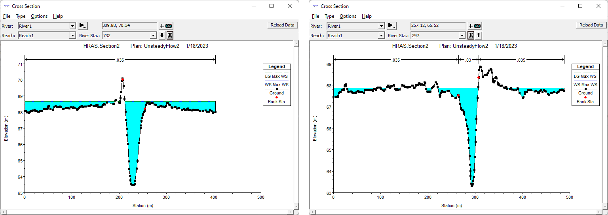
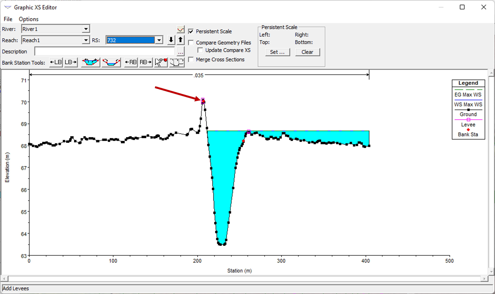
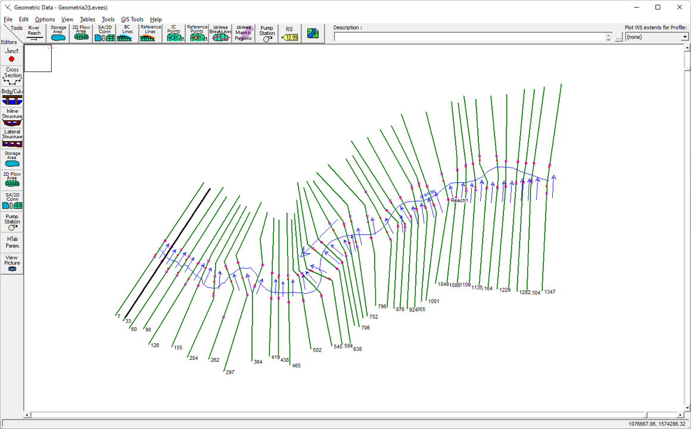
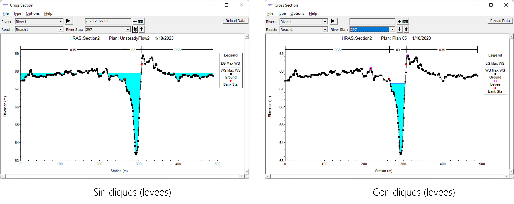
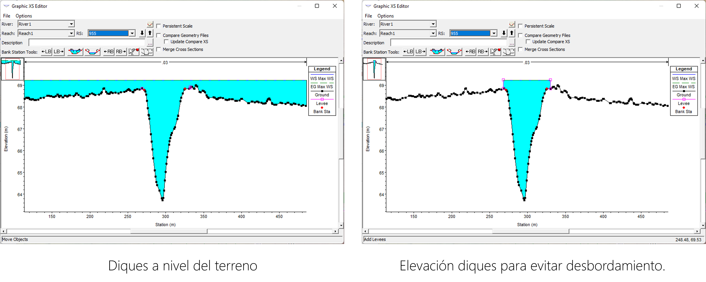
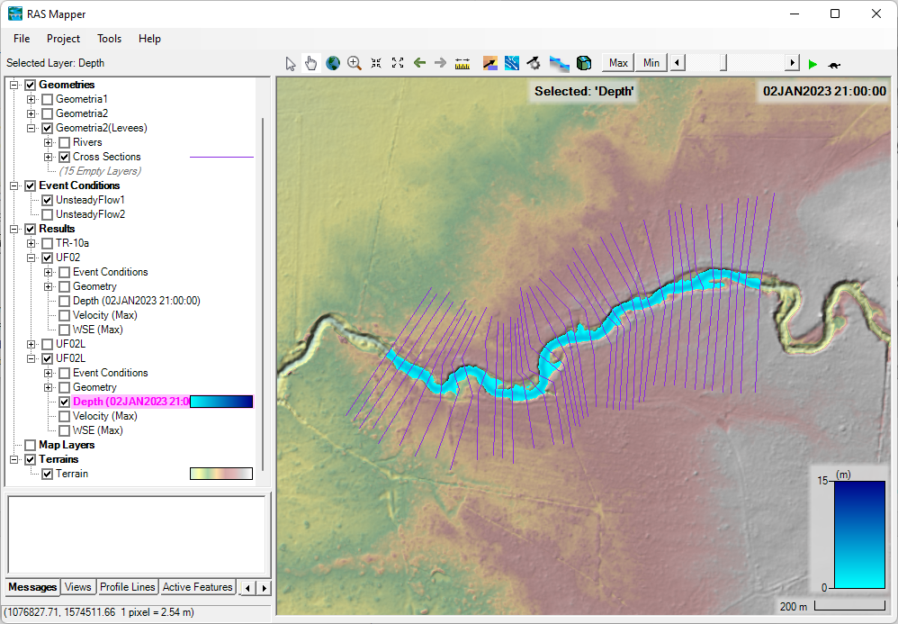
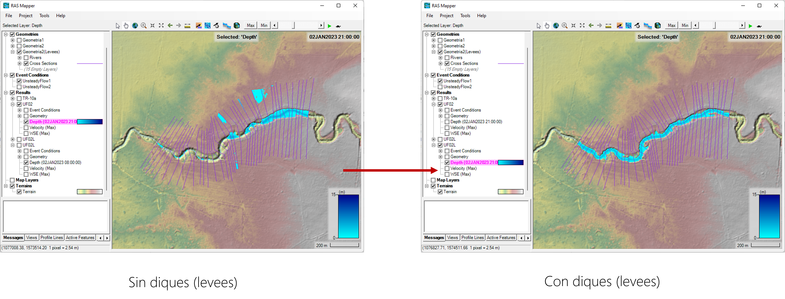

# Diques
Keywords: `Hydraulics` `HEC-RAS` `Levee` `Simulation` 

### Alcance
En esta clase se presenta el uso y aplicación de diques en la simulación hidráulica..

### Objetivos

* Conocer el procedimiento para la definición de diques en la geometría de un modelo.

### Requerimientos

* [**Sección 2. Modelación hidráulica básica**](../../Section02/Readme.md) 

### Diques
Esta herramienta permite al usuario ingresar y editar fácilmente estaciones y elevaciones de diques. El editor permite mover rápidamente estaciones de diques y/o elevaciones. Esto puede ser muy útil cuando se trata de decidir una ubicación y elevación de los diques.

A continuación se describen los pasos sugeridos para la definición de diques (levees) en la geometría del modelo hidráulico.

1. Revisemos los resultados de un modelo sin definición de diques (levees) y con un caudal que genera desbordamiento o que supera la capacidad del cauce principal.

2. Para la definición de los diques (levees), en el editor geométrico de secciones transversales podemos ir a la herramienta **Opciones → Diques** (Options → Levees...). A continuación se podrán dibujar los diques de forma manual o ingresar los datos de estación y elevación.

En la ventana de información geometrica se podrá ver la definición de diques en planta.

3. Con la definición de diques (levees), se garantiza que primero se inunda el canal principal y luego la planicie o llanura de inundación, como sucede en la realidad. 

4. Por otro lado, es posible utilizar esta herramienta para definir la altura requerida en el diseño de un dique para evitar el desbordamiento en un tramo del canal o rio.

5. En general con la visualización de resultados y con la herramienta RAS Mapper es posible ver la diferencia de los modelos con el uso de diques o levees. 

### Referencias
- [HEC-RAS User’s Manual. US Army Corps of Engineers.](https://www.hec.usace.army.mil/confluence/rasdocs/rasum/latest)
- [HEC-RAS Hydraulic Reference Manual.2020](https://www.hec.usace.army.mil/confluence/rasdocs/ras1dtechref/latest)
- [HEC-RAS Documentation. US Army Corps of Engineers.](https://www.hec.usace.army.mil/confluence/rasdocs)
    
### Control de versiones

| Versión | Descripción                                                       |                    Autor                    | Horas |
|:-------:|-------------------------------------------------------------------|:-------------------------------------------:|:-----:|
| 2023.01 | Versión inicial con definición de estructura general y contenido. | [juanrodace](https://github.com/juanrodace) |  0.5  |
| 2023.01 | Inclusión de conceptos, procedimientos, esquemas y gráficos.      | [juanrodace](https://github.com/juanrodace) |  1.0  |
| 2023.01 | Desarrollo de contenido multimedia.                               | [juanrodace](https://github.com/juanrodace) |  1.0   |

### Licencia, cláusulas y condiciones de uso

| [:arrow_backward:Anterior](../Confluence/Readme.md) | [:house: Inicio](../../Readme.md) | [:beginner: Ayuda/Colabora](https://github.com/juanrodace/J.HRAS/discussions/4) | [Siguiente:arrow_forward:](../Structures/Readme.md) |
|-----------------------------------------------------|-----------------------------------|---------------------------------------------------------------------------------|-----------------------------------------------------|

_J.HRAS es de uso libre para fines académicos, conoce nuestra licencia, cláusulas, condiciones de uso y como referenciar los contenidos publicados en este repositorio, dando [clic aquí](https://github.com/juanrodace/J.HRAS/wiki/License)._

_¡Encontraste útil este repositorio!, apoya su difusión marcando este repositorio con una ⭐ o síguenos dando clic en el botón Follow de [juanrodace](https://github.com/juanrodace) en GitHub._

