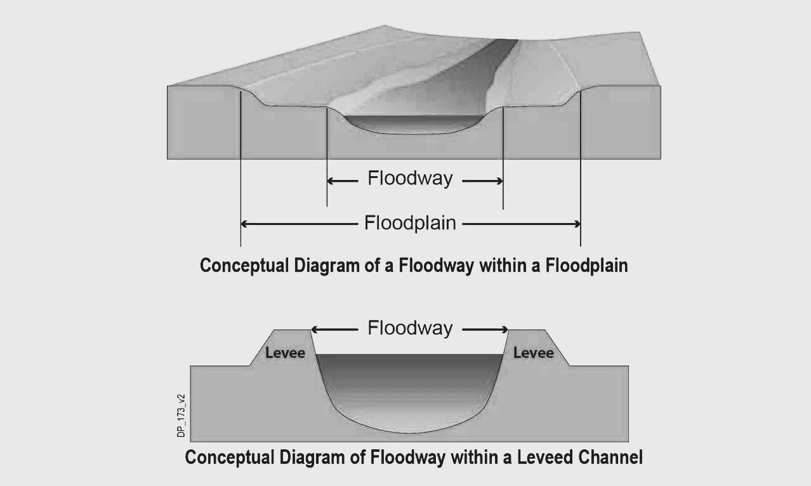

# Diques
Keywords: `Hydraulics` `HEC-RAS` `Levee` `Simulation` 

### Alcance
En esta clase se presenta el uso y aplicación de diques en la simulación hidráulica..

### Objetivos

* Conocer el procedimiento para la definición de diques en la geometría de un modelo.

### Requerimientos

* [**Sección 2. Modelación hidráulica básica**](../../Section02/Readme.md) 

### Diques
Esta herramienta permite al usuario ingresar y editar fácilmente estaciones y elevaciones de diques. El editor permite mover rápidamente estaciones de diques y/o elevaciones. Esto puede ser muy útil cuando se trata de decidir una ubicación y elevación de los diques.

A continuación se describen los pasos sugeridos para la definición de diques (levees) en la geometría del modelo hidráulico.

