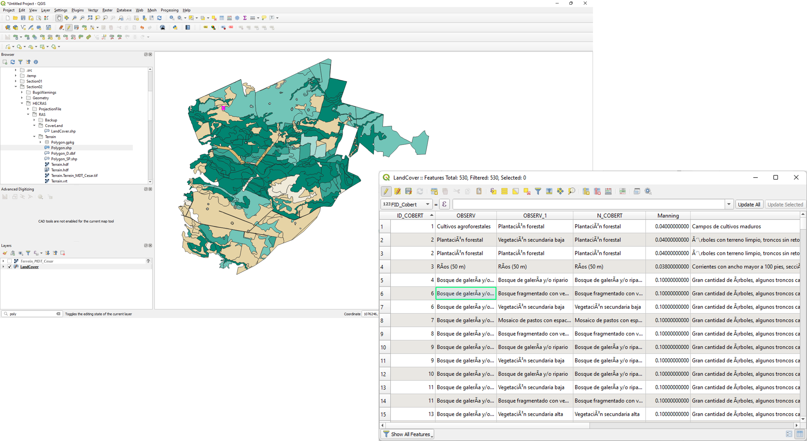
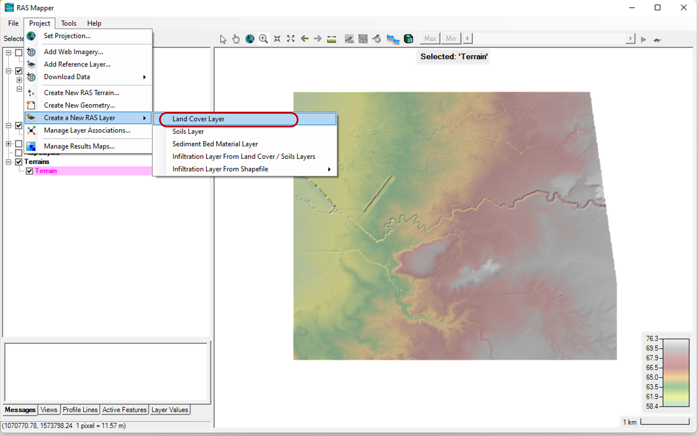
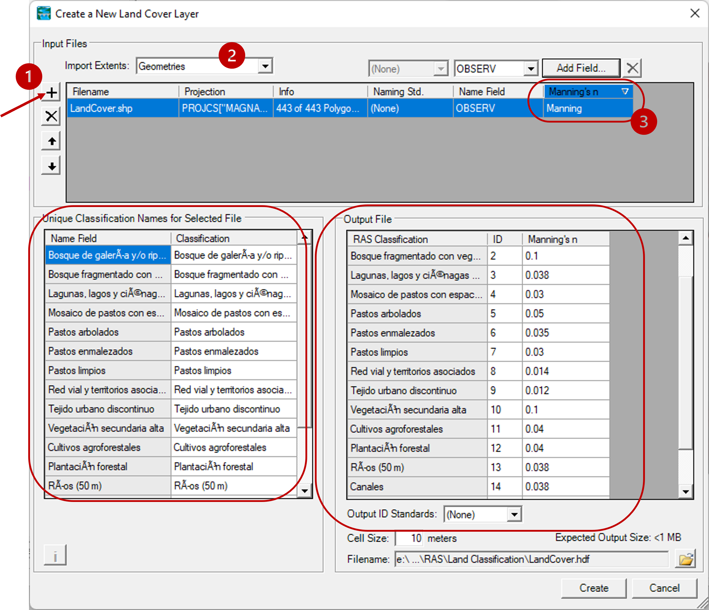
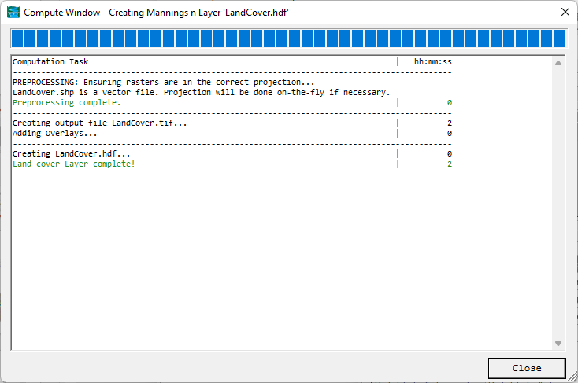
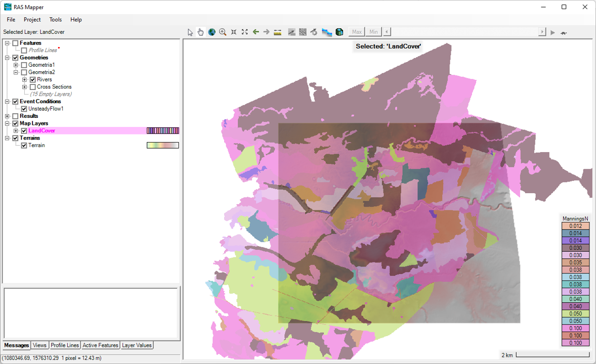
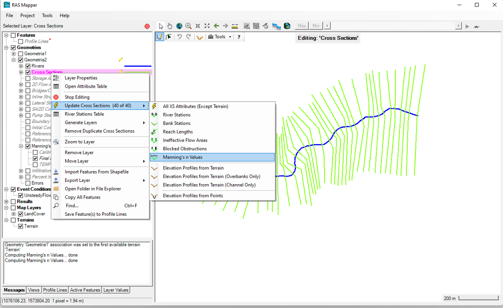
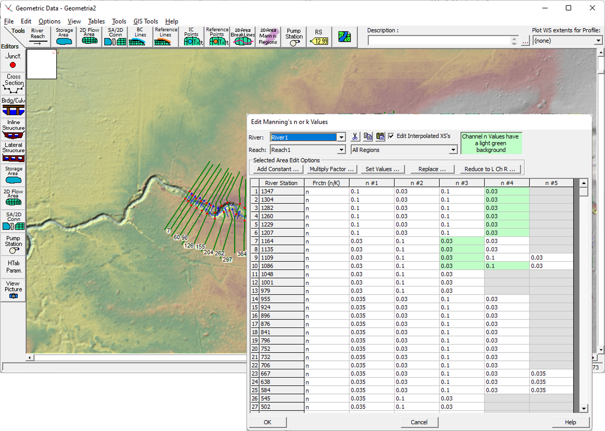

## Coeficientes de Manning a partir de Coberturas de Suelo
Keywords: `Hydraulics` `HEC-RAS` `LandCover` `Mannnig` 

### Alcance
En esta clase se presentan las diferentes opciones de visualización de los resultados de un modelo unidimensional (1D) incluyendo las visualizaciones en tablas y visualizaciones gráficas. Igualmente, se presentan los errores, avisos (warnings) y notas (notes) comunes que pueden aparecer en el proceso de simulación.

### Objetivos

* Conocer las diferentes formas de visualización de resultados.
* Conocer los posibles errores, avisos y notas comunes en el proceso de simulación.

### Requerimientos

* [**Sección 2. Modelación hidráulica básica**](../../Section02/Readme.md) 

### Coeficientes de Manning a partir de Coberturas de Suelo
A continuación se describen los pasos sugeridos para el cargue de información de cobertura de suelo, creación de mapa de coeficientes Manning y ajustes de la geometría definiciendo coeficientes Manning.

#### Mapas de cobertura de suelo

#### Creación de mapa de coeficientes Manning

#### Ajuste de geometría y definición de coeficientes

### Referencias
- [HEC-RAS User’s Manual. US Army Corps of Engineers.](https://www.hec.usace.army.mil/confluence/rasdocs/rasum/latest)
- [HEC-RAS Hydraulic Reference Manual.2020](https://www.hec.usace.army.mil/confluence/rasdocs/ras1dtechref/latest)
- [HEC-RAS Documentation. US Army Corps of Engineers.](https://www.hec.usace.army.mil/confluence/rasdocs)
- [HEC-RAS Mapper User's Manual](https://www.hec.usace.army.mil/confluence/rasdocs/rmum/latest)
    
### Control de versiones

| Versión | Descripción                                                       |                    Autor                    | Horas |
|:-------:|-------------------------------------------------------------------|:-------------------------------------------:|:-----:|
| 2023.01 | Versión inicial con definición de estructura general y contenido. | [juanrodace](https://github.com/juanrodace) |  0.5  |
| 2023.01 | Inclusión de conceptos, procedimientos, esquemas y gráficos.      | [juanrodace](https://github.com/juanrodace) |  2.0  |
| 2023.01 | Desarrollo de contenido multimedia.                               | [juanrodace](https://github.com/juanrodace) |       |

### Licencia, cláusulas y condiciones de uso

| [:arrow_backward:Anterior](../Readme.md) | [:house: Inicio](../../Readme.md) | [:beginner: Ayuda/Colabora](https://github.com/juanrodace/J.HRAS/discussions/8) | [Siguiente:arrow_forward:](../Confluence/Readme.md) |
|-----------------------------------------------------------|-----------------------------------|---------------------------------------------------------------------------------|--------------------------------------------|

_J.HRAS es de uso libre para fines académicos, conoce nuestra licencia, cláusulas, condiciones de uso y como referenciar los contenidos publicados en este repositorio, dando [clic aquí](https://github.com/juanrodace/J.HRAS/wiki/License)._

_¡Encontraste útil este repositorio!, apoya su difusión marcando este repositorio con una ⭐ o síguenos dando clic en el botón Follow de [juanrodace](https://github.com/juanrodace) en GitHub._