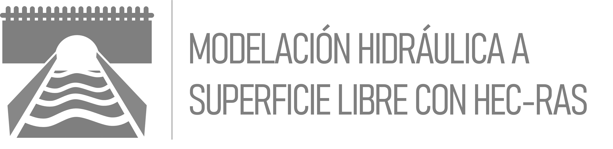

 
 <b>Modelación hidráulica a superficie libre con HEC-RAS</b> 
<b>Sección 3 - Modelación Hidráulica con opciones avanzadas</b> 

## Modelación Hidráulica con Opciones Avanzadas
En esta sección se presenta algunas de las opciones o características avanzadas o adicionales con las que cuenta el software HEC-RAS para la modelación hidráulica de sistemas a superficie libre y estructuras.

##

_J.HRAS es de uso libre para fines académicos, conoce nuestra licencia, cláusulas, condiciones de uso y como referenciar los contenidos publicados en este repositorio, dando [clic aquí](../License.md)._

_¡Encontraste útil este repositorio!, apoya su difusión marcando este repositorio con una ⭐ o síguenos dando clic en el botón Follow de [juanrodace](https://github.com/juanrodace) en GitHub._

| [:arrow_backward:Anterior](../Readme.md) | [:house: Inicio](../Readme.md) | [Siguiente:arrow_forward:](Manning/Readme.md) |
|------------------------------------------|--------------------------------|-----------------------------------------------|