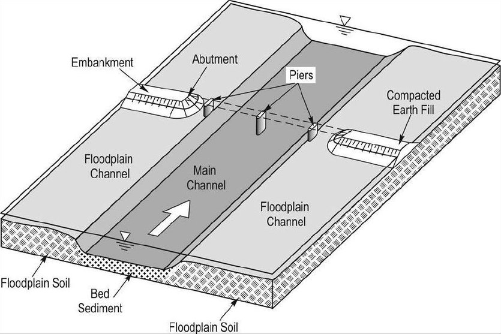
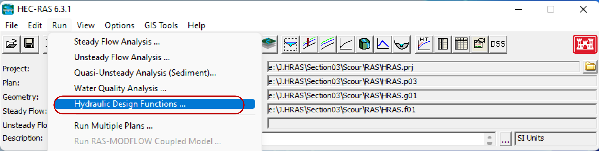
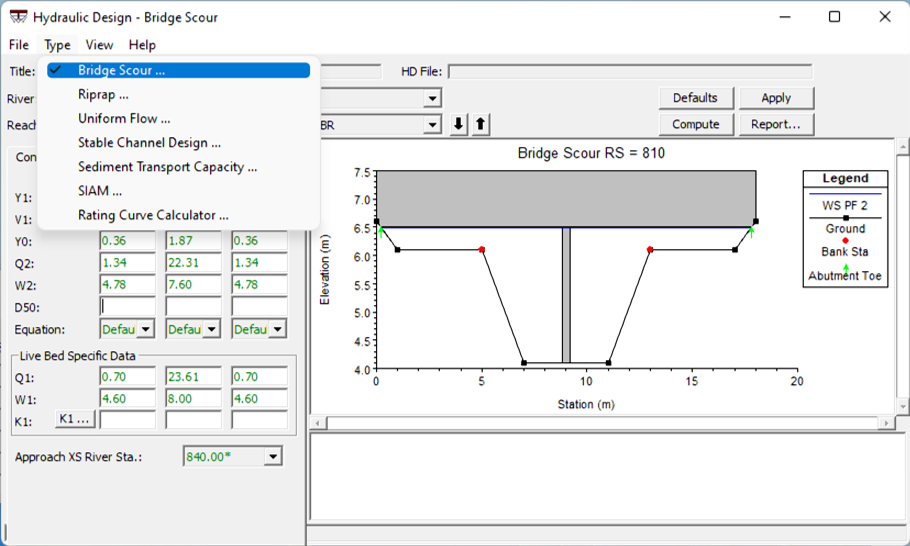
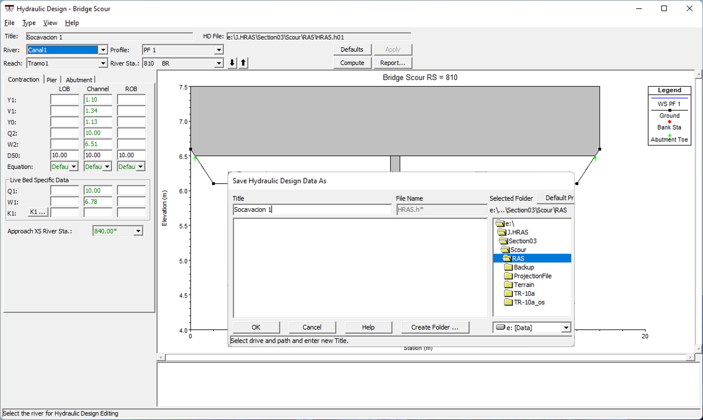
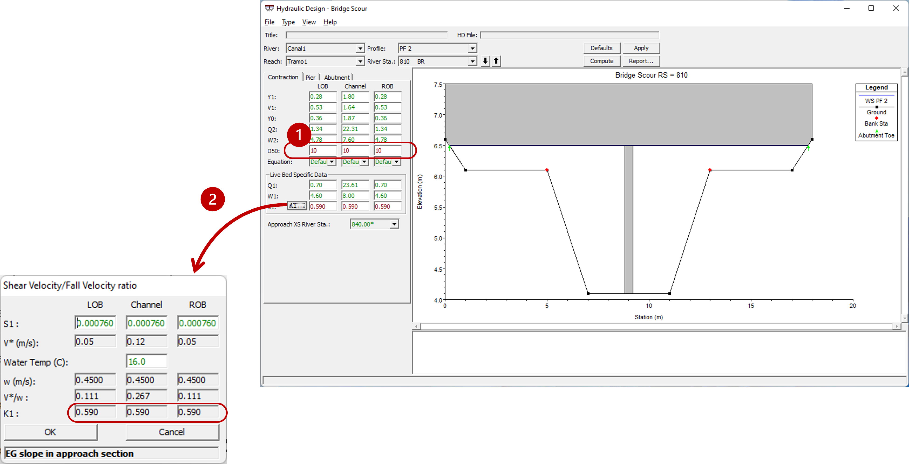
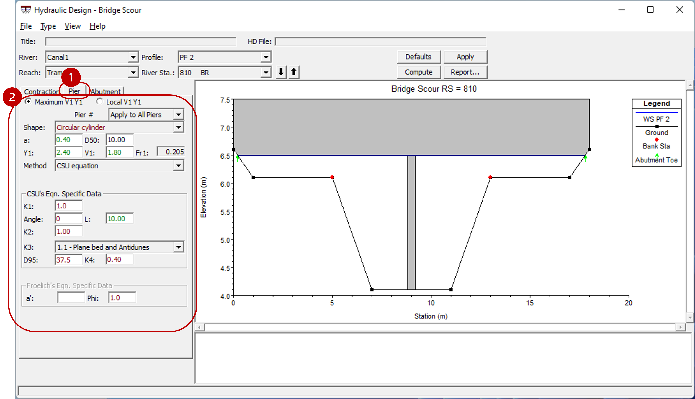
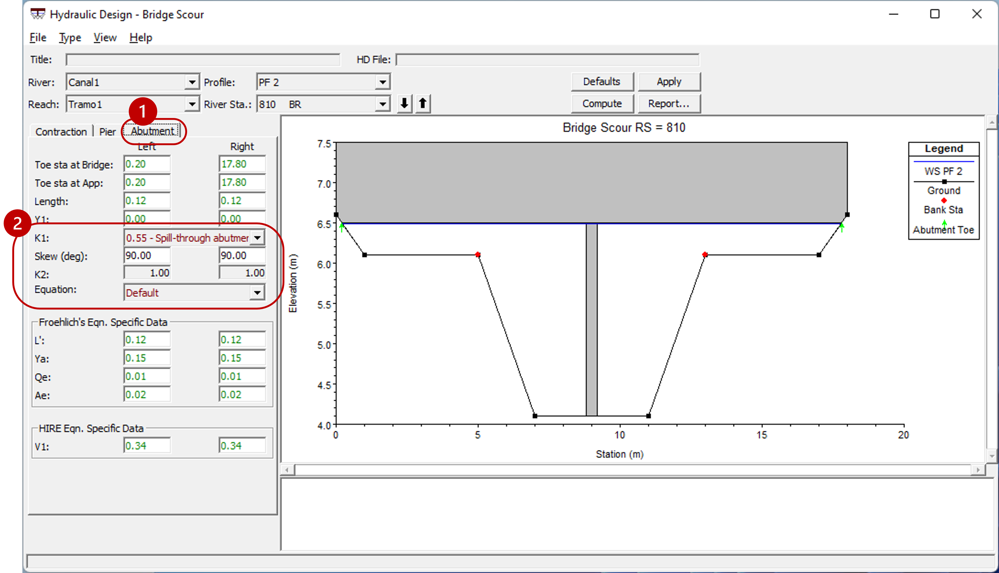
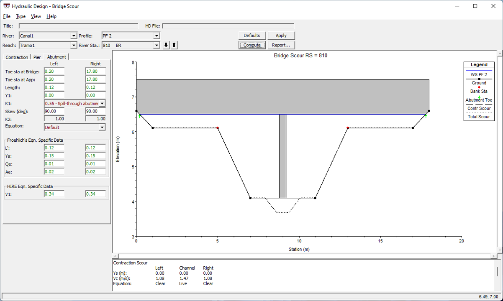
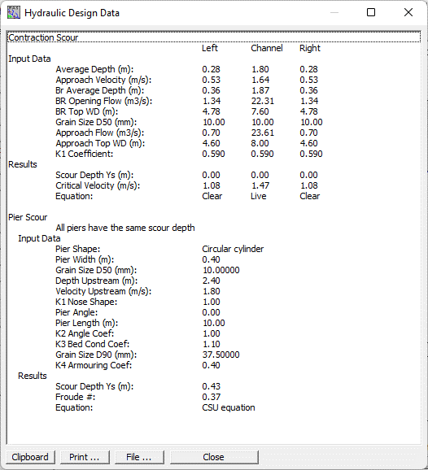

# Socavación
Keywords: `Hydraulics` `HEC-RAS` `Scour` `Bridge`

 
 Socavación en un puente. Arneson et all. 2012

### Alcance
En esta clase se presentan la opción de simulación y cálculo de la socavación local en puentes del sistema hidráulico.

### Objetivos

* Conocer la definición y características del módulo de cálculo de socavación en puentes.

### Requerimientos

* [Sección 2. Modelación hidráulica básica](../../Section02/Readme.md)
* [Modelación de estructuras hidráulica](../Structures/Readme.md)

### Socavación local

A continuación se describen los pasos sugeridos para la definición de características y cálculo de los diferentes tipos de socavación en un puente (contracción, pilas y apoyos laterales). Antes de iniciar, se debe contar con un modelo hidráulico previamente simulado con la respectiva estructura o puente ([Ver actividad 15](../Structures/Readme.md)).

1. Para iniciar, en la interfaz del programa vaya al menu **Simular → Funciones de diseño hidráulico** (Run → Hydraulic Design Functions). Se abrirá la respectiva ventana de diseño hidráulico.

2. En la ventana de diseño vaya al menu **Archivo → Nuevo/Guardar información de diseño hidráulico** (File → New/Save hydraulic design data). En la ventana emergente, ingrese el nombre que desee ponerle al archivo.

3. Verifique y/o seleccione la opcion **Socavación de puente (Bridge Scour)** en el menu *Tipo (Type).

4. Observará que varios de los datos y/o parámetros para el cálculo de la socavación ya se encuentran estimados (en color verde), producto de la simulación de flujo previamente realizada. En primer lugar, deberá definir los parámetros de granulometría, ecuación de cálculo y coeficientes para estimar la socavación por contracción.

5. Luego, seleccione la pestaña **Pila (Pier)** y describa la información de las pilas, su forma, granulometría en el lecho, método de cálculo y coeficientes, para el cálculo de la socavación en las pilas.

6. Ahora seleccione la pestaña **Apoyos (Abutment)** y defina el método de cálculo y coeficientes para la socavación en los apoyos.

7. Finalmente de clic en el botón <kbd>Compute</kbd> para que el programa realice la estimación de la socavación. En la ventana de diseño podrá visualizar la socavación calculada.

8. Podrá crear un reporte resumen con la información y resultados de socavación dado clic al botón <kbd>Report...</kbd> 

### Referencias
- [HEC-RAS User’s Manual. US Army Corps of Engineers.](https://www.hec.usace.army.mil/confluence/rasdocs/rasum/latest)
- [HEC-RAS Hydraulic Reference Manual.2020](https://www.hec.usace.army.mil/confluence/rasdocs/ras1dtechref/latest)
- [HEC-RAS Documentation. US Army Corps of Engineers.](https://www.hec.usace.army.mil/confluence/rasdocs)
- Hydraulic Engineering Circular No. 18, Fifth Edition, U.S. Department of Transportation Federal Highway Administration, FHWA-HIF-12-003. Arneson et all. 2012.
- Application of group method of data handling to scour depth prediction at bridge abutments in cohesive soil. Danish Mohd. 2014.
    
### Control de versiones

| Versión | Descripción                                                       |                    Autor                    | Horas |
|:-------:|-------------------------------------------------------------------|:-------------------------------------------:|:-----:|
| 2023.01 | Versión inicial con definición de estructura general y contenido. | [juanrodace](https://github.com/juanrodace) |  1.0  |
| 2023.01 | Inclusión de conceptos, procedimientos, esquemas y gráficos.      | [juanrodace](https://github.com/juanrodace) |  2.0  |
| 2023.01 | Desarrollo de contenido multimedia.                               | [juanrodace](https://github.com/juanrodace) |       |

### Licencia, cláusulas y condiciones de uso

| [:arrow_backward:Anterior](../Structures/Readme.md) | [:house: Inicio](../../Readme.md) | [:beginner: Ayuda/Colabora](https://github.com/juanrodace/J.HRAS/discussions/8) | [Siguiente:arrow_forward:](../../Section04/Readme.md) |
|-----------------------------------------------------|-----------------------------------|---------------------------------------------------------------------------------|-------------------------------------------------------|

_J.HRAS es de uso libre para fines académicos, conoce nuestra licencia, cláusulas, condiciones de uso y como referenciar los contenidos publicados en este repositorio, dando [clic aquí](https://github.com/juanrodace/J.HRAS/wiki/License)._

_¡Encontraste útil este repositorio!, apoya su difusión marcando este repositorio con una ⭐ o síguenos dando clic en el botón Follow de [juanrodace](https://github.com/juanrodace) en GitHub._