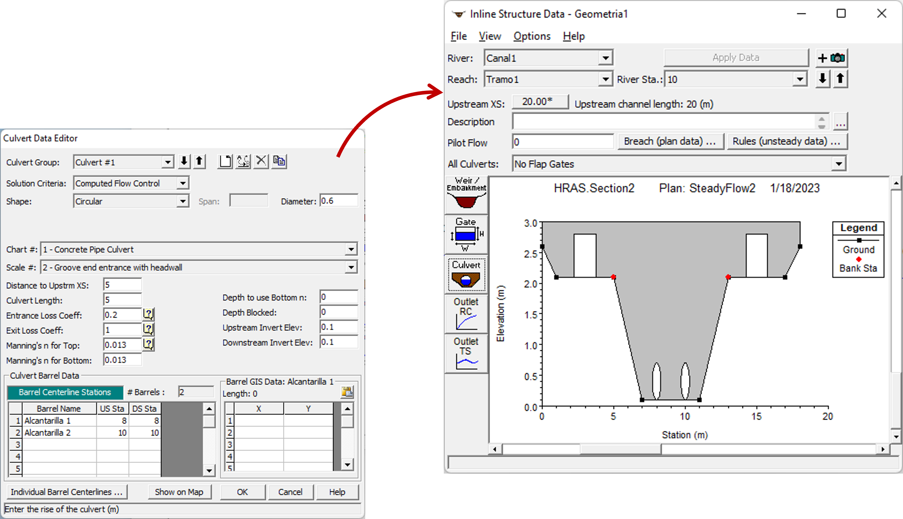

# Estructuras
Keywords: `Hydraulics` `HEC-RAS` `Structures` `Bridge` `Culvert` `Dams` `Weirs` `Spillways` 

 

 <b>Universidad Escuela Colombiana de Ingeniería Julio Garavito</b> 
<a href="https://github.com/juanrodace/">Juan David Rodriguez Acevedo</a> 
Profesor del Centro de Estudios Hidráulicos 
juan.rodrigueza@escuelaing.edu.co
 
 

    Video Actividad - Parte 1

##

### Alcance
En esta clase se presentan la inclusión de diferentes estructuras en el sistema hidráulico a modelar como puentes, pontones, alcantarillas, presas, vertederos, entre otros.

### Objetivos

* Conocer la definición y edición de puentes en el modelo.
* Conocer la definición y edición de alcantarillas en el modelo.
* Conocer la definición y edición de estructuras longitudinales en el modelo.
* Conocer la definición y edición de estructuras laterales en el modelo.

### Requerimientos

* [**Sección 2. Modelación hidráulica básica**](../../Section02/Readme.md)

### Estructuras en el sistema hidráulico

A continuación se describen los pasos sugeridos para la definición y simulación de los diferentes tipos de estructura en el modelo hidráulico.

#### Estructuras transversales. Puentes y alcantarillas.

1. Para iniciar, en la ventana de edición geométrica seleccionamos el ícono . Se desplegará la ventana de creación y edición de estructuras transversales de puentes y alcantarillas. Allí se debe ir al menú **Opciones → Agregar puente y/o alcantarilla** (Options → Add a bridge and/or culvert). 

A continuación, ingrese el número de la estación en la cual desea crear la estructura. En la ventana de edición e información aparecerán las secciones aguas arriba y aguas abajo de la estructura.

2. Para definir la geometría del puente o alcantarilla de clic en el botón <kbd>**Deck/Roadway**</kbd>. Se desplegará una ventana en la que puede definir dimensiones y características del puente o paso de vía como son: distancia a la sección transversal, ancho de la estructura, coeficiente de vertido, geometría (estación y alturas), taludes aguas arriba y aguas abajo e información en caso de que la estructura trabaje como vertedero.

Igualmente, para el caso de los puentes, al dar clic en el botón <kbd>**Pier**</kbd> o *"Pila"*, se abrirá la ventana para definir, si es el caso, la información de las pilas del puente. Acá podrá definir la geometría, ubicación y cantidad de pilas del puente. Al dar clic en el botón <kbd>OK</kbd>, se podrá visualizar el esquema de la estructura en las secciones aguas arriba y aguas abajo de esta. 

3. A continuación, podemos ingresar los datos de cálculo de la estructura, dando clic en el botón <kbd>**Bridge Modeling Approach**</kbd>. Se desplegará una ventana en la cual podrá definir los métodos de cálculo de la estructura tanto por encima como por debajo de esta (High Flow y Low Flow respectivamente).

4. Una vez finalizada la definición, en el editor de geometría podrá observar la estructura creada en planta. 

5. Para el caso de la alcantarilla, primero se debe definir la geometría general de estructura o cubierta del paso de vía mediante el botón <kbd>**Deck/Roadway**</kbd>, como se indicó en el paso 2. Posteriormente dando clic al botón <kbd>**Culvert**</kbd>, se desplegará la ventana de edición para ingresar la información de la(s) alcantarilla(s). En esta ventana se podrá definir: tipo, forma y material de la alcantarilla, geometría y dimensiones, distancia aguas arriba, longitud total, coeficientes de pérdida, coeficiente 'n' de Manning, cantidad y ubicación.  Al dar clic en el botón <kbd>OK</kbd>, se podrá visualizar el esquema de la estructura en las secciones aguas arriba y aguas abajo de esta.
 

6. Una vez más, al finalizar la definición, en el editor de geometría podrá observar la estructura creada en planta.

7. Luego de crear la estructura, puede realizar la simulación (de flujo permanente o no permanente) y posteriormente visualizar los resultados.

##

     Video Actividad - Parte 2

##

#### Estructuras en el canal. Presas, vertederos, compuertas, orificios y alcantarillas.

1. Para iniciar, en la ventana de edición geométrica seleccionamos el ícono . Se desplegará la ventana de creación y edición de estructuras en línea o sobre el canal. Allí debe ir al menú **Opciones → Agregar estructura en el canal** (Options → Add a inline structure). 

A continuación, ingrese el número de la estación en la cual desea crear la estructura. En la ventana de edición e información aparecerán la sección aguas arriba de la estructura.

2. Para definir la geometría de la presa o vertedero de clic en el botón <kbd>**Weir/Embankment**</kbd>. Se desplegará una ventana en la que puede definir dimensiones y características de la estructura como son: distancia a la sección transversal, ancho de la estructura, coeficiente de vertido, geometría (estación y alturas), taludes aguas arriba y aguas abajo e información de la forma y coeficientes del vertedero.  Al dar clic en el botón <kbd>OK</kbd>, se podrá visualizar el esquema de la estructura.

3. Si la estructura tiene compuertas, se podrán definir dando clic al botón <kbd>**Gate**</kbd>, donde se desplegará la ventana de edición para ingresar la información de la(s) compuerta(s). En esta ventana se podrá definir: tipo y forma, datos de flujo, coeficientes, geometría, cantidad y ubicación. Al dar clic en el botón <kbd>OK</kbd>, se podrá visualizar el esquema de la estructura en las secciones aguas arriba y aguas abajo de esta.

>**Nota:** Es importante tener en cuenta que al definir compuertas dentro de la estructura en el canal, se deben definir condiciones hidráulicas y de frontera en la ventana de información del flujo (permanente o no permanente) como se muestra a continuación.

4. Si la estructura tiene alcantarillas o tuberías, se podrán definir dando clic al botón <kbd>**Gate**</kbd>, donde se desplegará la ventana de edición para ingresar la información de la(s) alcantarillas(s), igual que en la definición de puentes o pasos de vía. En esta ventana se podrá definir:tipo, forma y material de la alcantarilla, geometría y dimensiones, distancia aguas arriba, longitud total, coeficientes de pérdida, coeficiente 'n' de Manning, cantidad y ubicación.  Al dar clic en el botón <kbd>OK</kbd>, se podrá visualizar el esquema de la estructura en las secciones aguas arriba y aguas abajo de esta.

#### Estructuras laterales. Vertederos, compuertas, orificios y alcantarillas.

1.  Para iniciar, en la ventana de edición geométrica seleccionamos el ícono . Se desplegará la ventana de creación y edición de estructuras laterales. Allí debe ir al menú **Opciones → Agregar estructura lateral** (Options → Add a lateral structure). 

A continuación, ingrese el número de la estación en la cual desea crear la estructura. En la ventana de edición e información podrá agregar una descripción, definir la posición de la estructura y definir el tipo de conexión.

2. Para definir la geometría de la presa o vertedero lateral, de clic en el botón <kbd>**Weir/Embankment**</kbd>. Se desplegará una ventana en la que puede definir dimensiones y características de la estructura como son: ancho, método y ecuaciones de cálculo, forma de la cresta, distancia a la sección aguas arriba y geometría (estación, elevación).  Al dar clic en el botón <kbd>OK</kbd>, se podrá visualizar el esquema de la estructura definida.

En la ventana de edición geométrica, también podrá visualizar la estructura en planta.

3. Si la estructura tiene compuertas, se podrán definir dando clic al botón <kbd>**Gate**</kbd>, donde se desplegará la ventana de edición para ingresar la información de la(s) compuerta(s). En esta ventana se podrá definir: tipo y forma, datos de flujo, coeficientes, geometría, cantidad y ubicación. Al dar clic en el botón <kbd>OK</kbd>, se podrá visualizar el esquema de la estructura en las secciones aguas arriba y aguas abajo de esta.

>**Nota:** Es importante tener en cuenta que al definir compuertas dentro de la estructura en el canal, se deben definir condiciones hidráulicas y de frontera en la ventana de información del flujo (permanente o no permanente) como se muestra a continuación.

4. Si la estructura tiene alcantarillas o tuberías, se podrán definir dando clic al botón <kbd>**Gate**</kbd>, donde se desplegará la ventana de edición para ingresar la información de la(s) alcantarillas(s), igual que en la definición de puentes o pasos de vía. En esta ventana se podrá definir:tipo, forma y material de la alcantarilla, geometría y dimensiones, distancia aguas arriba, longitud total, coeficientes de pérdida, coeficiente 'n' de Manning, cantidad y ubicación.  Al dar clic en el botón <kbd>OK</kbd>, se podrá visualizar el esquema de la estructura en las secciones aguas arriba y aguas abajo de esta.

5. Luego de crear la(s) estructura(s), puede realizar la simulación (de flujo permanente o no permanente) y posteriormente visualizar los resultados.

### Referencias
- [HEC-RAS User’s Manual. US Army Corps of Engineers.](https://www.hec.usace.army.mil/confluence/rasdocs/rasum/latest)
- [HEC-RAS Hydraulic Reference Manual.2020](https://www.hec.usace.army.mil/confluence/rasdocs/ras1dtechref/latest)
- [HEC-RAS Documentation. US Army Corps of Engineers.](https://www.hec.usace.army.mil/confluence/rasdocs)
    
### Control de versiones

| Versión | Descripción                                                       |                    Autor                    | Horas |
|:-------:|-------------------------------------------------------------------|:-------------------------------------------:|:-----:|
| 2023.01 | Versión inicial con definición de estructura general y contenido. | [juanrodace](https://github.com/juanrodace) |  1.0  |
| 2023.01 | Inclusión de conceptos, procedimientos, esquemas y gráficos.      | [juanrodace](https://github.com/juanrodace) |  3.5  |
| 2023.01 | Desarrollo de contenido multimedia.                               | [juanrodace](https://github.com/juanrodace) |  3.5  |

### Licencia, cláusulas y condiciones de uso

| [:arrow_backward:Anterior](../Levees/Readme.md) | [:house: Inicio](../../Readme.md) | [:beginner: Ayuda/Colabora](https://github.com/juanrodace/J.HRAS/discussions/4) | [Siguiente:arrow_forward:](../Scour/Readme.md) |
|-------------------------------------------------|-----------------------------------|---------------------------------------------------------------------------------|------------------------------------------------|

_J.HRAS es de uso libre para fines académicos, conoce nuestra licencia, cláusulas, condiciones de uso y como referenciar los contenidos publicados en este repositorio, dando [clic aquí](https://github.com/juanrodace/J.HRAS/wiki/License)._

_¡Encontraste útil este repositorio!, apoya su difusión marcando este repositorio con una ⭐ o síguenos dando clic en el botón Follow de [juanrodace](https://github.com/juanrodace) en GitHub._

##

##

 Este curso guía ha sido desarrollado con el apoyo de la Escuela Colombiana de Ingeniería - Julio Garavito. Encuentra más contenidos en https://github.com/uescuelaing  
