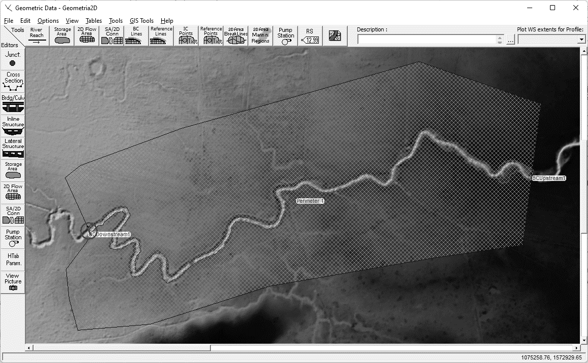
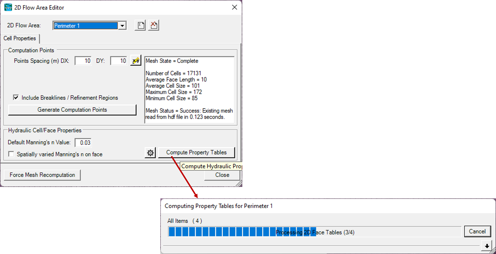
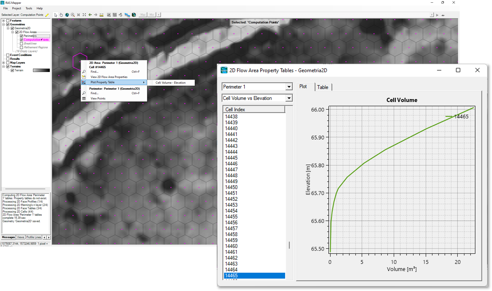
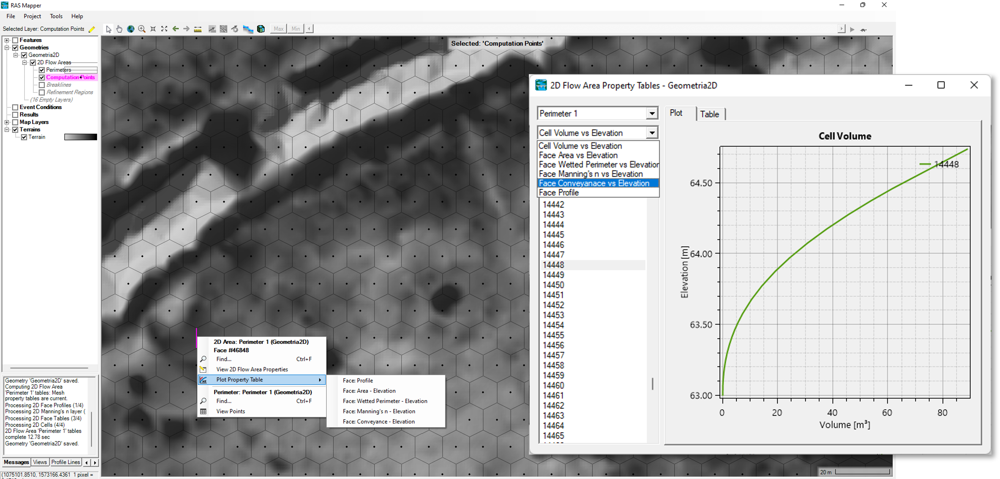
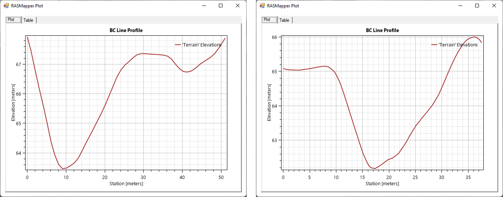

### Cálculo y definición de propiedades hidráulicas y geométricas
Keywords: `Hydraulics` `HEC-RAS` `2D` `Modeling` `Properties` `Cells` `Hydraulic`

### Alcance
En esta clase se presenta el proceso recomendado para el cálculo de las propiedades hidráulicas y geométricas en las celdas y caras de la malla

### Objetivos

* Definir el coeficiente de rugosidad asociado a una capa de cobertura.
* Calcular las tablas de propiedades hidráulicas y geométricas.
* Estudiar las propiedades en celdas y sus caras.
* Trazar la condición de frontera aguas arriba y aguas abajo.

### Requerimientos

* [Sección 1. Introducción y fundamentos](../../Section01/Readme.md)
* [Sección 2. Modelación hidráulica básica](../../Section02/Readme.md)
* [Actividad 13. Manning desde cobertura](../../Section03/Manning/Readme.md)
* [Actividad 17. Creación del MDT](../MDT/Readme.md)

### Cálculo y revisión de las propiedades en la malla

A continuación se presenta el proceso recomendado para el cálculo de diferentes propiedades para las celdas y sus caras como elevación, perímetro hidráulico, área hidráulica, coeficiente de rugosidad, entre otras:

1. Siga los pasos sugeridos para el cargue de información de cobertura de suelo y creación de mapa de coeficientes Manning, presentado en la [Actividad 13](../../Section03/Manning/Readme.md). Revise la asociación de la capa con la geometría 2D, dando clic derecho en el **Geometries** y seleccionando **Manage Geometry Associations**.

3. Manteniendo el modo edición, de clic derecho a **Perímetros** (Perimeters) y luego clic en **Editar las propiedades del área 2D** (Edit 2D Area Properties). Para realizar el cálculo de las propiedades de clic al botón <kbd>Compute Property Tables</kbd>. Finalice y guarde los cambios de edición.

2. En el mapa podrá acercarse a cualquier celda (cell) o cara(face) y dar clic derecho sobre esta, luego seleccione **Graficar tabla de propiedades** (Plot Property Table) y a continuación seleccione la propiedad que desee revisar.

* Volume vs. Elevation: Presenta una gráfica y tabla con el cálculo del volumen almacenado desde el punto más bajo hasta el punto más alto de la celda a partir de las elevaciones del modelo de terreno.
* Face - Profile: Perfil de terreno en la cara de la celda seleccionada.
* Area vs. Elevation: Corresponde al área hidráulica en función de la elevación.
* Manning vs. Elevation: Corresponde al coeficiente de rugosidad de Manning (n) en función de la elevación. 
* Conveyance vs. Elevation: Corresponde a la capacidad de transporte en función del cambio de pendiente a partir de los diferentes valores de elevación presentes en la cara de la celda.
   

### Condiciones de frontera

La localización espacial de dos diferentes condiciones de frontera (BC – Boundary Condition Line), no debe ser definida sobre una misma celda de la malla. Múltiples condiciones de frontera pueden ser agregadas a la malla compuesta. Se pueden asociar múltiples hidrogramas de entrada, por ejemplo, en el cauce principal y los cauces laterales. 

Para la modelación, por lo menos se debe ingresar una línea de condición de frontera aguas arriba y otra aguas abajo. Las líneas de condición de frontera pueden ser trazadas interna o externamente. Por ejemplo, el flujo base o flujo subterráneo puede ser definido en cualquier zona interna del modelo. Las líneas BC podrán ser dibujadas o importadas usando un archivo de formas (shapefile). Se recomienda importar estas líneas cuando se trate de elementos no rectos como vertederos circulares o curvos.

A continuación se presenta el proceso recomendado para trazar las líneas para condiciones de frontera:

1. En el modo edición de RAS Mapper, despliegue el arbol de **Geometries** y de **2D Flow Areas**. Luego seleccione las líneas de condiciones de frontera y con la barra de edición dibuje en planta las líneas BC aguas arriba y aguas abajo. Tenga en cuenta que la línea trazada debe estar localizada frente a las celdas de la zona del cauce. Se recomienda dibujar las líneas BC de izquierda a derecha tomando como referencia el sentido del flujo. Al finalizar, guarde los cambios de edición.

### Referencias
- [HEC-RAS User’s Manual. US Army Corps of Engineers.](https://www.hec.usace.army.mil/confluence/rasdocs/rasum/latest)
- [HEC-RAS Hydraulic Reference Manual.2020](https://www.hec.usace.army.mil/confluence/rasdocs/ras1dtechref/latest)
- [HEC-RAS Documentation. US Army Corps of Engineers.](https://www.hec.usace.army.mil/confluence/rasdocs)
- [HEC-RAS Mapper User's Manual](https://www.hec.usace.army.mil/confluence/rasdocs/rmum/latest)
- [HEC-RAS 2D User’s Manual. US Army Corps of Engineers.](https://www.hec.usace.army.mil/confluence/rasdocs/r2dum/latest)
- Herramientas computacionales para el diseño y modelación de cauces. r.cfdtools@gmail.com.  [(rcftools)](https://github.com/rcftools]).
    
### Control de versiones

| Versión | Descripción                                                       |                    Autor                    | Horas |
|:-------:|-------------------------------------------------------------------|:-------------------------------------------:|:-----:|
| 2023.01 | Versión inicial con definición de estructura general y contenido. | [juanrodace](https://github.com/juanrodace) |  1.0  |
| 2023.01 | Inclusión de conceptos, procedimientos, esquemas y gráficos.      | [juanrodace](https://github.com/juanrodace) |  2.0  |
| 2023.02 | Desarrollo de contenido multimedia.                               | [juanrodace](https://github.com/juanrodace) |  1.5  |

### Licencia, cláusulas y condiciones de uso

| [:arrow_backward:Anterior](../Mesh/Readme.md) | [:house: Inicio](../../Readme.md) | [:beginner: Ayuda/Colabora](https://github.com/juanrodace/J.HRAS/discussions/8) | [Siguiente:arrow_forward:](../Simulation2D/Readme.md) |
|-----------------------------------------------|-----------------------------------|---------------------------------------------------------------------------------|-------------------------------------------------------|

_J.HRAS es de uso libre para fines académicos, conoce nuestra licencia, cláusulas, condiciones de uso y como referenciar los contenidos publicados en este repositorio, dando [clic aquí](https://github.com/juanrodace/J.HRAS/wiki/License)._

_¡Encontraste útil este repositorio!, apoya su difusión marcando este repositorio con una ⭐ o síguenos dando clic en el botón Follow de [juanrodace](https://github.com/juanrodace) en GitHub._

