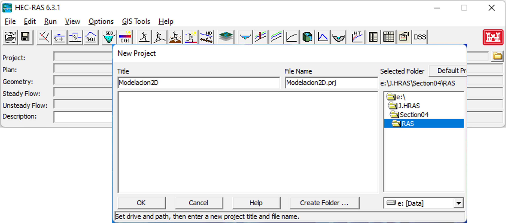
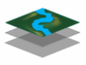
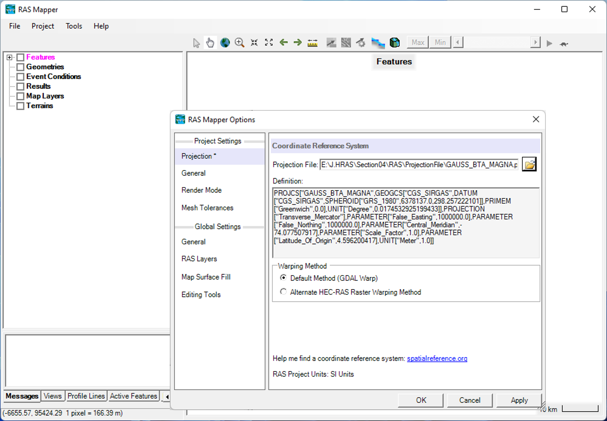
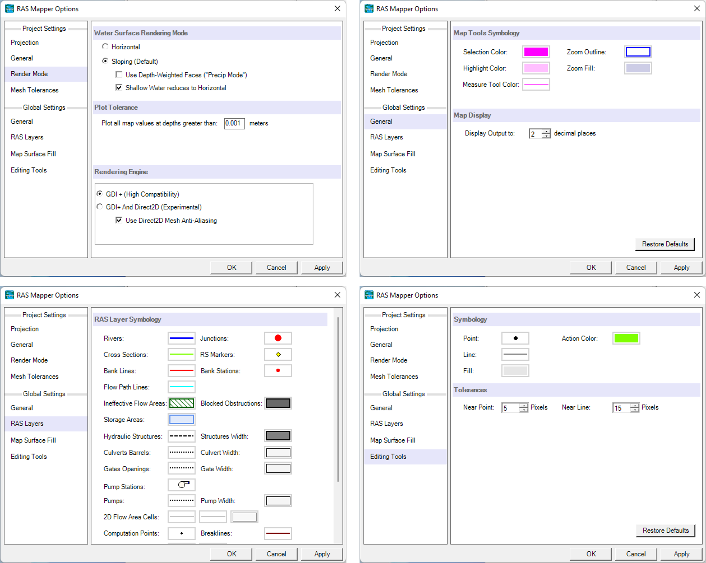

# Creación y procesamiento del modelo de terreno
Keywords: `Hydraulics` `HEC-RAS` `2D` `Modeling` `MDT` `Terrein`

### Alcance
En esta clase se presenta el proceso recomendado la creación del proyecto, configuración del RAS Mapper y creación del modelo de terreno.

### Objetivos

* Crear el proyecto HEC-RAS y establecer la configuración general de RAS Mapper.
* Crear el terreno (.hdf) RAS Mapper a partir de la capa raster.
* Visualizar y representar el modelo de terreno en RAS Mapper.
* Asociar mapas e imágenes de dominio público como fondo.

### Requerimientos

* [Sección 1. Introducción y fundamentos](../../Section01/Readme.md)
* [Sección 2. Modelación hidráulica básica](../../Section02/Readme.md)

### Creación de proyecto y configuración de RAS-Mapper

A continuación se presenta el proceso recomendado para la creación del proyecto y configuración del RAS Mapper.

1. Una vez inicie el programa, vaya al menú **Archivo → Nuevo proyecto** (File →New Project). En la ventana emergente podrá indicar el nombre del proyecto a crear y dar clic en <kbd>OK</kbd>. Revise y/o ajuste el sistema de unidades a utilizar en el menú **Opciones → Sistema de unidades** (Options → Unit system).

2. Ingrese a la herramienta RAS Mapper, dando clic en el botón . Luego seleccione **Herramientas → Definir sistema proyección del proyecto** (Tools → Set Projection for Project). En la ventana emergente, seleccione el archivo de proyección a utilizar.

3. En esta misma ventana o a través de **Herramientas → Opciones** (Tools → Options), es posible configurar varias opciones del RAS Mapper, como se describe a continuación.

- Modo de renderizado (Render mode): Podrá seleccionar el modo de renderizado entre inclinado (Sloping), horizontal (Horizontal) o híbrido (Hybrid). El primero es realizado a partir de la interpolación de las elevaciones de lámina de agua en cada lado de la celda y permite que la superficie se presente inclinada y continua. El segundo es presentado a partir de las elevaciones de lámina de agua obtenidas en cada celda.
- Configuración general (Global Settings- General): Contiene simbología de las herramientas de visualización de los mapas y dígitos decimales para visualización de resultados al vuelo en pantalla.
- Configuración de capas (Global Settings- RAS Layers): Contiene la simbología de visualización de diferentes capas que componen el modelo.
- Herramientas de edición (Global Settings- Editing Tools): Contiene la simbología de las herramientas de edición y las tolerancias de aproximación para puntos y líneas cercanas.

### Creación y procesamiento del modelo de terreno

A continuación se presenta el proceso recomendado para la creación y procesamiento del modelo de terreno.

1. 

### Referencias
- [HEC-RAS User’s Manual. US Army Corps of Engineers.](https://www.hec.usace.army.mil/confluence/rasdocs/rasum/latest)
- [HEC-RAS Hydraulic Reference Manual.2020](https://www.hec.usace.army.mil/confluence/rasdocs/ras1dtechref/latest)
- [HEC-RAS Documentation. US Army Corps of Engineers.](https://www.hec.usace.army.mil/confluence/rasdocs)
- [HEC-RAS Mapper User's Manual](https://www.hec.usace.army.mil/confluence/rasdocs/rmum/latest)
- [HEC-RAS 2D User’s Manual. US Army Corps of Engineers.](https://www.hec.usace.army.mil/confluence/rasdocs/r2dum/latest)
- Herramientas computacionales para el diseño y modelación de cauces. r.cfdtools@gmail.com.  [(rcftools)](https://github.com/rcftools]).
    
### Control de versiones

| Versión | Descripción                                                       |                    Autor                    | Horas |
|:-------:|-------------------------------------------------------------------|:-------------------------------------------:|:-----:|
| 2023.01 | Versión inicial con definición de estructura general y contenido. | [juanrodace](https://github.com/juanrodace) |  1.0  |
| 2023.01 | Inclusión de conceptos, procedimientos, esquemas y gráficos.      | [juanrodace](https://github.com/juanrodace) |  2.0  |
| 2023.01 | Desarrollo de contenido multimedia.                               | [juanrodace](https://github.com/juanrodace) |       |

### Licencia, cláusulas y condiciones de uso

| [:arrow_backward:Anterior](../Readme.md) | [:house: Inicio](../../Readme.md) | [:beginner: Ayuda/Colabora](https://github.com/juanrodace/J.HRAS/discussions/8) | [Siguiente:arrow_forward:](../Geometry/Readme.md) |
|------------------------------------------|-----------------------------------|---------------------------------------------------------------------------------|---------------------------------------------------|

_J.HRAS es de uso libre para fines académicos, conoce nuestra licencia, cláusulas, condiciones de uso y como referenciar los contenidos publicados en este repositorio, dando [clic aquí](https://github.com/juanrodace/J.HRAS/wiki/License)._

_¡Encontraste útil este repositorio!, apoya su difusión marcando este repositorio con una ⭐ o síguenos dando clic en el botón Follow de [juanrodace](https://github.com/juanrodace) en GitHub._