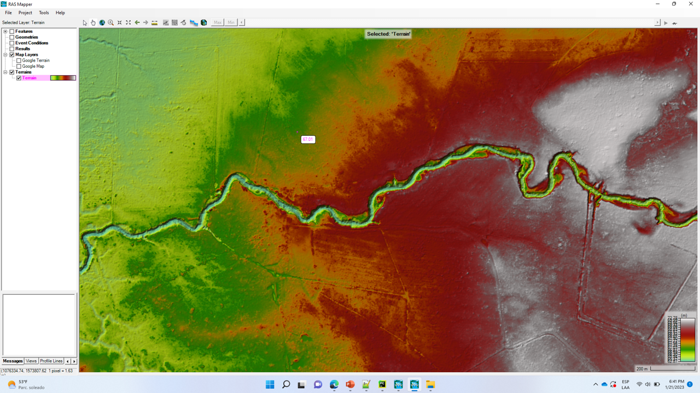

# Creación y procesamiento del modelo de terreno
Keywords: `Hydraulics` `HEC-RAS` `2D` `Modeling` `MDT` `Terrein`

### Alcance
En esta clase se presenta el proceso recomendado la creación del proyecto, configuración del RAS mapper y creación del modelo de terreno.

### Objetivos

* Crear el proyecto HEC-RAS y establecer la configuración general de RAS Mapper.
* Crear el terreno (.hdf) RAS Mapper a partir de la capa raster.
* Visualizar y representar el modelo de terreno en RAS Mapper.
* Asociar mapas e imágenes de dominio público como fondo.

### Requerimientos

* [Sección 1. Introducción y fundamentos](../../Section01/Readme.md)
* [Sección 2. Modelación hidráulica básica](../../Section02/Readme.md)

### Creación de proyecto y configuración de RAS-Mapper

### Creación y procesamiento del modelo de terreno
