

## Definición de área de drenaje y malla del modelo
Keywords: `Hydraulics` `HEC-RAS` `2D` `Modeling` `Mesh` `Area` `Perimeter`

 

 <b>Universidad Escuela Colombiana de Ingeniería Julio Garavito</b> 
<a href="https://github.com/juanrodace/">Juan David Rodriguez Acevedo</a> 
Profesor del Centro de Estudios Hidráulicos 
juan.rodrigueza@escuelaing.edu.co
 
 

    

##

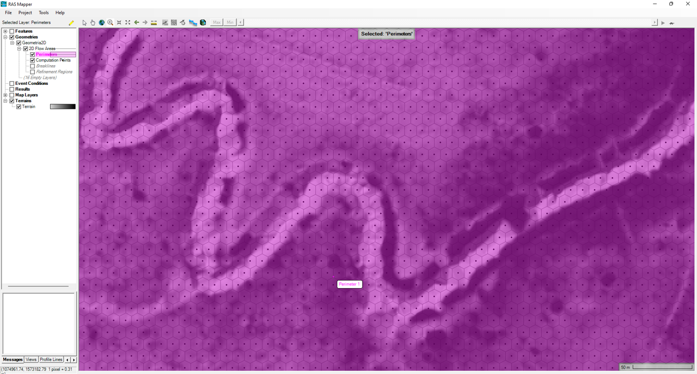

### Alcance
En esta clase se presenta el proceso recomendado para la delimitación del área de drenaje y la creación de la malla del modelo bidimensional (2D).

### Objetivos

* Crear el límite geográfico de la zona de estudio o modelación.
* Definir el espaciamiento de la malla entre celdas.
* Generar los puntos computacionales.
* Crear las líneas o regiones para refinamiento de la malla.
* Refinar la malla en RAS Mapper y corregir las celdas erradas.

### Requerimientos

* [Sección 1. Introducción y fundamentos](../../Section01/Readme.md)
* [Sección 2. Modelación hidráulica básica](../../Section02/Readme.md)
* [Actividad 17. Creación del MDT](../MDT/Readme.md)

### Definición y delimitación del área de drenaje

La modelación 2D requiere además de un modelo digital de terreno (MDT), el límite geográfico de la zona de estudio dentro de la cual se definirá el mallado bidimensional. Es HEC-RAS, estas áreas se conocen como **2D Flow Áreas** y pueden ser dibujadas manualmente desde esta herramienta o a partir de un archivo vectorial previamente definido con otra herramienta. 

A continuación se presenta el proceso recomendado para la delimitación geográfica de la zona de estudio, drenaje o modelación.

1. En el RAS Mapper de clic derecho sobre **Geometrías** (Geometries) y, seleccione **Agregar nueva geometría** (Add New Geometry). En la ventana emergente, agregue el nombre que desee.

2. Inicie la opción de edición, dando clic al botón <kbd>:pencil2:</kbd>. Despliegue el arbol de **Áreas de flujo 2D** (2D Flow Areas) y seleccione **Perímetros** (Perimeters). Utilizando la barra de dibujo podrá trazar manualmente el perímetro 2D de la zona de estudio.

> El área de flujo 2D también puede ser importada desde un archivo geográfico vectorial. Para esto, en el modo de edición, de clic derecho en **Perimeters** y seleccione **Import Features From Shapefile**. Seleccione el archivo y luego revise todas las propiedades parametrizables para el perímetro importado.

3. Al finalizar podrá visualizar el perímetro trazado en el mapa.

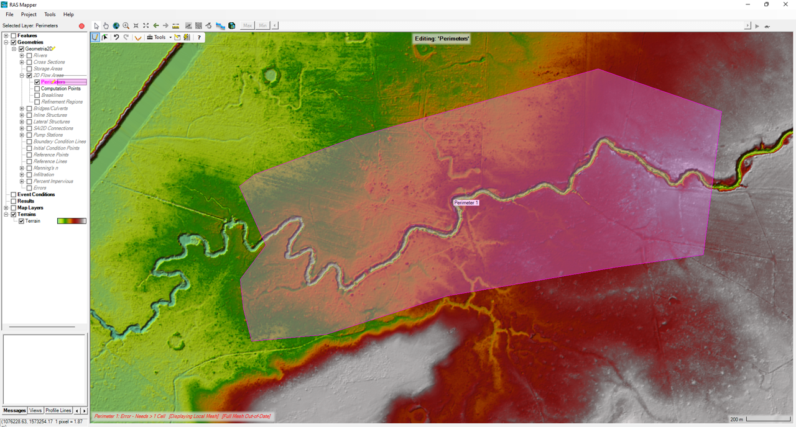

### Creación y definición de la malla 2D

Una malla o grilla computacional es creada a partir de la definición de un área de drenaje 2D. Cada celda de la malla está compuesta de las siguientes 3 propiedades.

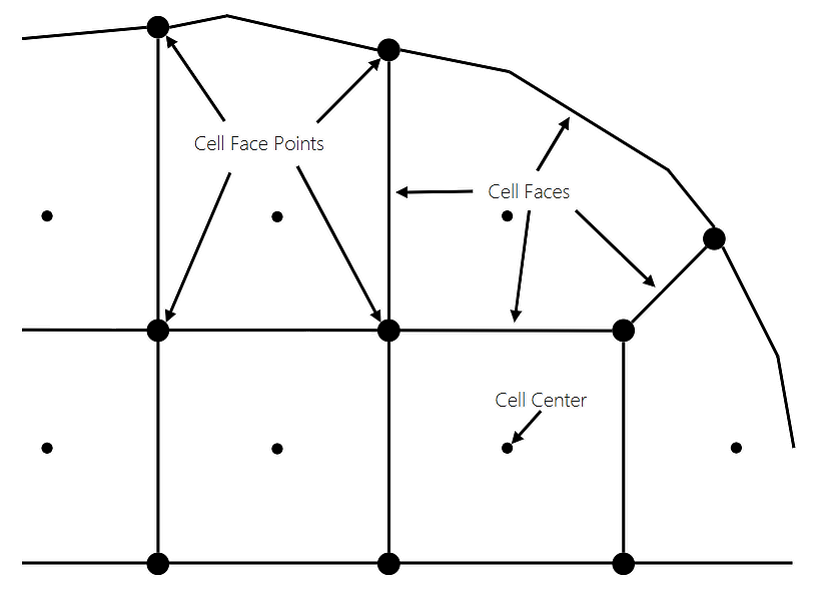 
<i>Tomado del Manual HEC-RAS 2D Modeling User Manual. Pag 3-5.</i> 

 * Centro de la celda (Cell Center): Corresponde al centro computacional de la celda y es el lugar específico donde la elevación de la lámina de agua es calculada. No necesariamente su localización se ubica en su centroide.
 * Caras de la celda (Cell Faces): Corresponde a los límites específicos de cada celda, generalmente son líneas rectas, sin embargo, también pueden componerse de múltiples nodos, tal como ocurre con el perímetro de las áreas de drenaje 2D. Una celda podrá contener como máximo 8 caras.
 * Puntos de Cara de Celda (Cell Face Points-FP): Corresponde a los puntos finales de cada lado de la celda. Estos puntos son utilizados para anclar o conectar un área 2D a un elemento 1D y para el reconocimiento de las celdas asociadas a las condiciones de frontera.

A continuación se presenta el proceso recomendado para la creación y definición de la malla bidimensional de la modelación.

1. Manteniendo el modo edición, de clic derecho a **Perímetros** (Perimeters) y luego clic en **Editar las propiedades del área 2D** (Edit 2D Area Properties). Para el perímetro creado, defina el espaciamiento de las celdas y de clic en <kbd>Generate Computation Points</kbd>. También puede asignar un valor por defecto para el coeficiente de rugosidad de Manning para las celdas que no estén asociadas a una capa de cobertura y revisar los valores por defecto de las tolerancias.

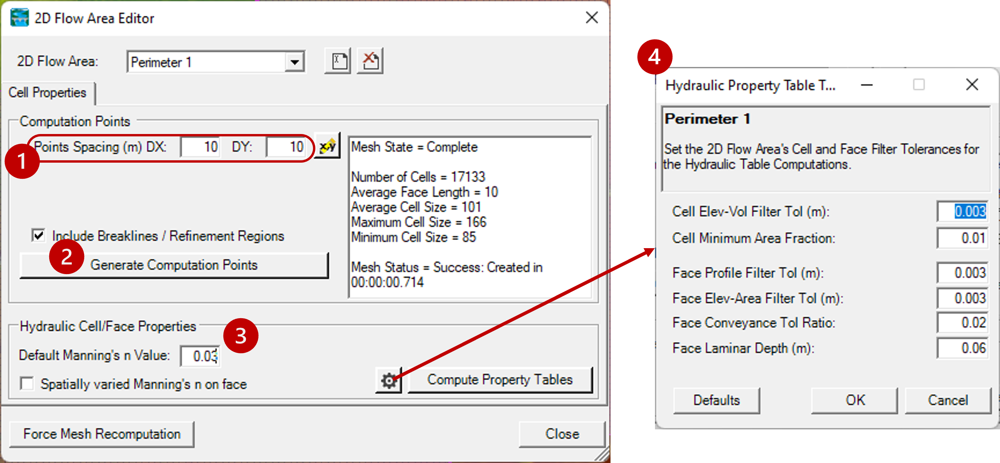
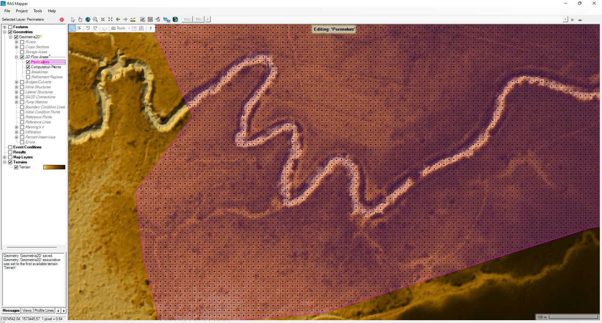

> Nota: Tenga en cuenta que dependiendo del tamaño de la celda, aumentará potencialmente el número de celdas y consecuentemente el costo computacional para resolver el modelo 2D.

> **Forma de las celdas**: Generalmente, para Áreas de Flujo 2D irregulares, el mallado interno es realizado de forma regular estructurada y las celdas de borde de forma irregular, creando así una malla no estructurada compuesta. RAS Mapper ha sido diseñado para usar mallas compuestas No Estructuradas, sin embargo, dependiendo de la geometría del Área de Flujo 2D, puede trabajar también con mallas completamente estructuradas. Dando clic derecho a Perímetros (Perimeters) y luego clic a Propiedades de la Capa (Layer Properties), podrá activar en Features la casilla para generación de celdas compuestas hexagonales. Deberá dar clic en <kbd>Generate Computation Points</kbd> en la ventana de edición para generar nuevamente el mallado. 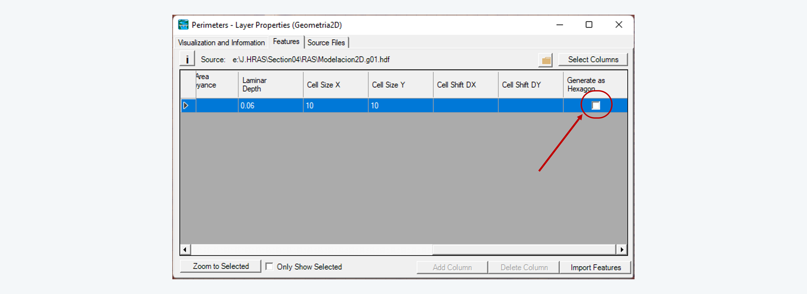 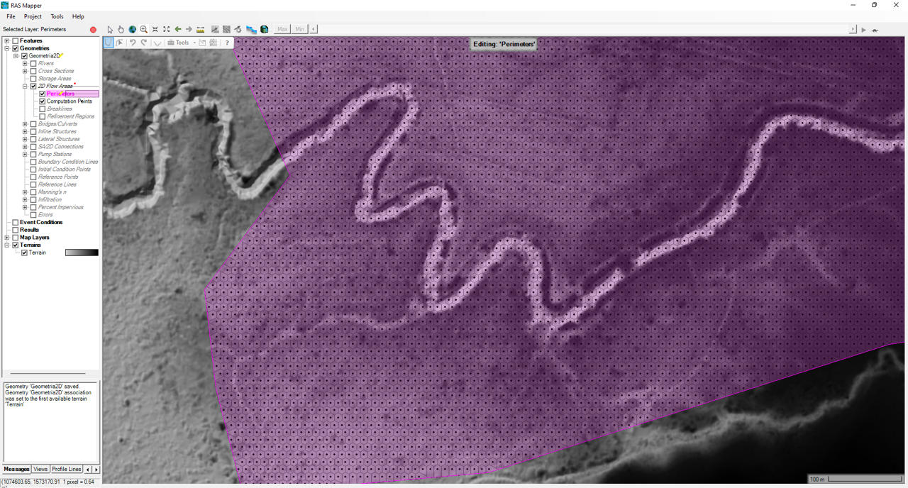

2. No olvide guardar los cambios de la geometría.

### Refinamiento de la malla 2D

Después de crear la malla computacional, podrá agregar líneas o regiones para su refinamiento. Generalmente, el refinamiento con líneas de corte se utiliza en las zonas de corona de taludes en diques o bancas y a lo largo de las vías para definir los límites de flujo _(similar a los diques o levees en un modelo 1D a partir de secciones transversales)_ o para controlar su dirección.

Las regiones de refinamiento funcionan similar a las líneas de corte y son mayormente utilizadas cuando las líneas de refinamiento se encuentran próximas o cuando se quiere cambiar el tamaño interno de las celdas y de su contorno en una región determinada, por ejemplo, en zonas de amortiguación, embalses, estructuras hidráulicas, a lo largo de todo el valle o en zonas con contornos curvos cerrados.

A continuación se presenta el proceso recomendado para el refinamiento de la malla:

1. En el modo edición, seleccione **Líneas corte** (Breaklines) o **Regiones de refinamiento (Refinement Regions)**, dependiendo de si usará líneas o regiones. Luego con la barra de edición trace las líneas o regiones de refinamiento. 

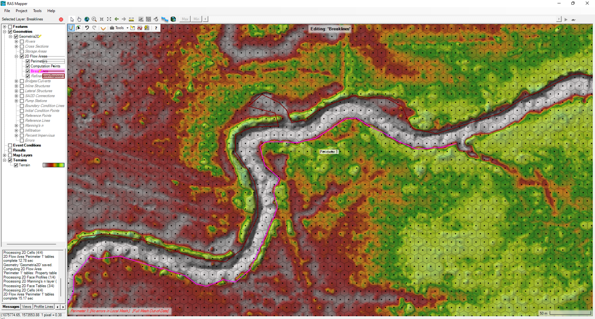
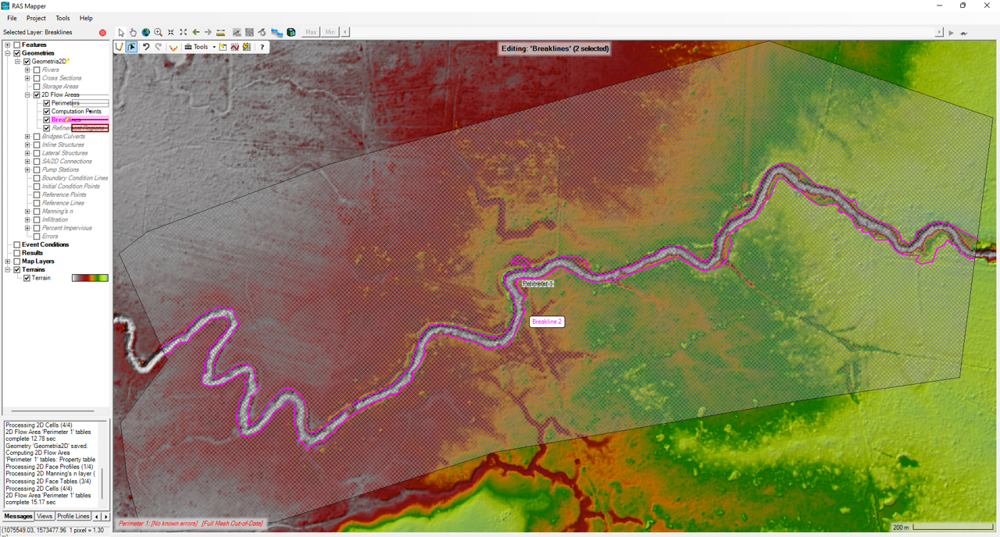

2. Ahora de clic derecho sobre las **Líneas corte** (Breaklines) o **Regiones de refinamiento (Refinement Regions)** y seleccione **Enforce All Breaklines** o **Enforce All Regions**, según sea el caso. En el mapa observará el ajuste realizado de la malla con las líneas o regiones. Guarde los cambios de la geometría.

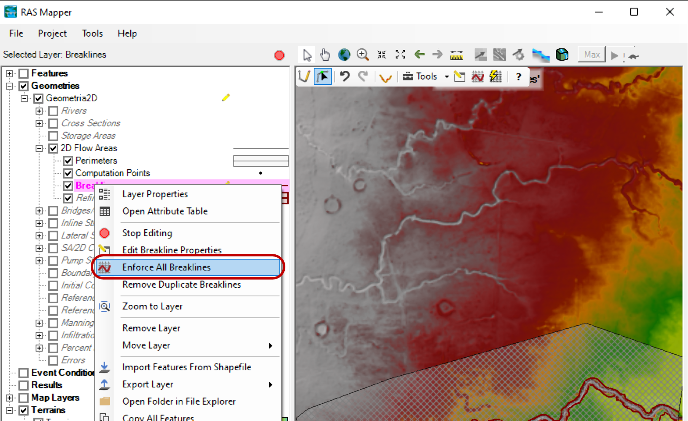
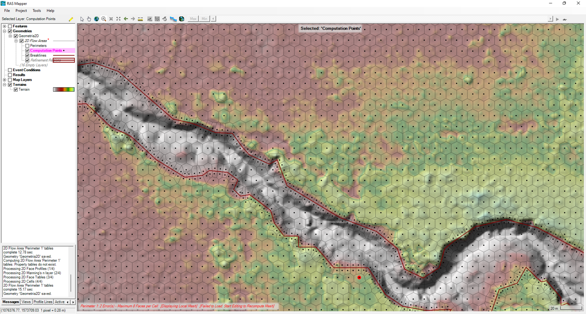

3. Durante el refinamiento, algunas celdas se han resuelto geométricamente con un mayor número de caras que las 8 permitidas. Para la corrección, se deben separar estas celdas en 2 o más, agregando puntos computacionales (computation points) adicionales en el modo edición. Puede seguir este proceso: 
   * Navegue por la malla cerca al área de refinamiento e identifique las celdas erradas (círculos rojos).
   * Realice un acercamiento a la celda errada y revise el número de caras.
   * En el modo edición (seleccionando los **Computation points**), agregue un nuevo punto dentro de la celda cerca a la zona con mayor número de caras.
   * Guarde los cambios realizados.

> Las líneas o regiones para el refinamiento, también pueden ser importadas al RAS Mapper a partir de archivos geográficos vectoriales. En el modo edición (<kbd>:pencil2:</kbd>), de clic derecho sobre las **Líneas de corte (Breaklines)** y seleccione **Importar características (Import Features From Shapefile)**. 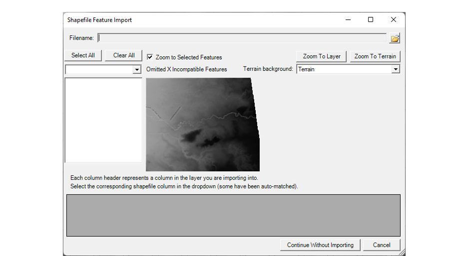 En la ventana emergente, defina el espaciamiento y revise las propiedades del archivo a importar y de clic en <kbd>Import Features</kbd>. Observará el primer ajuste realizado sobre la malla y las líneas de corte (breaklines). Para el caso de las regiones, repita el mismo proceso, pero seleccionando **Regiones de refinamiento (Refinement Regions)**

### Referencias
- [HEC-RAS User’s Manual. US Army Corps of Engineers.](https://www.hec.usace.army.mil/confluence/rasdocs/rasum/latest)
- [HEC-RAS Hydraulic Reference Manual.2020](https://www.hec.usace.army.mil/confluence/rasdocs/ras1dtechref/latest)
- [HEC-RAS Documentation. US Army Corps of Engineers.](https://www.hec.usace.army.mil/confluence/rasdocs)
- [HEC-RAS Mapper User's Manual](https://www.hec.usace.army.mil/confluence/rasdocs/rmum/latest)
- [HEC-RAS 2D User’s Manual. US Army Corps of Engineers.](https://www.hec.usace.army.mil/confluence/rasdocs/r2dum/latest)
- Herramientas computacionales para el diseño y modelación de cauces. r.cfdtools@gmail.com.  [(rcftools)](https://github.com/rcftools]).
    
### Control de versiones

| Versión | Descripción                                                       |                    Autor                    | Horas |
|:-------:|-------------------------------------------------------------------|:-------------------------------------------:|:-----:|
| 2023.01 | Versión inicial con definición de estructura general y contenido. | [juanrodace](https://github.com/juanrodace) |  1.0  |
| 2023.01 | Inclusión de conceptos, procedimientos, esquemas y gráficos.      | [juanrodace](https://github.com/juanrodace) |  3.0  |
| 2023.02 | Desarrollo de contenido multimedia.                               | [juanrodace](https://github.com/juanrodace) |  1.5  |

### Licencia, cláusulas y condiciones de uso

| [:arrow_backward:Anterior](../MDT/Readme.md) | [:house: Inicio](../../Readme.md) | [:beginner: Ayuda/Colabora](https://github.com/juanrodace/J.HRAS/discussions/5) | [Siguiente:arrow_forward:](../Hydraulic/Readme.md) |
|----------------------------------------------|-----------------------------------|---------------------------------------------------------------------------------|----------------------------------------------------|

_J.HRAS es de uso libre para fines académicos, conoce nuestra licencia, cláusulas, condiciones de uso y como referenciar los contenidos publicados en este repositorio, dando [clic aquí](https://github.com/juanrodace/J.HRAS/wiki/License)._

_¡Encontraste útil este repositorio!, apoya su difusión marcando este repositorio con una ⭐ o síguenos dando clic en el botón Follow de [juanrodace](https://github.com/juanrodace) en GitHub._

##

##

 Este curso guía ha sido desarrollado con el apoyo de la Escuela Colombiana de Ingeniería - Julio Garavito. Encuentra más contenidos en https://github.com/uescuelaing  
