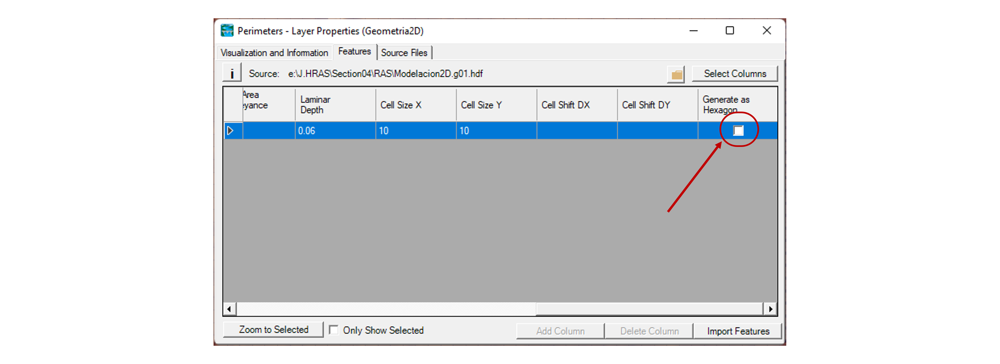

### Definición de área de drenaje y malla del modelo
Keywords: `Hydraulics` `HEC-RAS` `2D` `Modeling` `Mesh` `Area` `Perimeter`

### Alcance
En esta clase se presenta el proceso recomendado para la delimitación del área de drenaje y la creación de la malla del modelo bidimensional (2D).

### Objetivos

* Crear el límite geográfico de la zona de estudio o modelación.
* Definir el espaciamiento de la malla entre celdas.
* Generar los puntos computacionales.

### Requerimientos

* [Sección 1. Introducción y fundamentos](../../Section01/Readme.md)
* [Sección 2. Modelación hidráulica básica](../../Section02/Readme.md)
* [Actividad 17. Creación del MDT](../MDT/Readme.md)

### Definición y delimitación del área de drenaje

La modelación 2D requiere además de un modelo digital de terreno (MDT), el límite geográfico de la zona de estudio dentro de la cual se definirá el mallado bidimensional. Es HEC-RAS, estas áreas se conocen como **2D Flow Áreas** y pueden ser dibujadas manualmente desde esta herramienta o a partir de un archivo vectorial previamente definido con otra herramienta. 

A continuación se presenta el proceso recomendado para la delimitación geográfica de la zona de estudio, drenaje o modelación.

1. En el RAS Mapper de clic derecho sobre **Geometrías** (Geometries) y, seleccione **Agregar nueva geometría** (Add New Geometry). En la ventana emergente, agregue el nombre que desee.

2. Inicie la opción de edición, dando clic al botón <kbd>:pencil2:</kbd>. Despliegue el arbol de **Áreas de flujo 2D** (2D Flow Areas) y seleccione **Perímetros** (Perimeters). Utilizando la barra de dibujo podrá trazar manualmente el perímetro 2D de la zona de estudio.

> El área de flujo 2D también puede ser importada desde un archivo geográfico vectorial. Para esto, en el modo de edición, de clic derecho en **Perimeters** y seleccione **Import Features From Shapefile**. Seleccione el archivo y luego revise todas las propiedades parametrizables para el perímetro importado.

3. Al finalizar podrá visualizar el perímetro trazado en el mapa.

### Creación y definición de la malla 2D

Una malla o grilla computacional es creada a partir de la definición de un área de drenaje 2D. Cada celda de la malla está compuesta de las siguientes 3 propiedades.

 
<i>Tomado del Manual HEC-RAS 2D Modeling User Manual. Pag 3-5.</i>

 * Centro de la celda (Cell Center): Corresponde al centro computacional de la celda y es el lugar específico donde la elevación de la lámina de agua es calculada. No necesariamente su localización se ubica en su centroide.
 * Caras de la celda (Cell Faces): Corresponde a los límites específicos de cada celda, generalmente son líneas rectas, sin embargo, también pueden componerse de múltiples nodos, tal como ocurre con el perímetro de las áreas de drenaje 2D. Una celda podrá contener como máximo 8 caras.
 * Puntos de Cara de Celda (Cell Face Points-FP): Corresponde a los puntos finales de cada lado de la celda. Estos puntos son utilizados para anclar o conectar un área 2D a un elemento 1D y para el reconocimiento de las celdas asociadas a las condiciones de frontera.

A continuación se presenta el proceso recomendado para la creación y definición de la malla bidimensional de la modelación.

1. Manteniendo el modo edición, de clic derecho a **Perímetros** (Perimeters) y luego clic en **Editar las propiedades del área 2D** (Edit 2D Area Properties). Para el perímetro creado, defina el espaciamiento de las celdas y de clic en <kbd>Generate Computation Points</kbd>. También puede asignar un valor por defecto para el coeficiente de rugosidad de Manning para las celdas que no estén asociadas a una capa de cobertura y revisar los valores por defecto de las tolerancias.

> Nota: Tenga en cuenta que dependiendo del tamaño de la celda, aumentará potencialmente el número de celdas y consecuentemente el costo computacional para resolver el modelo 2D.

> **Forma de las celdas**: Generalmente, para Áreas de Flujo 2D irregulares, el mallado interno es realizado de forma regular estructurada y las celdas de borde de forma irregular, creando así una malla no estructurada compuesta. RAS Mapper ha sido diseñado para usar mallas compuestas No Estructuradas, sin embargo, dependiendo de la geometría del Área de Flujo 2D, puede trabajar también con mallas completamente estructuradas. Dando clic derecho a Perímetros (Perimeters) y luego clic a Propiedades de la Capa (Layer Properties), podrá activar en Features la casilla para generación de celdas compuestas hexagonales. 

2.