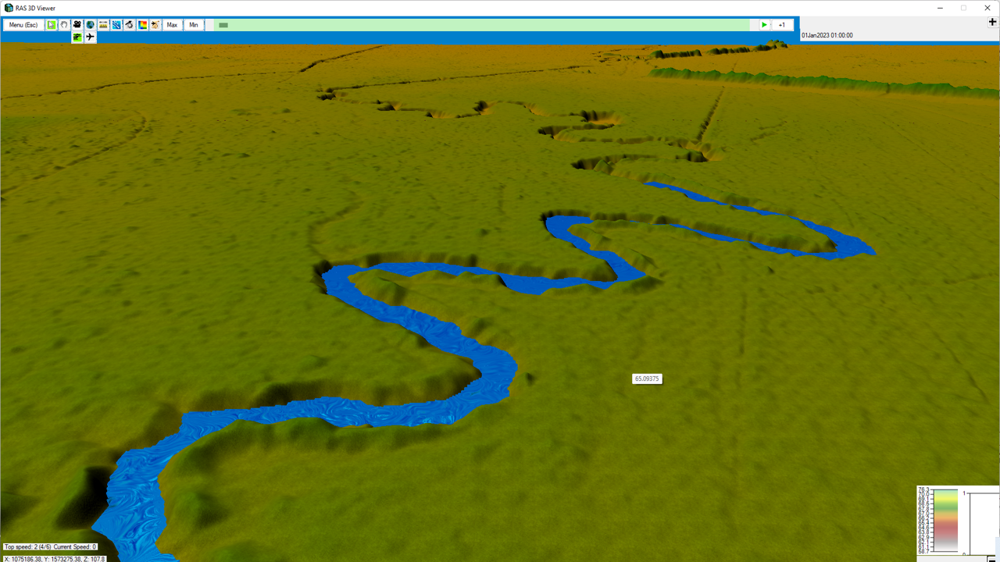
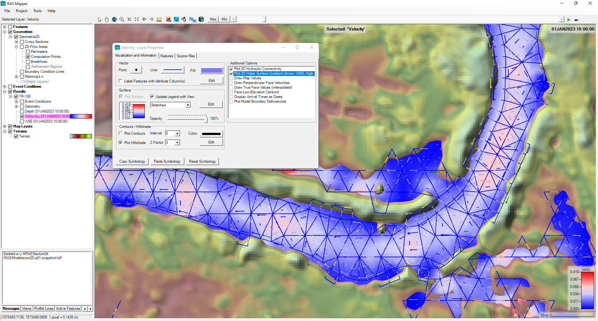
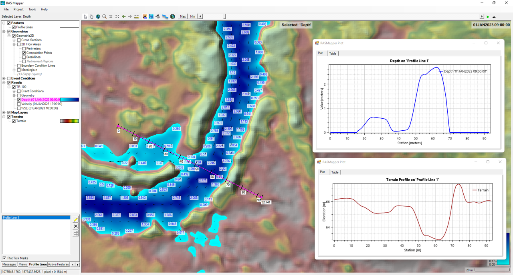
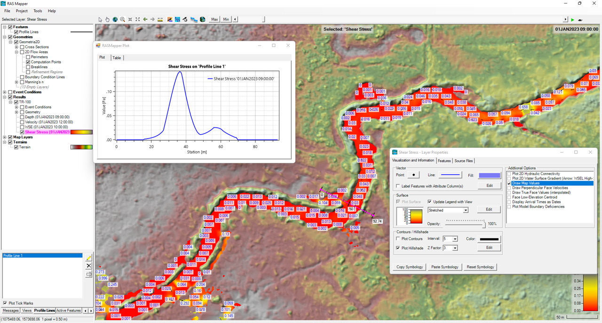

## Resultados y mapas
Keywords: `Hydraulics` `HEC-RAS` `2D` `Modeling` `Unsteady` `Maps` `Results`

 

 <b>Universidad Escuela Colombiana de Ingeniería Julio Garavito</b> 
<a href="https://github.com/juanrodace/">Juan David Rodriguez Acevedo</a> 
Profesor del Centro de Estudios Hidráulicos 
juan.rodrigueza@escuelaing.edu.co
 
 

    

##

### Alcance
En esta clase se presentan las diferentes opciones de visualización de resultados y creación de mapas para los modelos 2D.

### Objetivos

* Generar y visualizar los mapas de resultado del modelo 2D.

### Requerimientos

* [Sección 2. Modelación hidráulica básica](../../Section02/Readme.md)

### Creación y visualización general de mapas

RAS Mapper dispone de diferentes tipos de mapas para la visualización de los resultados obtenidos de la modelación.

- Profundidad de lámina de agua (Depth): Diferencia entre la elevación de la lámina de agua y la cota de terreno. Opcionalmente, el usuario podrá observar los gradientes de conectividad entre celdas.
- Límite zona inundada (Inundation Boundary): Polígono que delimita la zona máxima inundada. Puede ser exportada a diferentes formatos.
- Elevación inversa o cota (Water surface elevation - WSE): Cota de elevación de la lámina de agua.
- Velocidad del flujo (Velocity).
- Esfuerzo cortante (Shear Stress): Esfuerzo ejercido por el fluido en función de la profundidad de agua, el radio hidráulico y la pendiente de fricción.
- Número de Courant: Valor adimensional que representa el criterio para evaluar el espaciamiento entre las secciones transversales o el tamaño de las caras de las celdas de la malla y la velocidad de onda del flujo. 
- Número de Froude: Parámetro adimensional que representa la relación entre las fuerzas gravitacionales y las inerciales. Es utilizado para la clasificación del régimen de un flujo. 
- Porcentaje de tiempo inundado (Percent time inundated): Cantidad de tiempo que el área o la celda es inundada como porcentaje del tiempo total definido en el intervalo de tiempo de la modelación.
- Tiempo de permanencia del flujo (Residence time): Tiempo de residencia del flujo en horas por celda hasta cada instante de tiempo.
- Profundidad x Velocidad (Depth x Velocity): Capacidad del flujo para producir condición de riesgo por volcamiento o arrastre.  
- Tiempo de llegada (arrival time): Tiempo (horas o dias) a partir del cual se excede un valor de profundidad especificado.
- Recesión (Recession): Tiempo (horas o dias) en el que la altura de lámina de agua está por debajo de un valor de profundidad especificado.
- Duración de inundación (Duration): Tiempo total inundado a partir de un tiempo instante de tiempo especificado.
- Potencia de la corriente (Stream power): Potencia calculada como la media de las velocidades por la media de los esfuerzos cortantes. Puede ser interpretada como la capacidad de arrastre del flujo de los materiales del fondo y las partículas suspendidas.

#### Mapas por defecto

1. Una vez se inicie el RAS Mapper active la casilla de resultados y el plan a visualizar. Encontrará tres mapas por defecto (Depth, Velocity and WSE).

2. Al dar doble clic sobre la rampa de colores o clic derecho y seleccionar <kbd>Layer Properties</kbd> podrá cambiar las características de visualización, así como opciones adicionales para cada mapa. Igualmente en la barra superior podrá moverse en la simulación, de acuerdo con el intervalo definido en esta.

3. También podrá generar líneas de perfil para visualizar los resultados con respecto a un eje, sección transversal o línea en general.

#### Crear nuevos mapas de resultado

1. Para la creación de nuevos mapas, de clic derecho sobre el plan y seleccione **Crear un nuevo mapa de resultados (Create a new results map layer)**. Allí se desplegará una ventana donde podrá seleccionar la propiedad o característica hidráulica con la que desee generar el mapa. Luego debera seleccionar el perfil (Max, Min, Varios), las condiciones de salida y dar clic en <kbd>Add Map</kbd>.

2. De ser necesario, de clic derecho sobre el mapa creado y seleccione **Compute/Update Stored map**. Luego podrá visualizar el o los perfiles deseados, cambiar las opciones de visualización y utilizar las diferentes herramientas del RAS Mapper.

### Referencias
- [HEC-RAS User’s Manual. US Army Corps of Engineers.](https://www.hec.usace.army.mil/confluence/rasdocs/rasum/latest)
- [HEC-RAS Hydraulic Reference Manual.2020](https://www.hec.usace.army.mil/confluence/rasdocs/ras1dtechref/latest)
- [HEC-RAS Documentation. US Army Corps of Engineers.](https://www.hec.usace.army.mil/confluence/rasdocs)
- [HEC-RAS Mapper User's Manual](https://www.hec.usace.army.mil/confluence/rasdocs/rmum/latest)
- [HEC-RAS 2D User’s Manual. US Army Corps of Engineers.](https://www.hec.usace.army.mil/confluence/rasdocs/r2dum/latest)
- Herramientas computacionales para el diseño y modelación de cauces. r.cfdtools@gmail.com.  [(rcftools)](https://github.com/rcftools]).
    
### Control de versiones

| Versión | Descripción                                                       |                    Autor                    | Horas |
|:-------:|-------------------------------------------------------------------|:-------------------------------------------:|:-----:|
| 2023.01 | Versión inicial con definición de estructura general y contenido. | [juanrodace](https://github.com/juanrodace) |  1.0  |
| 2023.01 | Inclusión de conceptos, procedimientos, esquemas y gráficos.      | [juanrodace](https://github.com/juanrodace) |  2.0  |
| 2023.02 | Desarrollo de contenido multimedia.                               | [juanrodace](https://github.com/juanrodace) |  1.5  |

### Licencia, cláusulas y condiciones de uso

| [:arrow_backward:Anterior](../Simulation2D/Readme.md) | [:house: Inicio](../../Readme.md) | [:beginner: Ayuda/Colabora](https://github.com/juanrodace/J.HRAS/discussions/5) | [Siguiente:arrow_forward:](../../Readme.md) |
|-------------------------------------------------------|-----------------------------------|---------------------------------------------------------------------------------|-----------------------------------------------------|

_J.HRAS es de uso libre para fines académicos, conoce nuestra licencia, cláusulas, condiciones de uso y como referenciar los contenidos publicados en este repositorio, dando [clic aquí](https://github.com/juanrodace/J.HRAS/wiki/License)._

_¡Encontraste útil este repositorio!, apoya su difusión marcando este repositorio con una ⭐ o síguenos dando clic en el botón Follow de [juanrodace](https://github.com/juanrodace) en GitHub._

##

##

 Este curso guía ha sido desarrollado con el apoyo de la Escuela Colombiana de Ingeniería - Julio Garavito. Encuentra más contenidos en https://github.com/uescuelaing  
