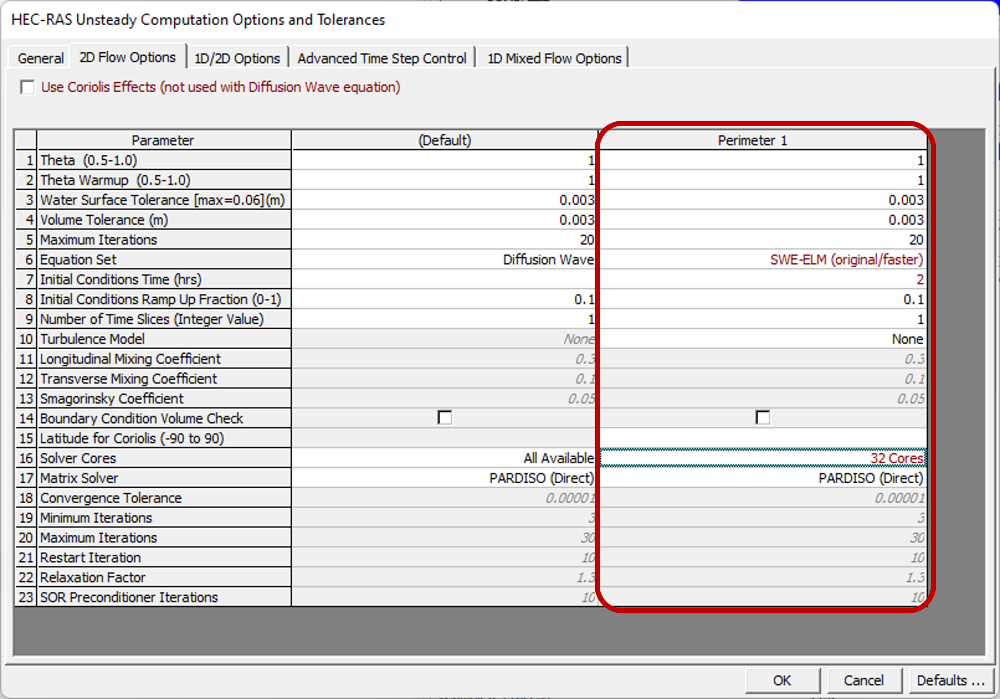

## Modelación hidráulica bidimensional 2D
Keywords: `Hydraulics` `HEC-RAS` `2D` `Modeling` `Unsteady` `Hydraulic`

 

 <b>Universidad Escuela Colombiana de Ingeniería Julio Garavito</b> 
<a href="https://github.com/juanrodace/">Juan David Rodriguez Acevedo</a> 
Profesor del Centro de Estudios Hidráulicos 
juan.rodrigueza@escuelaing.edu.co
 
 

    

##

### Alcance
En esta clase se presenta el proceso recomendado para la definición de datos y condiciones de frontera y la simulación bidimensional (2D) en condición de flujo no permanente.

### Objetivos

* Definir información de flujo y condiciones de frontera.
* Realizar la configuración del plan de simulación.
* Configurar los intervalos de tiempo variables.
* Definir el sistema de ecuaciones para resolver el modelo hidráulico.
* Ejecutar la simulación hidráulica bidimensional.

### Requerimientos

* [Sección 1. Introducción y fundamentos](../../Section01/Readme.md)
* [Sección 2. Modelación hidráulica básica](../../Section02/Readme.md)

### Información de flujo y condiciones de frontera

1. Para iniciar, vamos a ingresar a la ventana de **Información de flujo permanente (Steady flow data)**. En la ventana emergente, seleccione **Archivo → Nuevo/Guardar información de flujo no permanente** (File → New/Save unsteady flow data) e ingrese el nombre que desee asignarle a la información del flujo y de clic en el botón <kbd>**OK**</kbd>.

2. En la ventana de **Información de flujo no permanente** (Unsteady flow data), podrá ingresar una descripción de la información de flujo, así como definir las condiciones de frontera, condiciones iniciales y agregar información metereológica u observada en el sistema a modelar. Para este ejercicio, agregaremos un hidrograma de flujo aguas arriba del canal (BC Upstream 1) y definiremos flujo uniforme en la sección aguas abajo (BC Downstream 1). Una vez ingrese toda la información de clic en el botón <kbd>**Apply Data**</kbd> que encontrará en la parte superior derecha de la ventana. Finalmente, seleccione <kbd>**Plot Data**</kbd> para verificar y revisar el cargue de la información.  Recuerde guardar los cambios realizados a las características del flujo y condiciones hidráulicas

> Recuerde que en el caso de los hidrogramas o curvas de estación-flujo, deberá definir correctamente los tiempos de inicio y fin del hidrograma, así como el intervalo de tiempo y la pendiente de la línea de energía (EG slope for distributing flow). 

> _Nota: Si desea evaluar diferentes periodos de retorno, deberá crear un archivo de información de flujo no permanente para cada periodo de retorno.._

### Plan de simulación y simulación

1. Ingresar a la ventana de **Análisis de flujo no permanente (Unsteady flow analysis)**. Y en la ventana emergente, seleccione **Archivo → Nuevo/Guardar plan** (File → Save plan). Luego ingrese el nombre con el cual desea guardar el plan. Se creará un archivo con el formato <kbd>.p*</kbd>. 

2. En la ventana de análisis del flujo, ingrese una descripción y revise que el archivo de geometría y de información de flujo estén correctamente seleccionados. Luego seleccione las características o programas de la modelación (preprocesador de geometría, simulación de flujo no permanente, sedimentos, post-procesador, creación de mapas de inundación). También debe definir los tiempos de inicio y fin de la simulación y las propiedades de cálculo (intervalo de cálculo, intervalo de hidrograma de salida, intervalo de mapas de salida y archivo de salida).

3. Ahora ingrese al menú **Opciones → Opciones de cálculo y tolerancias**, allí podrá definir y/o seleccionar las opciones de cálculo, ecuaciones, condiciones iniciales, tolerancias, entre otros. Así mismo, en la pestaña <kbd>Advanced Time Step Control</kbd> podrá dejar el tiempo fijo o auto ajustable basado en la condición de Courant.

4. Finalmente de clic en el botón <kbd>**Compute**</kbd> y se iniciarán los cálculos de la simulación.

---
> **Nota 1: Ecuaciones para resolver el modelo**   HEC-RAS tiene la opción de ejecutar los siguientes conjuntos de ecuaciones: ecuaciones de onda difusiva 2D (diffusion wave), aproximación de inercia local (SWE-LIA) y las ecuaciones de Saint-Venant o Shallow Water Equations (SWE) con dos diferentes enfoques para la advección (euleriano-lagrangiano (SWE-ELM) y euleriano (SWE-EM)). En general, todos los solucionadores utilizan una combinación de métodos de diferencias finitas y volúmenes finitos en una malla poligonal no estructurada con batimetría de subcuadrícula.   
El método de solución SWE (anteriormente *full momentum*), es más conservador del momentum, pero puede requerir pasos de tiempo más pequeños y producir tiempos de ejecución más largos. Las ecuaciones predeterminadas son las de onda difusiva, con las cuales funcionarán bien muchas aplicaciones de inundación.    El conjunto de ecuaciones de <kbd>Diffusion Wave</kbd> se ejecutará más rápido y es inherentemente más estable. Sin embargo, hay aplicaciones en las que se debe usar el <kbd>SWE 2D</kbd> para una mayor precisión.    El usuario puede probar los conjuntos de ecuaciones múltiples y comparar las respuestas de manera eficiente seleccionando el conjunto de ecuaciones que se utilizará y ejecutando la simulación. Se sugiere que los usuarios primero creen un nuevo archivo de plan y luego usen un conjunto de ecuaciones diferente para comparar fácilmente los resultados. Para más información puede consultar el [User Manual](https://www.hec.usace.army.mil/confluence/rasdocs/r2dum/latest/running-a-model-with-2d-flow-areas/2d-computation-options-and-tolerances) o el [Reference Manual.](https://www.hec.usace.army.mil/confluence/rasdocs/ras1dtechref/latest/theoretical-basis-for-one-dimensional-and-two-dimensional-hydrodynamic-calculations/2d-unsteady-flow-hydrodynamics/numerical-methods)    **Recomendación** Algunas situaciones particulares en las que se recomienda el uso de las ecuaciones SWE (*full momentum*) son:   • Alta variación en la dinámica de ondas del flujo: rompimiento de presas y modelación de flujos instantáneos.  • Contracciones y expansiones bruscas.  • Canales controlados por mareas en bahías, estuarios o ríos con alto oleaje.  • Modelación de propagación de ondas: apertura o cierre instantáneo de compuertas.  • Sobreelevación de lámina de agua en canales sinuosos con curvas muy cerradas.  • Velocidades y alturas de lámina detalladas en modelación de estructuras.  • Resaltos hidráulicos.  

> **Nota 2: Intervalos de tiempo variables (Advanced Time Step Control)**   Las versiones recientes de HEC-RAS, permiten la definición de tiempos auto ajustables basados en la condición de Courant, para optimizar la precisión numérica de los valores calculados a partir de las ecuaciones hidráulicas del modelo. Este criterio evalúa el espaciamiento entre las secciones transversales o el tamaño de las caras de las celdas de la malla y la velocidad de onda del flujo. En general, el intervalo de cálculo definido debe ser igual o inferior al tiempo que el agua necesita para moverse de una sección o de una celda a otra.    En modelos con múltiples secciones transversales o con celdas muy pequeñas, la utilización de esta condición puede causar que el modelo requiera un largo tiempo para ser solucionado. Sí la distancia entre dos secciones transversales o el lado de una celda es muy grande, el número de Courant deberá ser menor a 1.     HEC-RAS dispone de dos metodologías para la aplicación del criterio de Courant, el primero basado en la velocidad de la onda y el segundo basado en el tiempo de permanencia del flujo en el volumen de control.    Los valores definidos para máximo y mínimo Courant dependerán del tipo de ecuaciones utilizado para resolver hidráulicamente el modelo. Esta configuración deberá ser aplicada independientemente a cada plan. Para aplicar la ecuación completa de Saint-Venant (full momentum) o Shallow Water Equations (SWE), se recomienda usar valores de Courant de entre +-1 y 3. Para ecuaciones solo de onda difusiva (Diffusive Wave), utilizar valores de entre +-2 y 5. Para más información puede consultar el [Manual.](https://www.hec.usace.army.mil/confluence/rasdocs/r2dum/latest/running-a-model-with-2d-flow-areas/variable-time-step-capabilities)    El nuevo solucionador <kbd>SWE</kbd> (SWE-EM) es un esquema de solución explícito que se basa en una forma más conservadora de la ecuación del momentum. Este solucionador requiere que se seleccionen pasos de tiempo para garantizar que el número de Courant sea en general inferior a 1 (no siempre). Este solucionador produce menos difusión numérica que el solucionador SWE original. Sin embargo, en general el SWE-EM, se necesita únicamente cuando los usuarios están interesados en observar muy de cerca los cambios en las superficies y velocidades del agua en y alrededor de estructuras hidráulicas, pilares/pilares y contracciones y expansiones estrechas. El solucionador SWE original (*full momentum*), es más que adecuado para la mayoría de los problemas que requieren el esquema de solución basado en la ecuación de momento completo.
---

### Referencias
- [HEC-RAS User’s Manual. US Army Corps of Engineers.](https://www.hec.usace.army.mil/confluence/rasdocs/rasum/latest)
- [HEC-RAS Hydraulic Reference Manual.2020](https://www.hec.usace.army.mil/confluence/rasdocs/ras1dtechref/latest)
- [HEC-RAS Documentation. US Army Corps of Engineers.](https://www.hec.usace.army.mil/confluence/rasdocs)
- [HEC-RAS Mapper User's Manual](https://www.hec.usace.army.mil/confluence/rasdocs/rmum/latest)
- [HEC-RAS 2D User’s Manual. US Army Corps of Engineers.](https://www.hec.usace.army.mil/confluence/rasdocs/r2dum/latest)
- Herramientas computacionales para el diseño y modelación de cauces. r.cfdtools@gmail.com.  [(rcftools)](https://github.com/rcftools]).
    
### Control de versiones

| Versión | Descripción                                                       |                    Autor                    | Horas |
|:-------:|-------------------------------------------------------------------|:-------------------------------------------:|:-----:|
| 2023.01 | Versión inicial con definición de estructura general y contenido. | [juanrodace](https://github.com/juanrodace) |  1.0  |
| 2023.01 | Inclusión de conceptos, procedimientos, esquemas y gráficos.      | [juanrodace](https://github.com/juanrodace) |  4.0  |
| 2023.02 | Desarrollo de contenido multimedia.                               | [juanrodace](https://github.com/juanrodace) |  2.5  |

### Licencia, cláusulas y condiciones de uso

| [:arrow_backward:Anterior](../Hydraulic/Readme.md) | [:house: Inicio](../../Readme.md) | [:beginner: Ayuda/Colabora](https://github.com/juanrodace/J.HRAS/discussions/5) | [Siguiente:arrow_forward:](../Results/Readme.md) |
|----------------------------------------------------|-----------------------------------|---------------------------------------------------------------------------------|--------------------------------------------------|

_J.HRAS es de uso libre para fines académicos, conoce nuestra licencia, cláusulas, condiciones de uso y como referenciar los contenidos publicados en este repositorio, dando [clic aquí](https://github.com/juanrodace/J.HRAS/wiki/License)._

_¡Encontraste útil este repositorio!, apoya su difusión marcando este repositorio con una ⭐ o síguenos dando clic en el botón Follow de [juanrodace](https://github.com/juanrodace) en GitHub._

##

##

 Este curso guía ha sido desarrollado con el apoyo de la Escuela Colombiana de Ingeniería - Julio Garavito. Encuentra más contenidos en https://github.com/uescuelaing  
